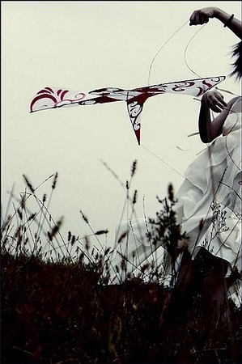
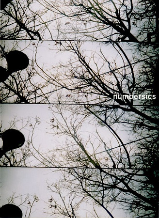
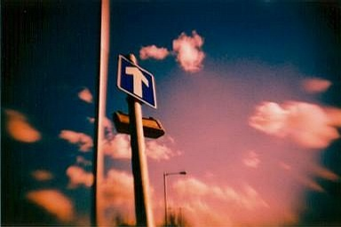
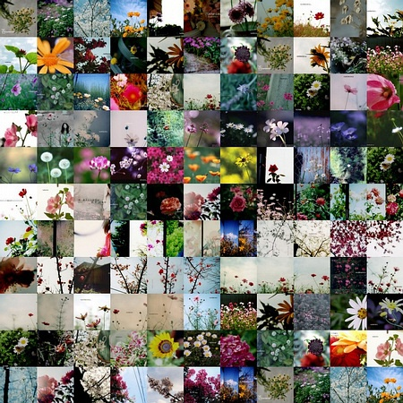
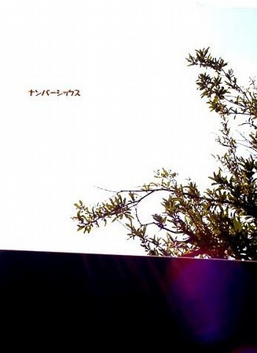
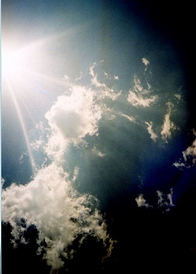

original link: https://www.douban.com/note/18163629/

為什麽總是失眠? 為什麽思緒飄到天邊?
為什麽憂慮一一實現? 為什麽我總臭著臉?

all right all right，just say "hi"
all right all right，I'll be fine

我不是不想念 沒什麽的你我間
我不是不想念 無憂無慮的夏天

我不是不想念 用力的看你的臉
我不是不想念 好想再見你一面

{不是不想念}\_\_By 這位太太

就是在那裡，
極端平靜的心讓我突然完全看破了你、妳、祢、他、她、祂。
過去與現在交織，定格的一張張畫面───
所有熱臉與冷屁股交會的那一剎那；
所有真心換糞土的慘淡臉孔，那莫名的驕傲再明顯不過。
不會再困在裡面，不會再把別人的罪過拿來自己生氣。

By Ruby@TW

不是不想念 在UVic的一個月
也許比起去Berkerly沒有那么的精彩
但是如ruby所說 極端平靜的心
看破了很多事情 想通了很多事情
相處不過不到一個月
卻覺得很熟悉很熟悉彼此
不用太多的客套 我們成為朋友
不用太多的留念 我們總會離開

離開之時
凌晨5點
很高興最後能看到你們
不用流淚 只需微笑
say hi, say goodbye

我不是不想念....
好想再見你一面...

這4周來的點點滴滴
不用特別記住
該記住的總會記住

望你們每天的生活都晴空萬里.

永遠想念藍藍的天空
是否愿意來個十年之約
十年後再聚UVic.....

