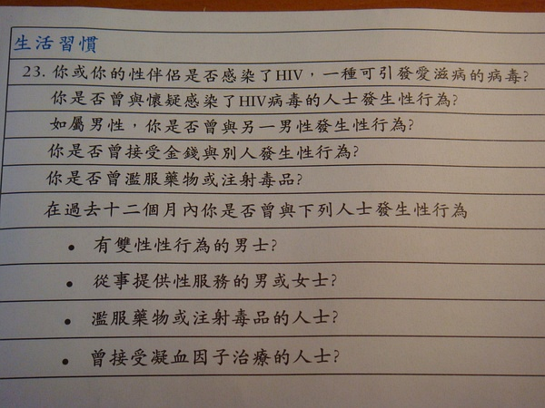

original link: https://www.douban.com/note/29281265/

這個星期真是無比之清閒啊
週一週二晚上啥事不做 看個電影 逛逛豆瓣 追追晉江
週三晚上跟著劇社看排練
週四晚上繼續看電影 逛豆瓣 看小說
今天晚上繼續看排練 日子過的真tm悠閒啊~

下午的時候去shaw 本來準備和翀翀一起去獻血
第一次獻血啊 害怕的很 先前趙導去獻了450cc說頭有點暈想睡覺
於是翀翀說她可是做好了十足的心裡準備的
我知道了可以打麻藥之後就也決定去獻了

一開始護士小姐給了我們一張表格 有好多亂七八糟關於健康的問題
還有一些關於你近十二月去過些啥地方之類的問題
最後填personal information 才發現我沒帶HKID card
因為我是第一次 於是我被拒了 不讓我獻了

再看翀翀 搞定這張表格 她就去見醫生了
醫生在知道了她春節曾經回過湖南老家 某個小縣城或者農村鄉下
然後也拒了她 說湖南有瘧疾 讓她過了一年之後再來獻血
不過要說之後她也還是會回老家的啊....那不是說她永遠都不能獻血???囧

之前碰到了小笛 結果她也被拒了 因為聖誕節的時候她參加了一個去柬埔寨扶貧的活動
柬埔寨有太多傳染病 醫生也建議她過了一年再獻血

就這樣 翀翀被打擊到了 之後忿忿不平 罵道 “居然說我的血不乾淨 虧我還做好了心裡準備”

獻血計劃就此夭折......=.=
唯一的意外就是一開始的問卷的某一部分被偶們倆腐女看著就囧囧有神啦~~

上圖~

如屬男性 是否曾與另一男性發生性行為?
