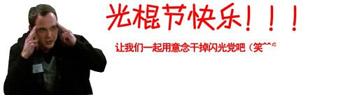

original link: https://www.douban.com/note/100054695/

当初到底是哪个鸡摸的苦逼发明的光棍节！！！！！

光棍不是两三年，每年都过着光棍节！！！！！！

所以咆哮完毕要蛋腚，再转刘瑜的《一个人要像一支队伍》和《独身主义》自勉！！！！！

## 《一个人要像一支队伍》

前两天有个网友给我写信，问我如何克服寂寞。

她跟我刚来美国的时候一样，英文不够好，朋友少，一个人等着天亮，一个人等着天黑。“每天学校、家、图书馆、gym，几点一线”。

我说我没什么好招，因为我从来就没有克服过这个问题。这些年来我学会的，就是适应它。“适应孤独，就像适应一种残疾”。

我觉得，快乐是可遇不可求的，但是充实是可求而不可遇的。

快乐这件事，有很多“不以主观意志为转移”的因素。基因、经历、你恰好碰上的人。但是充实，是可以自力更生的。罗素说他生活的三大动力是对知识的追求、对爱的渴望、对苦难不可遏制的怜悯。你看，这三项里面，除了第二项，其他两项都是可以“强求”的，都具有耕耘收获的对称性。

我的快乐很少，当然我也不痛苦。主要是生活稀薄，事件密度非常低。就说昨天一天我都干了什么吧：

- 10点，起床，收拾收拾，把一本书看了一大半的明史的书看完。
- 1点，出门，找个coffee shop，从里面随便买点东西当午饭，然后坐那改一篇论文。（期间凝视窗外的纷飞大雪，创作梨花体诗歌一首）。
- 7点，回家，动手做了点饭吃，看了一个来小时的电视，回email若干。
- 10点，看了一张dvd，韩国电影“春夏秋冬春”。
- 12点，读关于冷战的书两章。
- 2点，跟蚊米通电话，上网溜达，准备睡觉。

这基本是我典型的一天：一个人。书，电脑，dvd。一个人。

一个星期平均会去学校听两次讲座。一周工作日平均跟朋友吃午饭一次，周末吃晚饭一次。

多么稀薄的生活啊，谁跟我接近了都有高原反应。

我这人其实一点也不孤僻。生活中认识我的人都知道，我是多么平易近人开朗活泼。有时候，我就是懒，懒得经营一个关系。还有一些时候，就是爱自由，觉得任何一种关系都会束缚自己。当然最主要的，还是知音难觅。我老觉得自己跟大多数人交往，总是只能拿出自己的一个子集。我很难找到和自己一样一望无际的人。

有时候也着急。不仅仅是因为错过了亲友之间的饭局、谈笑、温情，不仅仅因为一个文学女青年对故事、冲突、枝繁叶茂的生活有天然的向往，也因为一个人思想的先锋性总是通过碰撞来保持的。我担心，我老这样一个人呆着，会不会越来越傻？

好像的确是越来越傻。

但另一些时候，我又惊诧于自己的生命力。在这样缺乏沟通、交流、刺激、辩论、玩笑、聊天、绯闻、传闻、小道消息、八卦、msn……的生活里，没有任何“圈子”，多年来仅仅凭着自己跟自己对话，我竟然保持了创造力和战斗力，竟然写小说政论论文饱博客而且写得如此饱满热情，我刘瑜又是何等顽强的一株向日葵。

年少的时候，我觉得孤单是很酷的一件事。长大以后，我觉得孤单是很凄凉的一件事。现在，我觉得孤单不是一件事。

有时候，人所需要的是真正的绝望。

真正的绝望跟痛苦、跟悲伤、跟惨痛都没有什么关系，真正的绝望让人心平气和。你意识到你不能依靠别人，任何人，得到快乐、充实、救赎。那么，你面对自己，把这种意识贯彻到一言一行当中。

它还不是气馁，不是得过且过，不是“平平淡淡从从容容才是真”这样的狗屁歌词，它只是“命运的归命运，自己的归自己”这样一种实事求是的态度。

那天偶然想起我过去几年写的这三个小说，《孤独得象一颗星球》《那么，爱呢》《烟花》，吃惊地发现，这里面其实有一个轨迹，从忧伤到怨恨，然后再到绝望。

绝望，就意味着自由。

以前一个朋友写过一首诗，名字叫“一个人要象一支队伍”。我想象文革中的顾准、狱中的杨小凯、在文学圈之外写作的王小波，就是这样的人。怀才不遇，逆水行舟，一个人就象一支队伍，不气馁，有召唤，爱自由。

现在看来，我也只能面对内心招兵买马了，一个人成为一支队伍。人家一个人象一个军，我象一个营，一个连还不行吗？

当然我的队伍没有他们的那么坚定，肯定有逃兵，经常嚷嚷着要休息，但是，我还在招兵买马呢，还前进呢，还边走边唱南泥湾呢。

我想自己终究是幸运的，不仅仅因为那些外在的所得，而且因为上帝给我的顽强和禀赋。它告诉我an unexamined life is not worth living，教我用虚无、骄傲、愤世嫉俗超越那种浑浑噩噩随波逐流的生活，然后教我用是非感、责任心来超越那点虚无、骄傲、愤世嫉俗。

当罗素说知识、爱、同情心是他生活的动力时，我觉得这个风流成性的老不死简直就是我的亲哥。

因为这幸运，我原谅上帝给我的一切挫折、孤单，原谅他给我的敏感、抑郁和神经质，原谅他让X不喜欢我，让我不喜欢Y，让那么多人长得比我美，让那么多烂书卖得比我的好，甚至原谅他让我长到105斤，因为他把世界上最美好的品质给了我：不气馁，有召唤，爱自由。

咦，怎么说到这儿了呢？本来是想谈谈自己克服寂寞的经验的，结果活活写成了一篇自我吹捧的范文，就当是本营长写给士兵们的战斗动员书吧，分析当前的形势和我们的任务。

## 《独身主义》

任何主张，加上的“主义”这个后缀，就变得恐怖。因为恐怖，人们就避而远之。比如“女权主义”，谁敢承认自己是女权主义者呢？那简直等于宣布自己长相恐怖性情变态脾气乖戾。又比如“环保主义”，保护环境，自然是好的，可是要上升到主义的高度，这个这个，有专家出来说了，还是要“以人为本”嘛。　

大多数人不喜欢强烈的主张，何况是强烈成主义的主张。
　
我也是最近才突破了“主义”这个词的反动外壳，开始打量独身状态里的种种诱惑。那次和西影坐在商场门口的长椅上八卦。她结婚几年了，所以我们自然谈到了她的造baby计划。

唉，我现在很自私，她说，想到要把自己的时间、精力分给另外一个人，就觉得不甘心，所以暂时不想要孩子。　

其实我比你更自私，我就势承认，也是因为不想把时间、精力分给另外一个人，所以连婚都不愿结。　

一直觉得自己对于婚姻这件事，抱着叶公好龙的态度。一个女人，30了，整个世界都在忧心忡忡地虎视耽耽地幸灾乐祸地看着你，等你把自己用跳楼价大甩卖了。别等了，跳吧，也就59楼，我们脖子都仰酸了，你就跳吧，我们还赶着去吃午饭呢。

于是出于善良，这些年来也配合他们的目光，做出一副急不可耐的样子。相亲，上网交友，到各种party抛头露面。最严重的，就是放弃自己曾经有过的一切标准、原则、理想，在那些毫无感觉的人面前骚首弄姿，努力用老爸老妈的口气说服自己，其实婚姻就是找个伴而已，其实感情都是培养出来的，其实一切的标准、原则、理想都只是自恋的表现形式而已。　

可是，凭什么呀。　

不就是个婚姻嘛？婚姻有什么了不起的。马克思说了，私有制是万恶之源，而婚姻本质上不过是爱情的私有制而已

我的一个朋友说过，一个人占有得越多，就被占有得越多。说的多好啊。比如你有一个房子，得，下半辈子就忙着还贷款吧。婚姻其实也是一样，为了占有一个人，你被占有了多少啊。他本来习惯于三天洗一次澡的，可是实在无法忍受她的唠唠叨叨，只好一天洗一次。她本来习惯于饱一顿饿一顿的，可是他一日三餐一餐都不能少，只好睡眼惺忪地起来给他做早饭。他本来喜欢周末哪也不去，就坐在沙发上打游戏的，结果她非得拉他去丈母娘家。她今晚就想一个人安安静静呆着，看看小说喝喝茶，可是他在那个房间里看足球赛吵得她头疼欲裂。他其实喜欢挣多少花多少，今朝有酒今朝醉，可是她非得强迫他每个月存工资的一半。她其实喜欢上网聊天，可是结了婚的女人，还上网聊天，他说，真是老不正经。　

为什么要结婚呢？他人即地狱啊，萨特说。

没有那么严重了，我的亲友ABCDEFG说，也有很多乐趣啊。一起旅行，一起做饭，搂着看电视，挎着逛商场，其乐融融啊。　

可我总是疑心，有多少人的婚姻是乐趣在维系，又有多少人，仅仅因为惯性。他之所以结着婚，是因为他已经结了婚。他之所以结了婚，是因为别人都结婚。别人都结婚，是因为――你问“别人”去吧，我怎么知道。我恶毒地以为，大多数人结婚，仅仅是因为无所事事，于是决定用一种无聊取代另一种无聊。

小昭在清华时，同学申请出国，忙得不亦乐乎的时候突然问：哎？你说我为什么要出国啊？小昭答：因为出国是唯一不需要解释的选择。

唯一不需要解释的选择。听上去简直令人凄凉，仿佛人的所有主观能动性，在传统、趋势、潮流等等集体性的事物面前，都不堪一击。仿佛人只是一只陀螺，在外力的抽打下，机械地旋转。

其实我希望自己的怀疑是错的。我希望这样的胡思乱想仅仅是因为没有对谁爱到“那个份上”。我希望有一天，象在大街上拣到钱包一样拣到“那个份上的爱情”，而“那个份上的爱情”正如他们说的那样，魔法无边，让我五迷三倒，七窍生烟。我可以为了它，一天洗四个澡，存80％的工资，一辈子不打游戏，早上六点起来做早饭，一打开电视就找足球赛，象一个八爪鱼一样缠着他不放，成天跟在他后头，唱S.H.E的那首歌：你往哪里走，把我灵魂也带走。当然，到了30岁这一年，我知道，北极并没有住着一个圣诞老人，生活中的老鼠并不像动画片里的那样可爱，有志者事竟成只是个笑话，希望它就是个希望而已。

【Fin】
