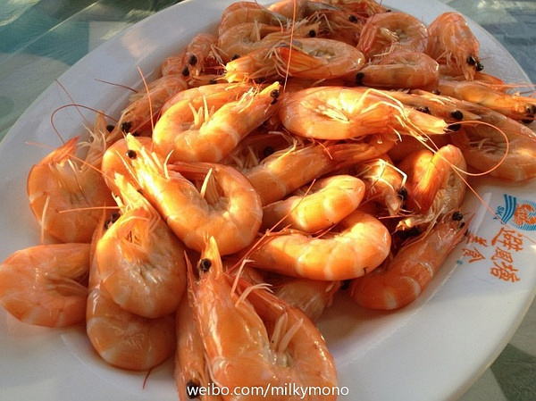

original link: https://www.douban.com/note/329611675/

拖了一个多月，都想说不写了，但还是觉得要总结回顾反省一下操蛋的2013年。

本命年嘛，从头霉到尾。

13年1月初接到房东电话要我们搬家，一开始还以为是想涨价就跟其表示可以涨，结果房东非说是自己老婆要生了，所以想搬回来。妈蛋的，那个时候爬山电梯才刚修好，住在山腰上的我们还没得瑟几天就被告知了噩耗。没办法2个星期内在隔着2站路几个街区的石塘咀找到了房子。事实证明着急的时候找的房子都是烂货！！！月底找了搬家公司，3个人的行李连家具一起搬家花了2800HKD，累觉不爱（跪

打包战斗进行中

2月初回家过年，一回到新搬的房子就被楼下的人投诉说厕所漏水，然后通过中介找房东要房东找师傅过来修啊，师傅尼玛不约好时间星期六一大早7点就过来敲门啊，楼下大妈也贸然星期天一大早6点半过来敲门投诉啊说家里老人因为漏水摔跤进医院啊，师傅不靠谱来修20多次修不好啊，死命追房东换一个修漏水师傅啊，政府食环署派人过来用颜色试剂检测是否我们家厕所漏水问题啊blablablabla。。。。。。。。整件事搞到6月份才消停（跪
这件事证明了新房东比旧房东还特么不靠谱，这破房子要价还高，住的那叫一个累心。

3月份师傅搞成这惨样而且还没修好，一直到6月换了另外一个师傅

3月份开始走向学霸（zha）之路，加上家里厕所那叫一个恶心，于是更开始泡图书馆之漫漫长夜了。其实那个时候就已经决定了一定会提早搬走，当时师傅第一次到家里来修漏水问题的时候，只有我一个人在家复习，但是完全无法安心下来，满脑子都是各种被害妄想= =（这种时候倒是真心希望有个蓝喷油QwQ）

4月到5月就是学术之颠，一直很有热情做pro，因为发现不少兴趣和乐趣。presen前一晚通宵到早上7点半，上交了ppt，匆忙回家睡了4个钟头，下午才team一起准备presen，但其实最后直接抛弃了ppt，把内容重新做了[prezi](http://prezi.com/)（强烈推荐大家试用一下这个，简洁好看很容易上手）晚上上场一展示prezi，所有人都夸酷炫（哦呵呵呵wwww）prof本来把早上7点半我们上交的ppt也打印了，结果发现咱根本没用ppt就放弃看手上的东西了~~过去了之后再看，其实换prezi这件事是最后几个小时才搞的。本来我觉得没时间了也不是特别必要，但是leader说还是试试吧，那就做吧，事实证明效果拔群。

5月做完presen之后简直卸下一大重担，噢噢最后我们team还拿了个第二名，有3000HKD奖金呢~>w< 当然读书的最后就是考试啦！那段时间book到了学校的超大通宵study table，使用期限半个月。于是几乎每天每天的通宵学习，凌晨4点回家，上午补觉。过了一段非常不健康的生活，回头看又很羡慕那个时候的自己。月中高中好友来香港玩，第一次和她在香港碰面，只叹时间不够，要不然可以多陪她玩。5月底考完所有的试，和同学们来了搓了一顿避风塘女汉子海鲜大餐！那天非常尽兴，和某些同学也许就是最后一次见面了~TvT

table22, i miss you~>3<

避风塘风景不错~船上吃海鲜别有一番滋味

夕阳下开吃~吭哧吭哧

吭哧吭哧~续

吭哧吭哧~终

5月中在最后一门考试还有2周的时候，还去了一趟丹霞山和韶关。去看了阳元石和阴元石（不知道的可以搜一下图片喔233）以及韶关的东西还蛮好吃的~

6月份找工作，补掉了前期没有追的番。7月初去了一趟黄山和宏村，黄山风景很不错，但是爬山用掉了半条命。在山上住了一晚，那晚赶脚整个人所有骨头都是酸疼的orz 后来去宏村算是完全的放松，到现在都很怀念梅菜烧饼和梅菜蒸鸭腿（¯﹃¯）
7月回来以后一直到8月就到一家公司做intern。算是跟专业有点相关性的，但是可能还是运气不够好再加上自己性格也不够好，公司没有给我full time职位。

8月因为种种原因，提前搬家了，搬到了长沙湾，其实我并没有打算这么早搬走的。另外两位前室友现在仍在住渣房，房东年前果然要求涨价了~不知道她们俩谈价如何。
长沙湾住的房子虽然离地铁站有点远，但是性价比高多了~

9-10月也一直在找工作。不过作死的那段时间开始报很多有用无用的考试。保险经纪的考试，证券从业资格的考试，还准备考cfa，还准备考日语。还在坚持着上一些coursera，每天都觉得自己在作死。

11月开始在一家奇葩公司上班，一开始做副总裁助理，后来才3个星期，副总裁就明白估计跟我性格不太合，把我调走不做他助理了，于是一直到现在为止，我都是行政部专职打杂的兼前台小姐╮(￣▽￣")╭ 呵呵呵，对的，我在非常不方便的前台坐了1个多月。工资什么的都是泪。
说这家公司奇葩有各种方面的。比如说明明都有3年多了，结果现在常务副总裁才嚷嚷着要搞工作流程，这不是一开始开公司就应该搞的吗？你们前面3年都特么在干吗？？？再比如说，1月初总裁秘书组织公司旅游，所有交通、住宿、吃饭费用都要她个人先出的钱，之后再报销。总共3万左右，2、3个月工资啊喂！前台大姐一直都负责公司各种琐碎的日常，买文具买灯泡买厨房用品买装饰品也是全部先自己垫钱。大姐跟我说，来这家公司上班是要带着钱来的(＃°Д°) 当然我也深有体会。帮忙订了两次机票，第一次订了之后要付5000多，当然又要我个人先垫钱，但是劳资没钱啊！就是特么没钱啊！信用卡也没额度啊！跟副总裁说没钱支付，我是希望他甩出他的什么黑卡说“先刷我的吧”←图样图森破！他说的是，“自己想办法啊！赶紧搞定啊！这么点小事都做不好？！” 我艹你大爷的，之后去问秘书姐姐，她说那只能先找会计部同事借信用卡。借用信用卡订好之后，副总又过来问我说搞定了吗，我说借了XX的信用卡，他说就是嘛总是可以解决的嘛~呵呵呵
妈蛋的！！！你是老板就特么可以随便用员工的钱啊？？？！！！脑残

第二次订机票，前一天中午才通知我订第二天的机票，又是春运期间，我很怕没有票有点着急，查了票之后跟副总汇报只有什么什么时间还有一程机票只有头等舱，他说好了就这么订吧！
当然我还是自己垫的钱，3个人的机票差不多2w人民币只能用我妈的信用卡支付的，真特么丢脸。刚订完没几分钟，一下说要取消一个人的一班飞机，一下说要改一班飞机的时间。做行政其实真的很锻炼一个人的脾气。。。。
结果这厮第二天一早去坐飞机还叨逼叨的微信问，谁同意订头等舱的？。。。。。卧槽就你就你说可以的，春运只剩头等舱了好吗！！！ 傻逼

11月还曾经尝试再找其他跟专业相关的工作，可惜大概还是被觉得能力不够。11月还因为准备考试、爸妈表妹来香港，每天都睡不够，白天工作也没头绪各种捉急。12月开始不再做傻逼副总的助理之后，说实话轻松好多。到现在我都不太懂怎么跟他沟通。一开始坐前台是觉得委屈，毕竟读了master了，原来还是只能做前台。后来觉得这也没什么大不了的，哪天觉得真受不了了就走呗~~其实坐在前台反而多了和总裁（女）沟通见面的机会。1月初开年终总结会议，总裁会上表扬了我，她说觉得我心态好，本来以为把我安排做前台我会辞职不干，结果我还是坚持做了，不会太把自己当回事，之后要重点培养什么的。这些话听着好像振奋人心好像很有前途，其实大部分都是个屁，事实还是拿成功学的那一套唬人，达到剥削廉价劳动力的目的。

总之，11月、12月在各种鸡飞狗跳中过去了。2013年也就结束了。

1月过去的也很快，公司出去玩，去深圳参加公司年会抽奖抽到ipad mini（还在年会上表演跳舞什么的这是黑历史= =|||）然后就过年回家什么的。

本命年最后一天的霉运就是从香港飞机回武汉的时候，武汉因为大雾飞机无法降落，于是飞机又飞回了香港，加油之后再次飞到武汉的无奈故事。家里人订的是大年三十的下午吃年饭，于是我就没能赶上。本来是一大早9点的飞机，我6点多就出门去机场了，结果拖到晚上6点才到家。╮(╯-╰)╭

本命年过去之后，马年我大概会比较顺一些吧~~

过年回家，爹妈又开始问我以后的计划，我说我还在想要不要出国读博士。然后又被抨击说真的想读的话赶紧准备啊，这样再蹉跎下去太浪费时间。很心烦啊，未来的事。没想到过了这么久，我还是很迷茫，不知道自己到底要做什么。本以为时间会告诉我，我会自然而然明白想做什么。但其实是不是我根本没有认真考虑过，又或者我连要怎样去考虑这件事的方法都不懂呢。
就这样一年一年蹉跎下去真的不行啊！

昨天跟同学K聊天，她兴趣跟我相同，我说我在想以后去读这方面的博士，她说有兴趣不用读博，一直关注着这方面，组建个兴趣小组，每周见面聊聊分享相关学习内容就已经足够了。真的要以兴趣作为职业，并不是那么容易的事，而且也并不一定是最好的一条路。

仍然条理混乱中。人生目标什么的...............
