年初九, 拜个晚年. 🐵年好~

还没有上班, 因为拔了智齿, 就趁机休了一个星期病假, 在家多歪着.

15年底老爸说是也有1000块的买书钱, 于是我就下手买了这本 [Genesis 创世纪 ](http://book.douban.com/subject/20500583/) 摄影集.
回家之后看到的确吃了一惊, 它很大很厚一本, 对得起这个价钱.
而翻看之后, 一下子又重新回忆起纪录片<[地球之盐](http://movie.douban.com/subject/10741871/)>中的画面.

去年 HKIFF 看的这部纪录片, 其实我并不是纪录片爱好者, 但看评价不错就还是买票去看了.
看着摄影师Sebastião Salgado去各个地方, 世界的尽头, 看到了各种各样的苦难, 最后绝望地回到了家乡.

> My soul is breaking. I don't believe in human's rescue any more.

本在想这个故事该怎么继续下去呢? 没想到摄影师放下镜头, 走进了荒山, 开始了种植.
在荒山重新变成绿林之后, 摄影师说, 感觉被救赎了. 热泪盈眶.
生命应该是个循环, 所以是永恒的. 重拾希望, 才有了"创世纪"的摄人心魄.

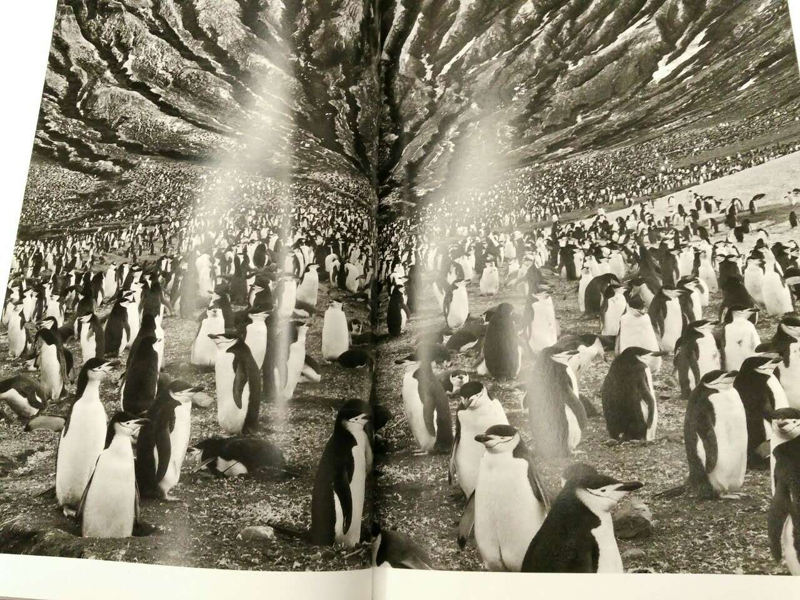
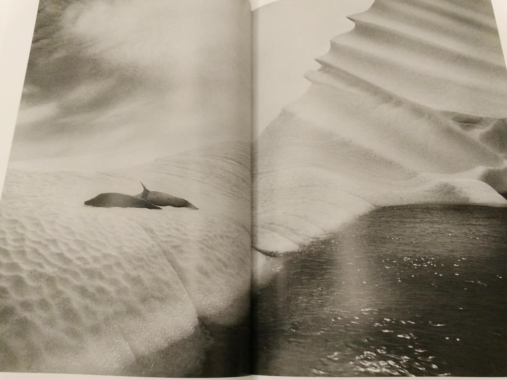
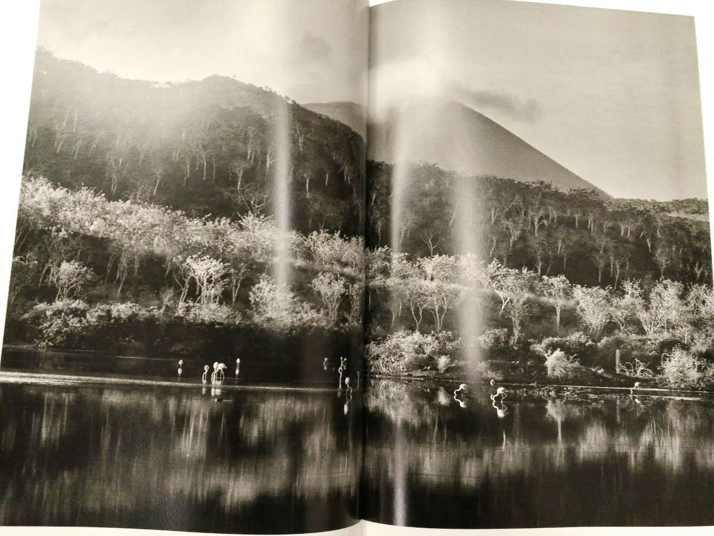
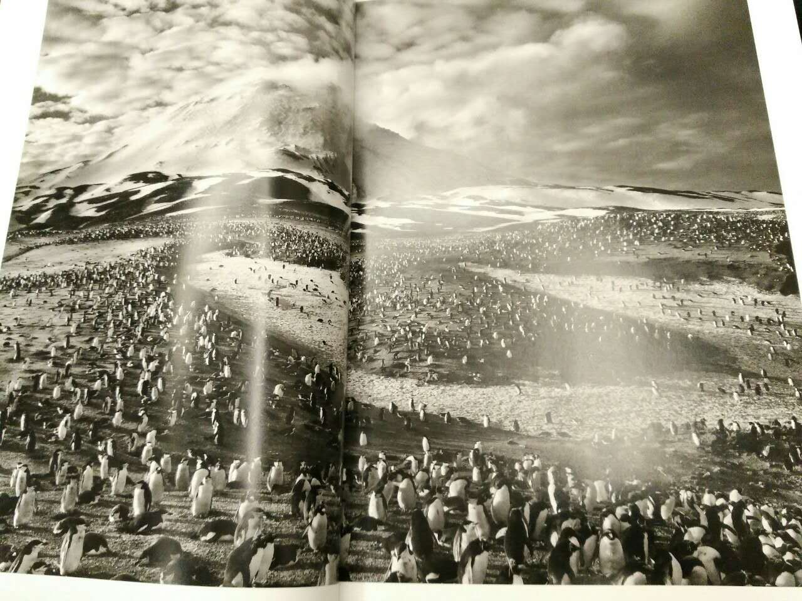
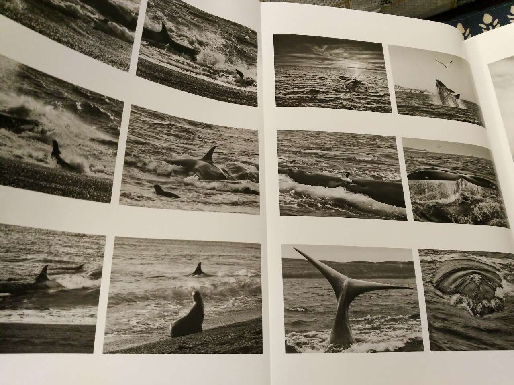
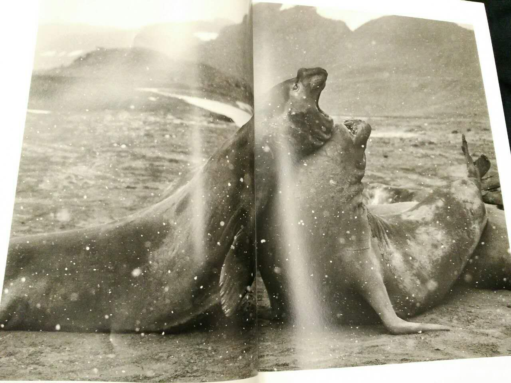
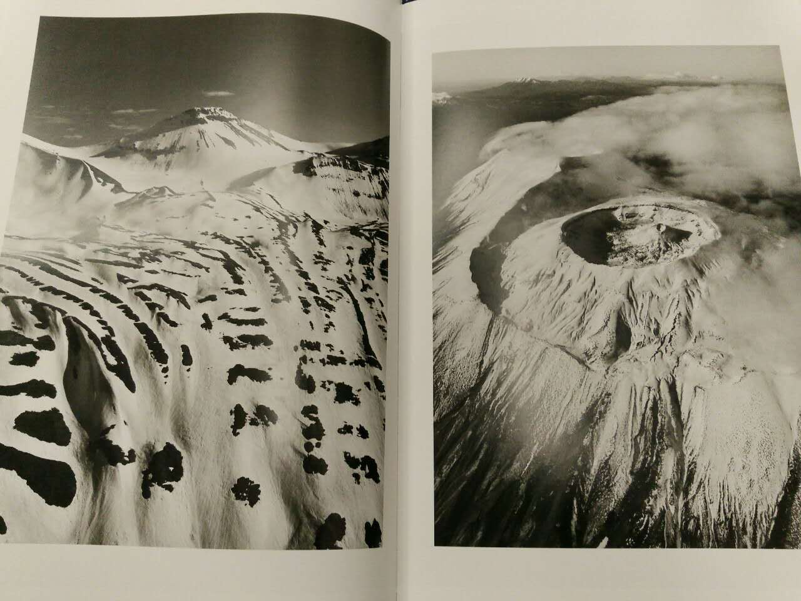
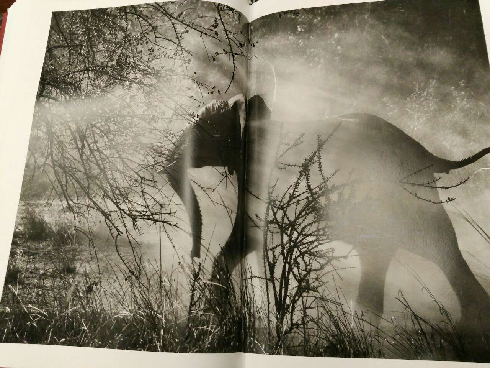
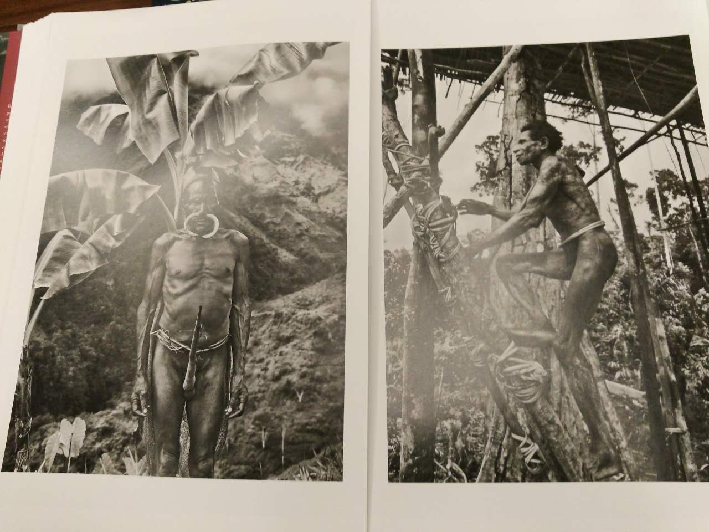
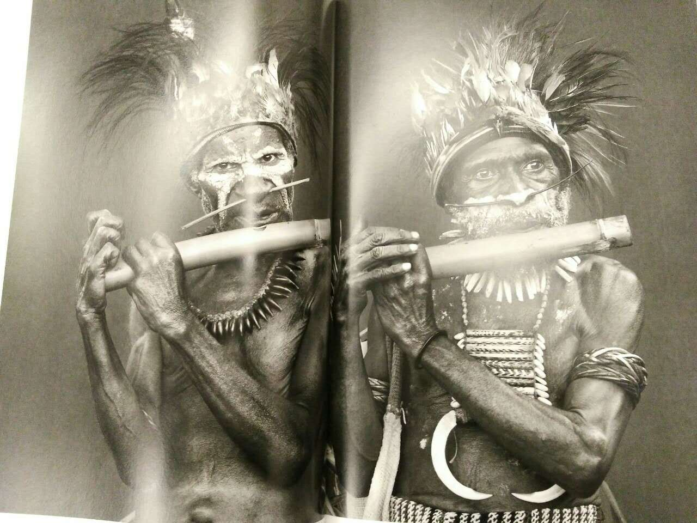
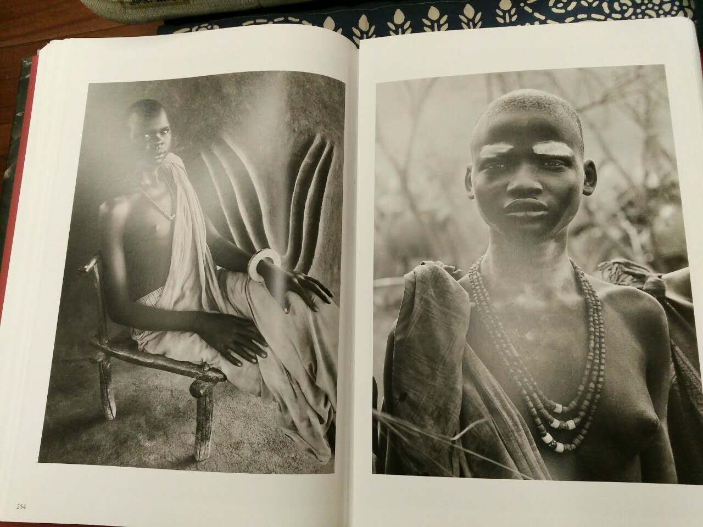
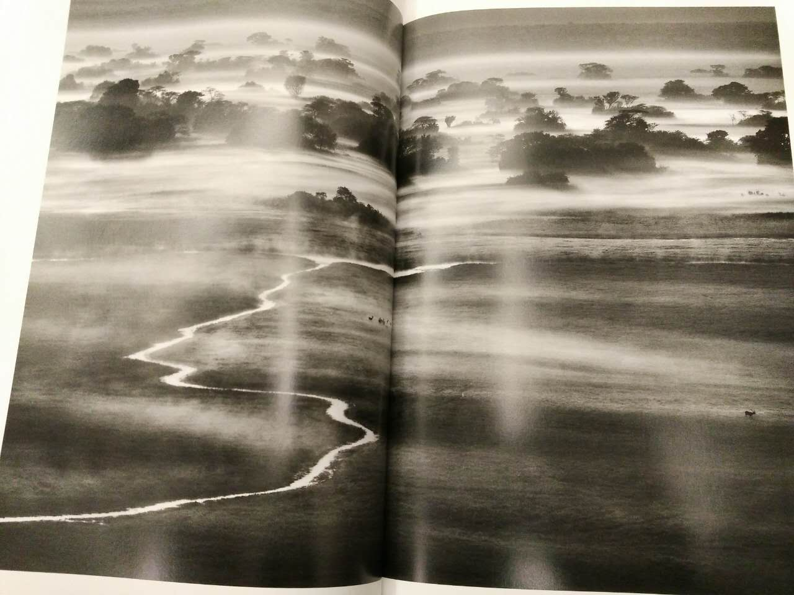
