这是一篇纯粹吐槽的东西....

## 事情的经过

### 周二
周二晚上一时兴起, 下了网易严选的 app, 想买点东西.
注册的时候遇到了很纠结的问题.

注册页面
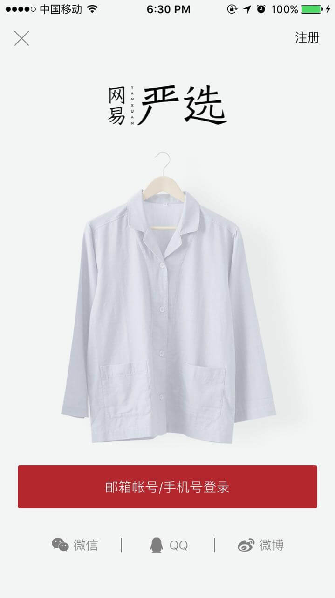

一开始我选择的是用手机号注册, 因为这样比较快.
然而却无法注册成功.

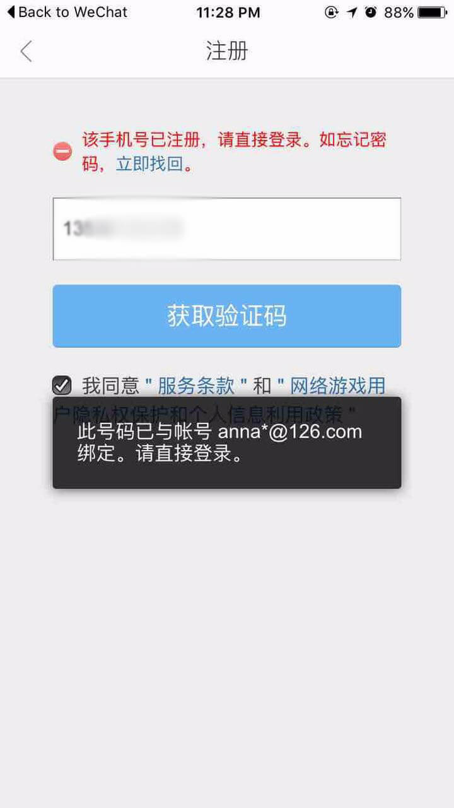

一直提示我, 此账号与一个`anna*@126.com`的邮箱绑定, 我可以肯定我从没有注册过126的邮箱, 一脸懵逼的我在想难道我的手机号被人盗用了?????!!!!😳

然后我点击上面那张图里的「立即找回」尝试找回这个账号看看.

出现这个页面↓
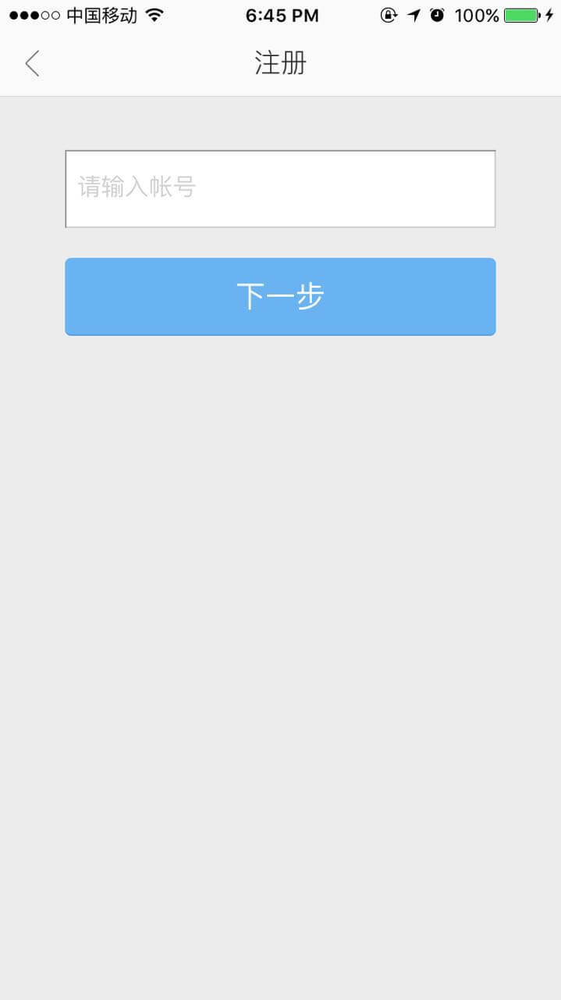

输入账号嘛, 我理所当然输入的是输入了手机号. 输入过程中是这个样子的↓
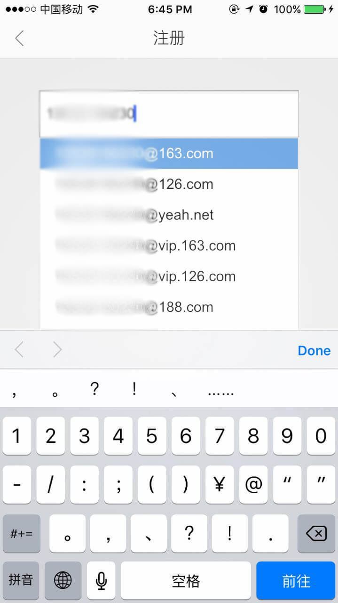

没有在意, 还是单纯只输入了手机号, 就点击了「下一步」, 结果提示我「用户不存在」↓
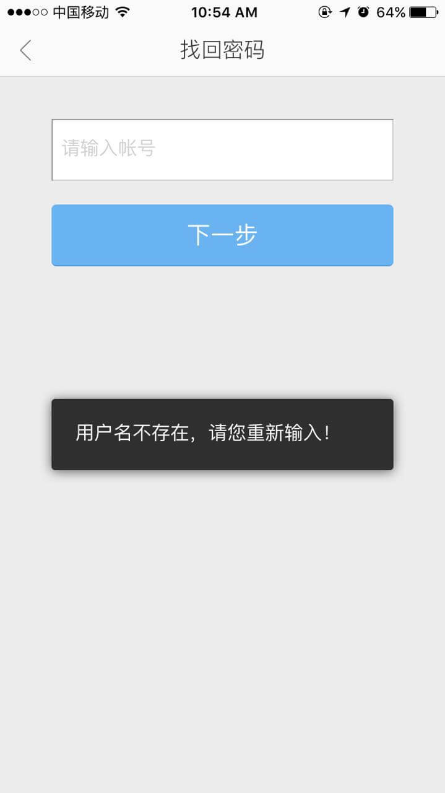

🙄🙄🙄🙄🙄🙄🙄🙄🙄🙄🙄🙄🙄🙄🙄

WTF?????

想不通这个过程里发生了啥, 上述操作我重复了好几次, 结局都是一样.

想着觉得不能就这么算了的我, 用了第三方的微博账号登录了网易严选, 然后找了半天, 找到了一个人工客服的入口, 但是客服时间当时已经过了, 所以我就留了言, 询问是怎么回事, 以及想知道自己的手机号会不会被盗用了....

### 周四早上
周四早上起床后才想起来点进去看看是否有回复, 然而看到的是

> 我们不是网易邮箱客服哦

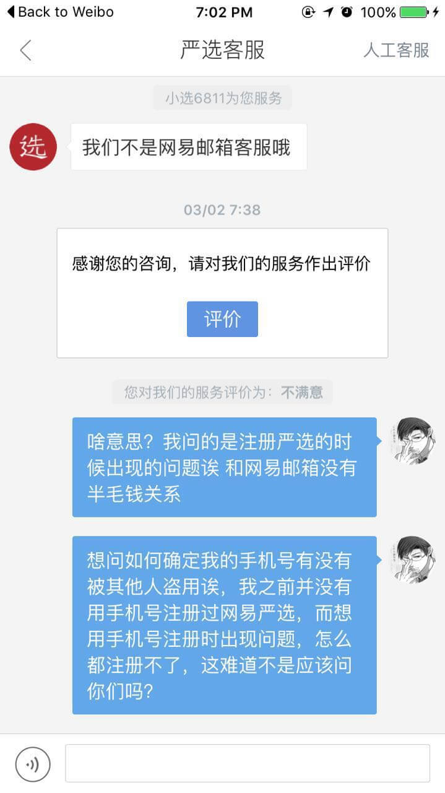

我们不是网易邮箱客服哦
我们不是网易邮箱客服
我们不是网易邮箱客
我们不是网易邮箱
我们不是网易邮
我们不是网易
我们不是网
我们不是
我们不
我们
我.......................

🙄🙄🙄🙄🙄🙄🙄🙄🙄🙄🙄🙄

### 周四晚上
周四晚上又想起来看下回复的时候, 只说找技术人员核实一下, 而且是周四早上9点多回复的, 核实了一整天都没有结果, 我只好再次询问是否有结果.

### 周五晚上
周五忙了一天, 晚上想起来再看看结果. 然而发现人工客服换人了!!!!!! 而且似乎前面的聊天记录在新接手的人那里 ta 看不到???!!!!!!!!! 🙄🔪

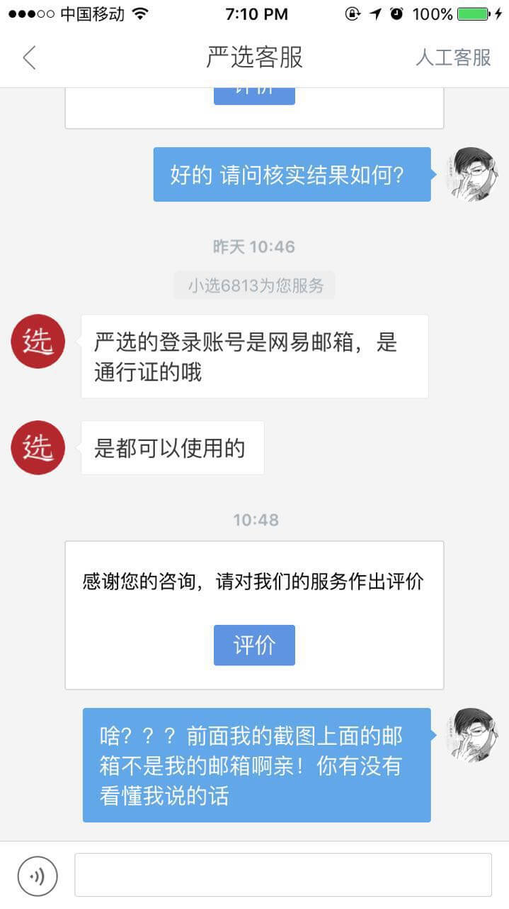

愤怒地留了个言之后玩游戏睡觉去了....

### 周六
今天早上起床又想起这件事, 点进客服, 嗯...又换了个人....
不过这次比较好的是, 终于是在线状态, 实时沟通的.

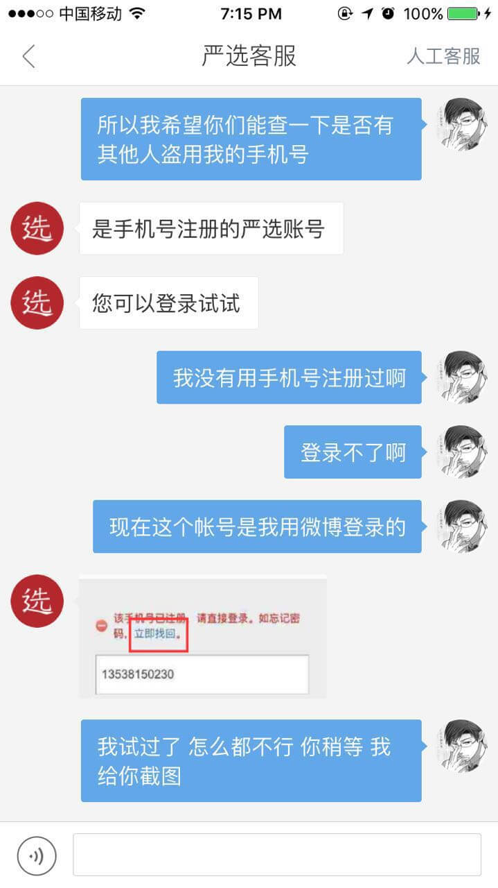

这次终于是个比较理解我说话的人, 但是她说的我都试过了, 本来想退出登录再重复一次最前面的注册流程的时候截个图, 然而我又天真了, 等我截好图, 再用微博账号登录之后, 客服特么又换了个人...............🙄🔪🔪🔪🔪

只好再把问题描述一次, 所有截图丢过去. 一开始这个客服又说是我的邮箱安全问题…💊💊💊💊💊💊
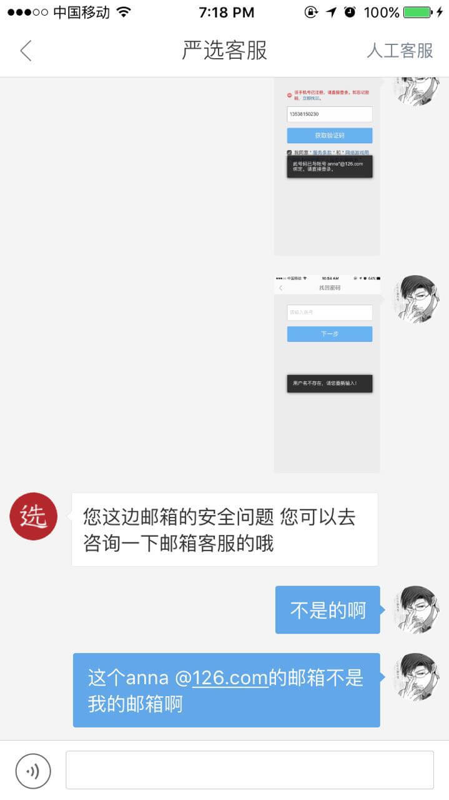
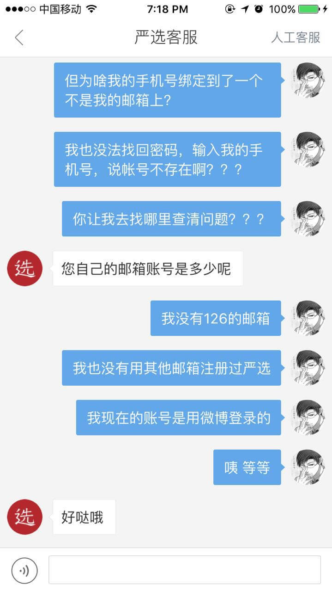

这时, 突然想到一个去年还是前年的事. 我的一个在香港的朋友的126邮箱被盗了, 需要绑定一个大陆的手机号来找回密码, 她当时没有大陆手机号, 所以找我借了下手机号来做这件事, 因为很小一件事, 也没有其他影响, 以致于早就忘了, 如果不是这次注册发生问题, 我大概都不会想起来....😂😂😂

大概明白问题是怎么发生的之后, 我又找客服问了几个问题求证.
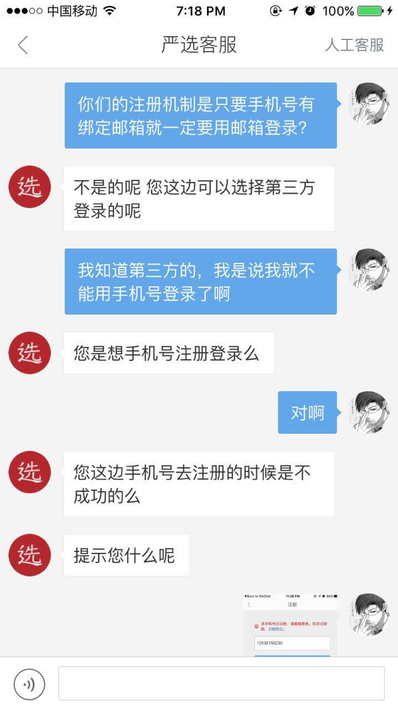
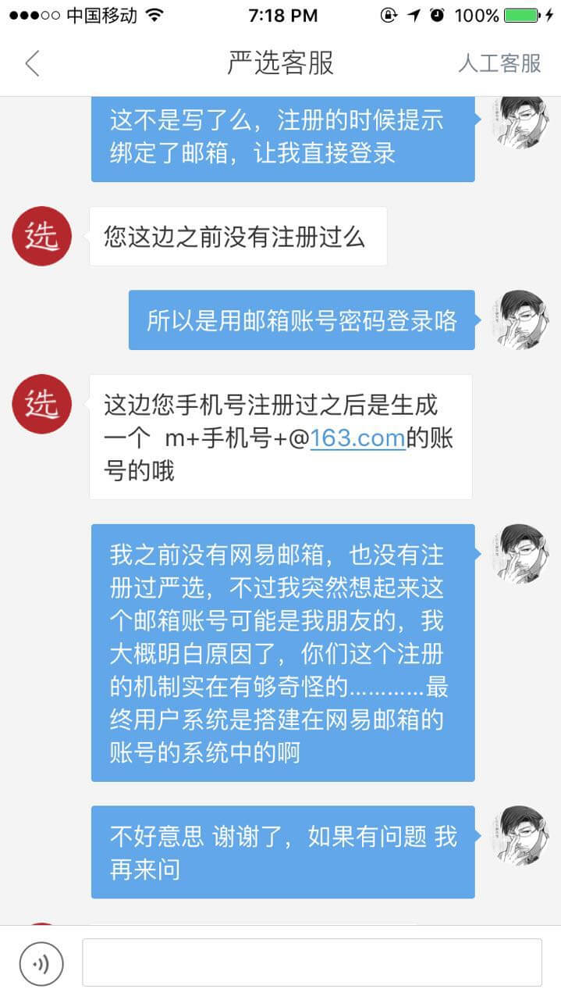

在看到客服说, 即使是手机号注册成功, 也会生成一个 `m{手机号}@163.com` 的账号的时候, 我终于明白网易严选的用户系统的一部分是搭建在网易邮箱的系统上的.

纠结了几天的问题终于明白了.....

## 据我推测网易严选的注册逻辑是这样的...

> 仅考虑使用手机号的 case

- 注册使用手机号:
  - 检查手机号是否已有绑定的126/163邮箱
    - yes: 提示可以直接登录
      - 港真, 这里的提示**「请直接登录」**太让人疑惑了, 到底是怎么登录??? 我理所当然地理解为用手机号登录了, 然而实际的意思大概是用已绑定的邮箱的账号和密码登录, 求修改文案...🔪💊
    - no: 正常逻辑就是发送验证码, 验证后即可注册成功
      - 按照客服说的, 手机号注册成功也是生成一个163的邮箱账号
- 登录/找回密码时输入手机号:
  - 仅检查了是否存在 `m{手机号}@163.com` 的账号, 连是否有绑定邮箱都没有检查???!!!🔪💊
  - 这里的文案也有问题, 仅写的是让我「请输入账号」, 到底要我输入什么账号? 以什么格式输入????🔪💊

不知道是不是所有网易产品的用户系统是不是都这么混乱的....

(暂时来看手游大概会好一些, 貌似基本以手机号为准, 仅玩过阴阳师的人这么认为...)

## over
以上都是吐槽加猜测, 有啥不准确的就让ta随风飘过, 反正大概都是产品经理的锅😒
