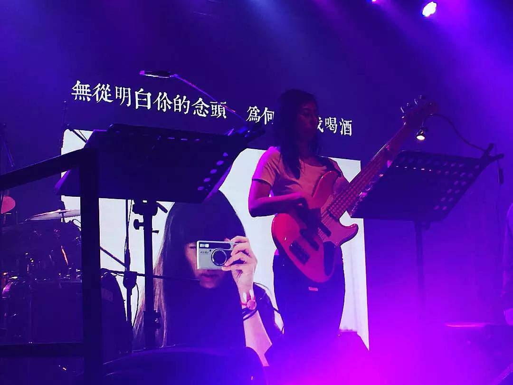

original link: https://www.douban.com/note/650710129/

不曾想, 从听到喷油的 my little banana 的铃声至今已经 10 个年头了.

今年圣诞久违地去 live house, 听了第 6 次 mla 的演唱会. (花了一段时间回忆曾经去过的 live)

[2008.5.30, 第一次是浪漫九龙塘](https://www.douban.com/photos/photo/184233942/), 也是我看的唯一一次有座位的, nicole 当时说坐着似乎有点无聊呢

[2009.11.22, 第二次失业救济音乐会](https://www.douban.com/photos/photo/375948339/) 从中大去 蒲吧 实在是很远

[2011.9.2, 香港是个大商场深圳场](https://www.douban.com/photos/photo/1247191262/), 印象中音响效果不好

[2012.10.21 菊花的味道](https://www.douban.com/photos/photo/1748146846/), 还记得 去信和卖碟 一开始以为是 "去信" 和 "卖碟" 哈哈哈哈

[2013.3.9 深圳一夜](https://www.douban.com/photos/photo/1987594689/)

[2017.12.25 this X'mas, you are not alone](https://www.douban.com/people/MoNoMilky/status/2085199697/)

14年的十周年没有得到消息, 15年从 HK 到了深圳, 16年从深圳到了北京, 今年终于又从北京回了深圳, 也终于没有错过 live 的消息, 开票第一时间去抢了票, 此处鸣谢 Carrie 酱

去 live 前一天才被喷油科普, 阿p 的女票就是以前步履不停的 model 张禹希, 我一脸惊恐, 是有多久没有好好关注过他们了...以及<适婚的年龄>的封面就是她.... 好啦, 妹纸的确很漂亮, 以前买过不少步履不停也是因为妹纸太好看~ 但是, 我和大多粉丝一样, 只想说, 当年唱着「你是浪子, 别泊岸」的人, 如今自己却泊了岸, 并且开始 heyhey baby 了.....哈哈哈哈哈, 所以原来是多年前早以立下 flag 🚩

> 2019.4.27 突然想用这篇日记继续记录去看 mla 的记录吧，不奢求太多，只求每年能见一次

第 7 次： [2018.9.30 你說之後會找我](https://www.douban.com/people/MoNoMilky/status/2258099935/)

2019 年不知道什么时候 live 呢~

---

2020.8.21 updated:

2019 年发生了很多很多事，我本来买了 2019 音乐会的票的，可是没有去成，可以说我也的确害怕去了就回不来深圳了。对于某些看法也许不同，但是我依旧喜欢他们。买票而没去的钱就当是捐了，依旧希望他们好好活着。

前几天听说全名已经不让搜索了，今天发现所有条目都显示不存在了，还蛮伤心的，回头发现连我自己的日志都被悄悄转为仅自己可见了，实在是太可笑了

虽然但是，我要放出来这篇日志

2021.7.17 updated:

2020 年因为疫情自然是没有举办 live 的，然而 2021 年 8 月底预备要开 live 及发新专辑，可惜依然没有通关的迹象。
