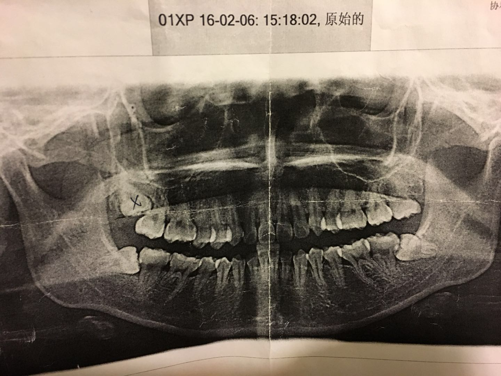

没想到 2018 年第一篇想写我住院拔牙的事... 嘛, 基本也只是个人记录.

其实最早是 16 年春节回家前, 和我妈说感觉有两个智齿冒出了小尖尖, 并且是横着长的, 我的舌头舔得到.
于是, 回武汉后我跑去了医院, 拍了个片子, 如下:

很明显, 下面的两颗智齿都是完全横着长的, 必须拔掉, 左上的智齿其实是完全正常的, 但是因为左下的智齿长歪了, 所以没有办法咬合, 如果不拔掉, 有可能持续不停地长, 甚至破坏到下面的牙龈, 所以也得拔掉, 右上的牙齿最麻烦(就是图里面被医生画了个 x 的那颗), 很深还影响旁边的大牙, 当然还是得拔.

16 年春节前, 我就在门诊一次性拔了左边的两颗智齿, 因为是比较简单的两颗, 而且拔同一边也至少对我后续吃饭影响较少. 之后 16 年 10 月国庆节我也回了武汉在门诊拔掉了右下的那颗横着的.

在门诊拔牙的话, 算比较方便的, 当然只有局部麻醉, 然后切开你的牙龈, 把肉里面的智齿切成几块, 然后连牙根一起取出, 最后缝针. 之后连续打 3-5 天消炎止血的针, 这期间只能吃流食, 牛奶/豆浆/鸡蛋羹/稀饭之类的, 以及不能刷牙, 只能漱口之类的.  然后一周后去拆线, 这个拔牙才算完成. 虽然每次都被医生告诫拔完之后, 等麻药作用过去, 可能会很疼, 我也听过很多朋友说拔完很疼, 我除了眼睛可见的脸肿了, 港真还真的不怎么疼…..这也算一种幸福吧 🌝

说完前两次, 再来说第三次. 本来 16 年国庆拔完, 医生说最后这颗有点深, 比较难拔, 建议还是住院, 比较有保障. 于是先预约这 17 年春节回去拔. 不成想, 17 年春节前在北京被冷的重感冒, 咳嗽地不要不要的, 医生说那咳嗽不能做手术, 麻醉医生是绝对不会给咳嗽的病人麻醉的, 他给我的解释是说, 如果麻醉了, 你可能就不知道你想咳嗽, 甚至是可能就此窒息的….. 😨 怕了怕了, 好好治感冒先….

于是就这样, 最后这颗牙拖到了今年 2018 年.

其实回武汉前两个星期我又有点感冒了, 那个周日朋友约出去吃饭, 我几乎不能讲话… 然后在家咳嗽了一个星期, 但是其实除了狂咳嗽, 没有流鼻涕, 没有发烧. 下一个周末又跑去广州找朋友玩, 结果不知道怎么本来以为快好的病情却加重了, 周五大晚上去火锅宵夜的时候没事, 周六晚饭却完全没食欲, 看电影中途跑去厕所把胃里的东西全吐了… 回朋友家之前买了点药, 本想直接吃了点药睡下, 感觉整个人都很晕, 后脑壳疼, 几乎站不住. 结果刚吃了药, 又一阵恶心, 把药又全吐了…… orz 虽然朋友说要我去医院急诊, 但我实在撑不住了, 需要倒头就睡. 朋友依了我, 给了我她的天鹅绒睡衣, 明明那天晚上广州至少也是 15 度的样子, 我也把自己过了起来先睡了, 稍微给朋友们扫了兴有点抱歉, 不过周日睡醒后就好多了. 头不疼了, 把前一晚给我买的白粥热了喝了, 舒服了很多. 说起来那个白粥真挺好喝的, 就是那种很实在的煮了很久的老火白粥. 回深圳后周一又去了趟医院, 医生给我的初步诊断是急性支气管炎…. 😰 原来我老觉得是感冒, 去药店买的药也是感冒药, 完全没有用…😂 医生给我开了3天的药, 要我看看效果. 果真还是得对症下药啊, 其实吃了药后第二天马上咳嗽好转了不少, 吃完 3 天基本可以算好了.

终于, 这次可以来住院了.

周一早上到了病房办住院手续, 护士先告诉了我是哪个病床, 然后给我手上带了个手环, 上面有我的名字年龄入院日期之类的基本信息, 还有个二维码可以扫…(嗯哼~ 医院也先进了不少) 这个手环在住院期间都需要待着, 洗澡也可以不用取的, 不怕水的材质. 然后给我讲了下疼痛的 0-10 不同指数意思, 病房的基本规定, 还有热水时间啦, 门禁时间啦之类的. 然后让我去做 3 项入院手术前的常规检查, 主要都是心脏相关, 心电图啦, 心脏彩超啦, 做完后已经中午, 中饭去吃了个羊肉面, 回家准备了些需要带到病房的东西, 比如拖鞋, 靠枕, 杯子, 小面盆, 毛巾, 抽纸, 充电器… 下午到了病房开始等管床的医生给我录入病例. 这个就是最基础的询问我的所有基础信息, 还有有没有过敏史啊, 有没有住过院啊, blablabla... 等这些搞完已经下午 4 点多了, 于是和护士打了声招呼说我晚上 8 点多前回来, 回家吃了晚饭, 洗了个澡, 收拾了一下再去了医院. 医院病房是 9 点半的门禁. 本来我还带了电脑, 想说干点活…这环境港真干不出啥….😂 不仅没有 wifi, 也不好意思打扰病房里其他病人, 于是只好看起来 bones 了….

周二一大早, 6 点多护士过来给我抽了血拿去化验, 基本上医院的流程是等化验结果出来没有大问题才真正决定手术. 于是早上等所有医生和护士都巡查过病房后, 我就去吃了碗热干面暂时回了家, 干了一点点活…下午又到医院去之后, 护士给我做了头孢的皮试, 让我等着主治医师给我来签手术同意书. 等到 4 点左右, 主治医师来了, 给我讲了下手术的风险, 以及可能的后遗症. 这些文件都被医院留下了, 我没有备份, 按照记得的说下.

印象最深的是有关上颌窦这个, 因为这颗智齿有点深, 比较靠近上颌窦, 所以最坏的情况是有部分牙齿碎片掉入上颌窦, 如果发生这种情况那就必须从其他地方打开上颌窦并把牙齿碎片取出. 虽然看我的状况还是有点距离的, 但不能保证不发生意外. 另外的后遗症里, 记得最清楚的是做完手术最直接的感受可能还不是牙齿, 可能是喉咙痛, 像感冒一样, 因为需要从鼻腔里塞进去一个管子, 额 具体为了啥我就不记得了, 反正也是我并不想看到的画面…😂 另外一个是说黄色那颗大牙在后几个月都会有点受影响, 因为一般来说牙齿两侧都有骨头帮它固定, 黄色这颗之前右边都是智齿的位置, 现在拔掉了这颗智齿后, 它就有一边没有支持了, 可能会松动. 医生说过几个月它的旁边会长一点骨头去支撑它的, 所以最近几个月让我尽量用左边咀嚼, 给右边多点时间… emmmm 好的, 最近几个月都别想胡吃海塞了...

签完同意书后, 去吃了晚饭, 回家洗澡, 然后回了病房, 并且打了一针手术前的消炎针. 然后 12 点后不能吃任何东西, 也不能喝水.

周三早上, 当然不能吃早饭, 把前一晚吃的也拉空了, 这下真的是完全空着肚子了, 等到了 9 点多快 10 点的时候, 给我在屁股上了个镇静剂, 港真有点疼…. 然后我就被领到了手术区等着. 对了, 手术必须穿上手术服, 我的情况是可以穿内裤, 不能穿 bra… 手术区也不是电视剧里那种上面一个大灯显示是否在手术. 这里的手术区是个很大的区域, 所有手术的家属都在手术区外面等待, 于是很多人的...等待的时候我看了很久平面图, 那个手术区一共有 20 个手术室, 不同的医护人员 物料都是有固定路线如何流动. 等到 10 点 50 的时候, 一个护士叫了我的名字, 让我签了一个麻醉同意书. 然后领着我去了手术室, 嗯哼我自己爬上了手术台躺下… 护士解开了我的上衣给我胸前贴了好几个监测用的那种东西, 好的, 我终于知道为啥不能穿 bra 了, 然后就失去了意识.

全麻的体验其实真的就是感觉才晕过去一秒, 下一秒你醒过来发现你在一个不同的地方. 这个地方是麻醉苏醒室. 虽然意识已经回来了, 但是眼睛仍然睁不开, 而且喉咙很难受, 想咳嗽一下发现咳不了, 鼻子上还插着管, 可以呼吸, 听得见护士跟我说等一下给你去掉管子, 还好还没有痛感, 取下鼻子插管的时候鼻子流血了我也没感觉, 只知道护士给我用棉签清理在. 取下鼻子插管后, 我才终于觉得喉咙很有点灼烧感, 我觉得这个不是感冒, 就是有异物的那种感觉. 等我终于能睁开眼睛的时候, 护士看我没有大问题, 就送我回病房了… 病房的护士麻烦了其他病人的两个男家属帮忙, 把我抱回了我自己的病床. 然后就右手给我上了心电测量仪和血压测量仪, 左手给我打起了针, 消炎止血营养护胃好多袋药. 哦对, 回到病房是下午 1 点了. 我嘴里咬着的止血棉花 2 点可以慢慢取出, 但是一直到晚上 7 点才能用枕头或者坐起来一点. 就这么僵硬着半睡半醒地撑到了 7 点, 终于可以坐起来了, 虽然一开始坐起来还可能突然心跳猛增...

比较尴尬的事发生了, 护士说需要量一下小便的量, 估计是为了测量是否将麻药全部代谢出来了吧. 首先呢, 因为摊在床上还不能下床, 所以小便只能在床上解决, 男的还好说, 搞个尿壶, 对着撒尿就完了. 妹纸真的有点…..只能买尿盆了, google 搜"床上坐便器" 的图片…..😂 港真真的是羞耻 play 啊……. 其次因为太久没喝水没撒尿, 我真的明明感觉很急就是拉不出来, 一想使劲憋, 那个心跳就不停的蹭蹭蹭地涨, 涨太多心电测量仪是会有报警的, 一报警更加紧脏了…..😂 尝试 3 次失败后, 向护士求助, 护士给了一条建议, 尝试之后非常好用, 至少可以正常小便了, 至于建议具体是啥就不说了…………😂

又是半睡半醒间终于等到了周四早上, 也就是昨天早上, 其实我又老早想撒尿了, 但是不想再用尿盆了, 我要自己去厕所解决, 所以硬是等到了 7 点半, 护士来给我拆了心电监测装置后, 终于下床了…. 手术后在床上躺着不能动 18 个小时, 简直累死 orz

昨天早上也就喝了点牛奶, 然后继续打针. 打到了下午 2 点多, 我看自己状态还不错, 就和医生和护士请假回家了, 终于可以不用住在医院了. 毕竟前一天晚上没有洗头洗澡, 感觉很脏了… 不过昨天晚上洗澡也是比较麻烦的, 因为我的左手基本不能用. 左手静脉埋了个针管, 叫留针. 说是如果在一定时间内需要频繁密集打针的话, 这样留针更好, 减少对血管的破坏. 去年我老爸生病打了一个月的针就是这样留针的, 3-4 天左右换一次. 这个留针不能被水污染, 所以洗澡的时候还得用保鲜膜包起来然后左手一直举着, 单手的我连洗头都搞不定, 都是我妈给我搞定的… 感觉自己就是个废人……..`_(:з」∠)_ `

在家睡还是安稳多了…. 今天早上又去了医院, 打最后几瓶药, 打到中午, 然后问了下医生和护士, 我恢复地比较好, 终于可以出院了…. 虽然还是只能流食, 以及下周还要过来拆线.

话说这次也和之前两次一样, 没有明显的痛感, 甚至这次我非常遵从医嘱, 没有用舌头去舔伤口缝线的地方, 现在都有点感觉不到伤口在哪里, 除了脸还是有点肿, 摸得出来.

留针大概是这样...话说今天护士把留针取走的时候我才发现这种针埋进血管好长一撮, 还好插进去的时候我没有看见, 以及估计护士手法还比较好, 这两天没有觉得明显的疼痛. 不过, 去掉之后, 左手当然还是会觉得多少有点肿胀的感觉的.

另外一个忧伤的小话题是, 周三手术后到今天, 一直木有大便….当然除了有打营养液保证不缺什么, 但也根本没能吃什么东西, 这两天晚上在家也是喝粥….😂 希望赶紧恢复原样吧….

庆幸自己周二早上去吃了碗热干面

以上.
