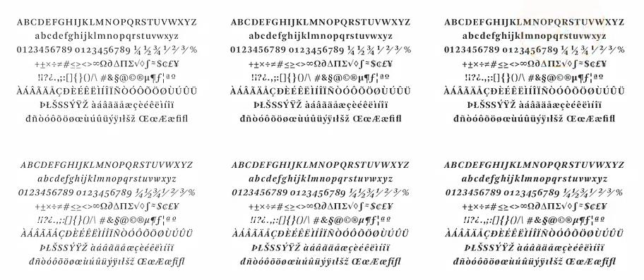

original link: https://www.douban.com/note/666373670/

> 一个纯种小白的一点笔记

上次的 [Note 1](https://www.douban.com/note/665653445/) 是 [Fundamentals of Graphic Design](https://www.coursera.org/learn/fundamentals-of-graphic-design) 这门课的一节, 这次我又开了 [Intro to Typography](https://www.coursera.org/learn/typography) 第一周的内容和上次大体相同, 就补充点之前没有的内容. 以下截图都是出自这门课.

## 一丢丢历史

众所周知, [活字印刷术](https://zh.wikipedia.org/wiki/%E6%B4%BB%E5%AD%97%E5%8D%B0%E5%88%B7%E6%9C%AF)最早是由毕昇在 11 世纪发明, 但是对西方真正起影响力的是一个叫 Johannes Gutenberg 德国人在 15 世纪 reinvented. Well, 似乎对于他是独立发明, 还是受中国的影响, 不是很明确. 嘛~这个不是我关心的重点.

毕昇

wooden type, 也就是模具是木制的

Metal type, 这个是 12pt Ultra Bodoni 字体

Metal type 使用起来就是这样, 感觉很 cool

这种叫 photo type font

## 再说 Typeface vs Font

在这个讲师看来, 似乎一定要说区别的话, typeface 是一个 big design project, 包括一个字体的所有设计细节, 例如大写字母小写字母, 数字, 符号, 特殊字符, 货币单位等等, 每个字符至少 3 种 weight 和 italic 不同也需要, 所以是有很多很多细节需要手工完成的.

要设计一个字体的所有细节, 大概就是这种感觉

## Stroke & Proportion

这俩是能体现一个字体的 texture 的东西.

**modulation** : Stroke modulation is how much the thickness of the stroke changes in different parts of the letter. 也就是说如果一个字体是 heavily modulated, 那么它的一个字母上, stroke 在不同的地方粗细差异会非常明显.

condensed 和 extended 就蛮好理解的了, 基本可以认为是字母的宽度.

字体还会看 counter, 也就相当于反向的观察.

这个挺有趣的, 像 n 这样的字母的最上面的弧线其实比 x-height 略高一丢, 这是因为眼睛会觉得 circles 是比 squares 小的, 所以需要将弧形的部分变得稍微大一点以补偿视觉.

也就是说如果真的让弧线与 x-height 成切线, 会觉得这个 n 的左边的那根 stem 太长而不协调.

## 又是 Font Size

原来还有 pica 这个单位, 6分之一个 inch

em: horizontal space as wide as the type size's tall

这个 em 虽然和 CSS 里 font-size 用的 em 不完全一样, 但是意义是相同的, 1em 都是等于当前字体的 font point size.

en: horizontal space as half wide as the type size's tall

## 其他

选择字体的时候也可以对比 aperture 这么一个东西. 参考上面两个字体的 a/c/e, 会发现上面字体的开口都比下面字体的大, 字母 c 特别明显. 这样的话, 当使用很小的 font size 的时候, 用上面的字体会更合适, 因为下面的字体在小 size 的时候, 笔画容易连到一起去 (blur with each other), 不易阅读.
