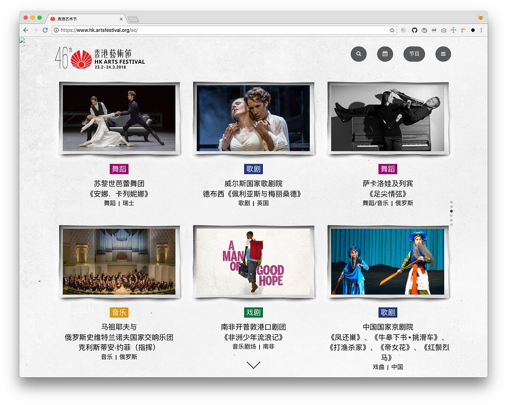
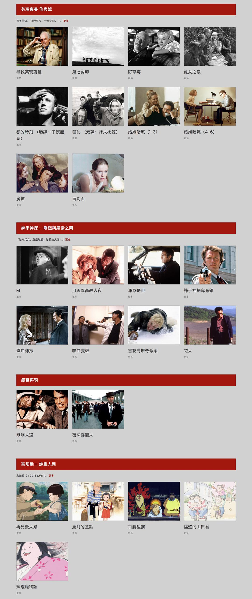

original link: https://www.douban.com/note/682858282/

> 昨晚上和几个深圳旁友烤肉, 被问香港有啥文艺活动推荐, 或者有些什么公众号或者获取信息的推荐, 所以简单列一个 list, 我个人感兴趣的参加过的活动.

## **香港艺术节 HKAF (每年 2-3 月)**

网站: [https://www.hk.artsfestival.org/](https://www.hk.artsfestival.org/)

每年最大的艺术活动了吧, 很多世界级的演出, 节目相当丰富. 当然, 并不那么便宜... 以前学生的时候买半价学生票开心的不要不要的, 现在穷了并且最近两年整体票价涨了, 所以最多看一两场便宜的或者真的有兴趣的, 或者某些觉得错过就可能再也看不到的节目.

### **购票时间**

1.  第一轮: 10月网上订票, 热门节目需要开票就抢 香港艺术节是前一年的 10 月就开始提前售票, 这个时间是直接在网上订票的. 但是网上订票是没有开放最便宜票价的, 但是如果是真的感兴趣的节目最好是这个时候先下手, 因为热门节目真的很快就被抢没了, 即使之后公开发售, 也不一定能抢到. 具体时间可以提前在 9 月份的时候去看下官网, 也有提前公布出来的一部分节目列表. 选节目本身也是很费劲的, 以及香港这些节目的通病都是, 看中文介绍和英文介绍都看不懂... (那种字你都认得, 但就是看不懂表达什么意思的`看不懂`😂) 另外网上订票需要用国际信用卡支付, 可以选择寄票到香港的地址, 也可以选择自行取票.
2.  第二轮: 12月票房公开发售, 还是一样, 热门节目开票就得买 如果热门节目网上没有买到, 可以等 12 月的公开发售, 一般香港的公开发售就是说可以去票房直接现场买票, 所谓的票房一般是指[通利琴行](http://www.tomleemusic.com.hk/home_tc.php)之类的专卖点. 别以为通利琴行只卖乐器...它有很多家分店可选, 尖沙咀有一整栋楼可以去玩的~

### **PS**

不知道是不是买过票之后才有, 我每年都会收到艺术节的 email, 会有通知"啊, 我们请到xxxx来表演了!" "啊 我们x月x日就要开票啦!" "啊 这个节目加场了!" "啊 这个节目还没有卖完快来买吧!"

## **香港国际电影节 HKIFF (每年 3-4 月)**

网站: [http://www.hkiff.org.hk/](http://www.hkiff.org.hk/)

艺术节完了就是电影节, 其实香港不止这一个电影节, 还有很多其他的欧洲电影节啦, 亚洲电影节啦, 可以具体去关注, 但是还是国际电影节最能吸引人了, 有些电影如果是亚洲首映全球首映的话, 还可能见到导演和主演. 不过它也很有毛病的, 在开票前可能提前两天才公布排片, 选择合适的时间想看的片又是一件很费劲而且很紧迫的事, 因为一样, 热门电影开票马上会被抢空... 以及一样, 网站难用...

### **购票时间**

3 月, 开始前几天才能买票, 网上订票也是一样国际信用卡支付, 可邮寄香港地址可自行取票. 也是可以直接去票房购票.

### **PS**

电影节的票都是不设划位的, 先到先得, 所以一般会比开场时间早到电影院去排队, 不想坐第一排看电影的话, 也需要早点去排队.

## **Cine Fan 电影节发烧友 (除电影节外几乎每个月都有)**

网站: [http://cinefan.com.hk/](http://cinefan.com.hk/)

这个也是香港国际电影节协会办的日常活动, 每两个月为一个周期, 以一两个主题放映电影, 很多老片经典. 例如最近 6-7 月的是这些:

### **购票**

网站上有购票链接, 一般是链接到 [URBTIX 城市售票网](https://ticket.urbtix.hk/internet/)上去买票了. 另外觉得有必要的人可以直接交年费成为电影节发烧友会员, 每年也就 120 HKD, 买票就打八折, 详见[此处](http://cinefan.com.hk/zh-hant/privilege-scheme/)

## **香港书展 (每年 7 月中下旬, 湾仔会展中心)**

网站: [http://hkbookfair.hktdc.com](http://hkbookfair.hktdc.com/) (今年的马上开始了, 7月18日-24日)

估计这个很多人都知道的吧, 不过我去过几次之后暂时不想再去了, 首先排队太长了, 队伍又大部分在室外热死, 进去之后又挤死, 展区太大, 从来也逛不完...以及人太多的一个毛病是在展区你的手机没有信号... 不过这个体验大概是 13 年还是 14 年的时候, 那一次和朋友走丢之后手机完全用不了, 用会场内部的专用座机才联系上, 不知道现在是否有改良.

### **购票**

去的当天可以直接在湾仔地铁站出来找 7-11 或者 Circle K 买票

## **香港動漫電玩節 ACGHK (每年 7 月底, 湾仔会展中心)**

网站: [www.ani-com.hk](http://www.ani-com.hk/) (今年的是 7月27日-31日) 书展刚完就是这个, 这个是大厂商和出版社来卖货的展, 也有一个 cosplay 比赛. 一样的毛病是排队累人.....进去之前买票, 很 easy.

## **同人展**

才发现 ACGHK 也附带自己搞了一个同人展 Creative Paradise, 已经第5届了. 没去过具体情况就不知道了. 我以前去过的比较喜欢的两个同人展是 CWTHK 和 Rainbow Gala.

### **CWTHK**

网站: [http://www.comicworld.com.tw/Acts/hk](http://www.comicworld.com.tw/Acts/hk) 其实 CWT 本身是台湾同人志贩售会, 所以单独搞的这个 CWTHK 是在香港卖台湾太太们的作品的展, 所以不管是到场的 coser 质量还是同人质量都很不错. 今年的会在10月7日举办.

### **Rainbow Gala**

网站: [http://www.rainbow-gala.com/](http://www.rainbow-gala.com/) 这个就是纯粹香港本地举办的活动啦, 似乎每年都有两次, 一次4月一次12月, 很不错的了, 名字起得也很好~

## **End**

以上是一些常规的每年都会有的活动, 其他的小活动信息推荐使用 Timable ([http://timable.com/](http://timable.com/)) 获取. 这个网站搜集了全港各种大大小小的展览/活动/节目, 很全面了. 有手机 app, 体验一般, 能用就行. 还有几个主要的购票网站供参考:

-   城市售票网 [https://ticket.urbtix.hk/internet/zh\_TW](https://ticket.urbtix.hk/internet/zh_TW)
-   购票通 [https://www.cityline.com/Events.do](https://www.cityline.com/Events.do)
-   快达票 [https://premier.hkticketing.com/](https://premier.hkticketing.com/)

[https://shimo.im/docs/5AdLSJWr55EQHFTZ/](https://shimo.im/docs/5AdLSJWr55EQHFTZ/%20%E7%82%B9%E5%87%BB%E9%93%BE%E6%8E%A5%E6%9F%A5%E7%9C%8B%E3%80%8C%E9%A6%99%E6%B8%AF%E6%96%87%E5%8C%96%E6%B4%BB%E5%8A%A8%E6%8E%A8%E8%8D%90%20%28?%29%E3%80%8D%EF%BC%8C%E6%88%96%E5%A4%8D%E5%88%B6%E9%93%BE%E6%8E%A5%E7%94%A8%E7%9F%B3%E5%A2%A8%E6%96%87%E6%A1%A3%20App%20%E6%89%93%E5%BC%80)
