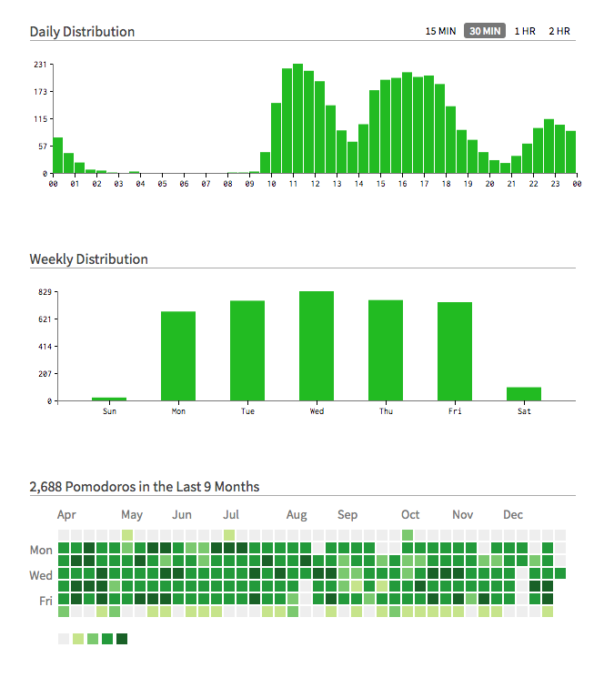
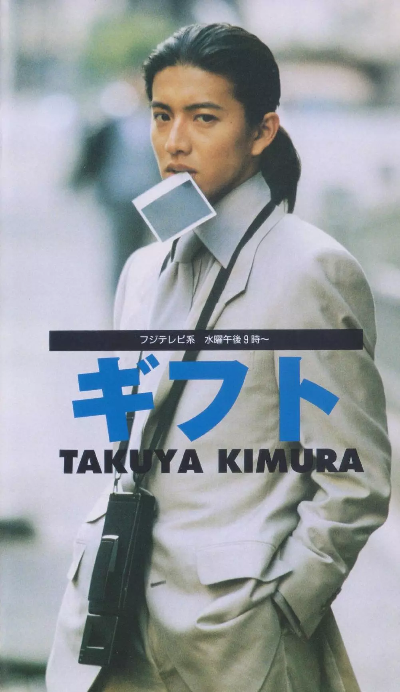
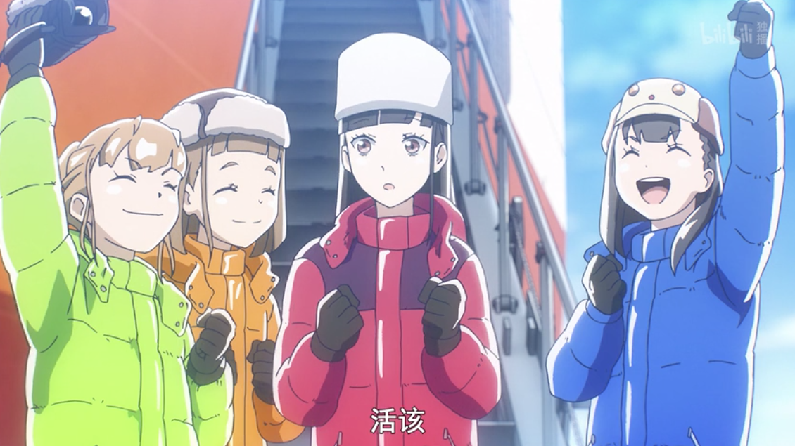

2018年终于平稳得在深圳呆了一年，home office 了一整年，**≈宅了一整年**。

平稳的生活了一整年，以致于参照往年的总结，觉得好像没啥值得写年终总结的。。。。。但总觉得这个年更的东西都写了 7 年了，还是让它坚持下去吧~

在深圳的大主卧的生活可以说是很舒爽了，连麻麻两次来短住都直说不想走了www 基本上 2018 年算是坚持了一下稳定的作息，包括稳定的晚睡😂 可以说是 home office 必需的自制了，否则可能什么事都做不出来而被炒。。。

再以及全年也基本坚持自己做饭（仅限工作日），只允许自己每周周末有 1- 2 个外卖 quota，感觉比较健康，也没有太苛求，体重上半年稳定下降，下半年基本稳定不变（除非出去玩长个2-3斤）当然，说是自己做饭，对于我一个不怎么会做饭也对做饭没有兴趣的人（当然我从不以吃货自居）来说，做饭真的大部分来说只是填饱肚子，所以基本只追求在最短的时间做出味道不难吃营养还算均衡的饭，我待在厨房的最大极限是1个小时，极度不喜欢处理生肉，所以经常买半成品或者冷冻鱼类肉类或者腊肠腊肉类，所以即使坚持自己做饭，手艺可以说没有半点提高，以后也完全不想改 `_(:з」∠)_` 这么说起来，做饭对于我也是工作的一环而已，属于可以轻松完成的但是完全不热爱的简单工作，和豆瓣众友邻真是完全相反哈哈哈哈哈~

再以及，宅着一整年发现自己越发的洁癖了，对室友的所有不整洁不卫生的地方越来越无法忍受，经常放弃单纯等待保洁阿姨的到来，自己有一点看不爽的时候就马上打扫，不知道会不会越来越严重。。。😂😇

## 设计 & 日语
今年有关学习的话这么两个主题。

作为一个弱鸡颜狗前端，总觉得会做设计的前端才是完美的，也一直觉得自己会做设计才有前途。跑去 Coursera 报了几个 Graphic Design 的课，1个多月就刷完了，虽然不是说完全没用，也就稍微多了一点基础知识而已，最主要也就是让我对 Typography 有了不小兴趣。但是要说做网页设计，仍然大脑一片空白，大概我真的是个没有想象力的人吧。这方面就和我不会画画，也做不出漂亮的手帐一样，是因为脑子里并没有那些画面吧。嘛，这个主题对于我比数学和编程还难，以后再慢慢花时间吧~
有关 Typography 写了三个简单的笔记：[一](https://www.douban.com/note/665653445/) [二](https://www.douban.com/note/666373670/) [三](https://www.douban.com/note/667028571/)

年初的时候就想好，终于有空继续考日语了，决定好了12月考 N1。于是，2018年我开始经常性使用 twitter 了，10年前就注册了账号但不太明白怎么用而搁置了，但是当时就 follow 了不少声优、漫画家、动画和出版社公式推之类的，现在终于可以基本看懂了，所以逼迫自己多阅读点日文先~ 毕竟直接看长篇大论的话肯定吃不消，还是用自己感兴趣的内容让自己习惯先。

本打算把备考战线拉长，每天花不多的时间（< 2hrs），轻松点完成复习，但前提是先把单词背完。。。自然是过于乐观了，复习计划并没有完成。另外，复习的中途发现自己连 N2 以前的知识点都基本忘光了，毕竟是 2014 年考的了，也并没有更多余的时间再补一补了。再以及11月的时候因为公司开大会必须跑杭州几天，前后都要赶工，整体心态被打扰，11月基本没有好好复习冲刺一下，最后只好怀着放弃的心态去散步了。嘛，打算今年再考一考了，但是说实话即使考过了还是觉得很渣，至少我写不出成篇的东西，连一条长一点的推文都不一定写的清楚。想要更加上手い，还是得努力试着去写，前两天想到**试着写漫画 review**，因为今年的恶劣环境，开始自力更生自己买电子漫画了，bp 多年终于正当的付钱了，所以顺便写点 review，还可以赚积分，看更多的漫画~

## 工作
前面说到觉得会做设计的前端很厉害，如果“设计--前端--后端”，是这样的连接关系，我觉得在设计和前端中间靠近前端的人很厉害 <- 一直想做这样的人，但今年的感觉是我大概更像是在前端和后端中间的人。。。

今年有一半工作时间都在做一个比较奇怪的项目，是我司大佬快速 prototype 出来的，我在继续完善中，大佬是 perl 的大粉丝，所以这个项目是用 perl 和 js 混合写的，我不得不从头学习 perl。港真，学了 perl 之后深刻的觉得 python 真特么简单，perl 的语法有些地方是真的费解，以及各种约定的标记虽然用熟了觉得方便，不了解的时候看代码觉得简直天书，也特别容易错。但是 perl 的强项是文本处理的便捷，正则真的好用，今年也努力熟练了正则，js 的正则我也不怕了哼哼哈哈哈

是的，搞了挺长时间 perl 的项目的时候，我的 js 几乎止步不前中。。。`_(:з」∠)_` 😢 按照大佬的愿景，2019 的重点可能是可视化的方向了，11月赶工的就是这些方面的 demo，这也算终于比较像是真正的前端了吧？

顺便推荐一个用了一年的浏览器插件，[Marinara](https://chrome.google.com/webstore/detail/marinara-pomodoro%C2%AE-assist/lojgmehidjdhhbmpjfamhpkpodfcodef)，其实也就是个番茄钟，我并没有特别遵守番茄钟的作息安排，只是单纯用它来提醒时间以及统计每日的工作时间，虽然不准，也是参考嘛~

## 日常与非日常...

### 面基
前面也说到今年开始经常刷推，虽然本意是想多看点日文资讯，但还是免不了多拓宽了一下，关注了不少中文推圈的程序员设计师之类的，其中有幸和两位推友面基了一下。一次就是 8 月去东京玩的时候去见了在东京工作的前端工程师，另一次就是去杭州开会的时候见到了一位挺特别的有听力残疾的算法工程师。如果把见 Az 也算见网友的话，今年见了三位网友，一把年纪还在干这种听上去中二的事，怪开心的wwww

### 又去霓虹
今年去了两次霓虹，达成东京（[平成最后の夏](https://www.douban.com/note/687932624/)）和北海道（[平成最后の冬](https://www.douban.com/note/701265318/)）心愿~
本来只达成东京成就就挺开心的了，结果后来十一正常工作调休了三天，调休又必须年内休完，于是迅速决定带着麻麻去北海道玩，感谢麻麻完全交给我规划安排，她也不像以前一样 bb 我的兴趣爱好，我得以以我喜欢的方式玩，完全没有任何和家人出行的烦扰。
在北海道的几天，麻麻也很满意我的安排，每天开心地 po 朋友圈。麻麻提到我从小喜欢动漫，后来自学日语，就有同事留言问她，是不是不应该禁止他们家小孩看日本动画，麻麻坦然说看个人兴趣吧，“你看我禁止也没成功” 233🤣

### 游戏
今年终于成为了主机游戏玩家，买了 Switch，沉迷塞尔达了一段时间，现在大概140+，还没有去打盖弄救公主，以及手残如我，还没学会盾反，也还是见到人马就跑。最近喜欢玩分手厨房，希望能一个人通关。自我定义是个边缘玩家，完全不硬核的，毕竟手残+智障。但还是希望能接触更多有趣的游戏~

### 日剧
今年看的剧和动画和去年持平，还有很多看到一半跟丢的，当然一般都不好看。。。

今年一定要看的新剧的话：
- [大叔之爱 (2018)](https://movie.douban.com/subject/30156023/) :
red 到可怕，虽然最后一集很想给编剧寄刀片。以及田中圭彻底火了，可惜我们小林子貌似没有那么火？不过这一波让他们俩的写真集都重版了，去东京的时候买到了小林子的写真集 Clear，19岁的小林子真的好看到 cry

- [非自然死亡 (2018)](https://movie.douban.com/subject/27140017/) :
十元和 masa 小哥的各种 look 满分，Lemon 满分~

- [我是大哥大 (2018)](https://movie.douban.com/subject/30183785/) :
做一个沙雕，开心就好~人夫也突然火了呢~ op 真的喜欢！

另外今年应该只补了一部日剧，但是疯狂推荐：
- [快递高手 ギフト(1997)](https://movie.douban.com/subject/2333693/) :
大概是大神颜值巅峰了，真的太帅了：“长发偶尔扎个小辫，穿gucci西装，抽雪茄，背着拍立得骑单车” 这个形象实在太适合大神了！当然推荐的理由不只是因为大神的颜值，剧情本身也足够有趣呀，情节不拖沓，人物也都很可爱~ 还有开头的主题曲 Tokyo Joe 太好听了！！我 ball ball 你们去看！！

### 番组
动画上很多新番没看，补了几个旧番，一起说下：

- [比宇宙更遥远的地方 (2018)](https://movie.douban.com/subject/27080661/) :
小南极太美好了！剧情其实很简单，几个高中女孩子，跟着科考队去了南极的前前后后。可以说这才是我最向往的青春！到达南极第一件要做的事并不是为了母亲，而是为了让曾经嘲笑过的人看看，大笑三声，「ざまあみろ！」

- [MEGALO BOX (2018)](https://movie.douban.com/subject/27157760/) :
音乐十分！

- [恶魔人 Crybaby (2018)](https://movie.douban.com/subject/26997470/) :
想到原作是 72 年的就觉得太吊了，虽然没有看过前面的版本，但觉得这一版也挺好的，音乐也好听~

- [齐木楠雄的灾难](https://movie.douban.com/subject/26801048/) :
直接把一季补了之后，就有了二季，年末出了完结篇，太喜欢齐神了！里面的角色全都馬鹿又可爱~

- [灰羽联盟 (2002)](https://movie.douban.com/subject/1472128/) :
16年后的补番，这部片太温柔了，结尾还是看哭了，疯狂推荐两个结尾曲 Blue Flow 和 Love Will Light the Way

- [兽爪 (2006)](https://movie.douban.com/subject/1950888/) :
非常喜欢愚蠢的哦多多，并且因为哦多多便当而哭成傻逼😭

### 电影
今年看的电影还是不多，最喜欢的是影帝之所以称为影帝的[《无人知晓》](https://movie.douban.com/subject/1292337/)，单纯觉得影帝太好了。而在这之后在东京看了[《银魂2》](https://movie.douban.com/subject/27199577/)，影帝的宅十四可爱到窒息，所以，现在影帝在我最喜欢的男优排行上极速上升到第二了！（第一永远是🌰~）

另外想推荐 2017 年的[《啊，荒野》](https://movie.douban.com/subject/26842503/)，虽然苏打拿了最佳男主角，但是我个人认为梁益准演的更好，他的角色比苏打的角色更复杂，更有层次。

另外非常震撼的一段是电影节的时候看老片[《盗火线》](https://movie.douban.com/subject/1295686/)里看到的，中间有一段非常 hardcore 的街头枪战，三个人几把机关枪被围攻，但就是完全硬怼，没有爆炸，纯粹的枪林弹雨，三个人拿机关枪扫射警车突破围攻。这一段完全没有配乐，只有机关枪的突突突和“go！go！go！”。镜头一气呵成，看得非常爽~

### 音乐剧
再，今年受安娜推荐看了一点音乐剧，当然只有一次现场，就是[《骑士物语》](https://www.douban.com/location/drama/30224412/)，其余都是看的 b 站视频，可以看这个[收藏夹](http://space.bilibili.com/173101/favlist?fid=2864304)。

## 2019
一定要说有什么愿景和计划的话：
- 考过 N1，尝试多写日语
- 想练练字，写日记写的字太丑了
- 大佬给的书单要看了。。。
- 可视化方向的技术学习
- 比现在早一个小时睡觉，希望能做到 1 点睡着 `_(:з」∠)_`
- 保持体重

啊，是不是想问标题是肿么回事。10月的时候去剪头发，被理发师说以后发际线可能有危险

我：.........（苦笑）

whatever，该秃的还是会秃。。。我会努力早点睡的`（<ゝω・）☆`

附前几年总结: [2017](https://www.douban.com/note/650747131/) [2016](https://www.douban.com/note/600437210/) [2015](https://www.douban.com/note/532445213/) [2014](https://www.douban.com/note/475347560/) [2013](https://www.douban.com/note/329611675/) [2012](https://www.douban.com/note/255202347/) [2010](https://www.douban.com/note/125442027/)
