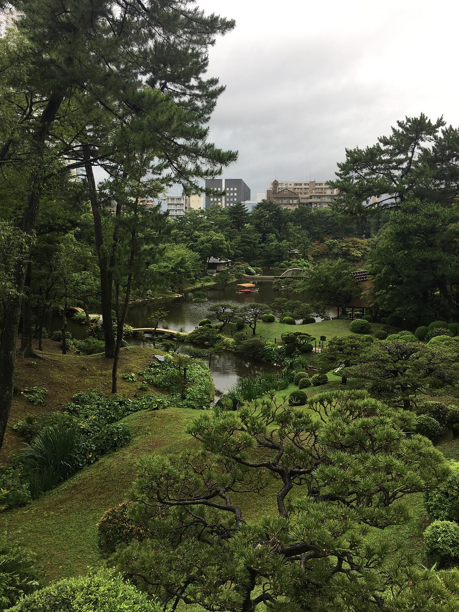
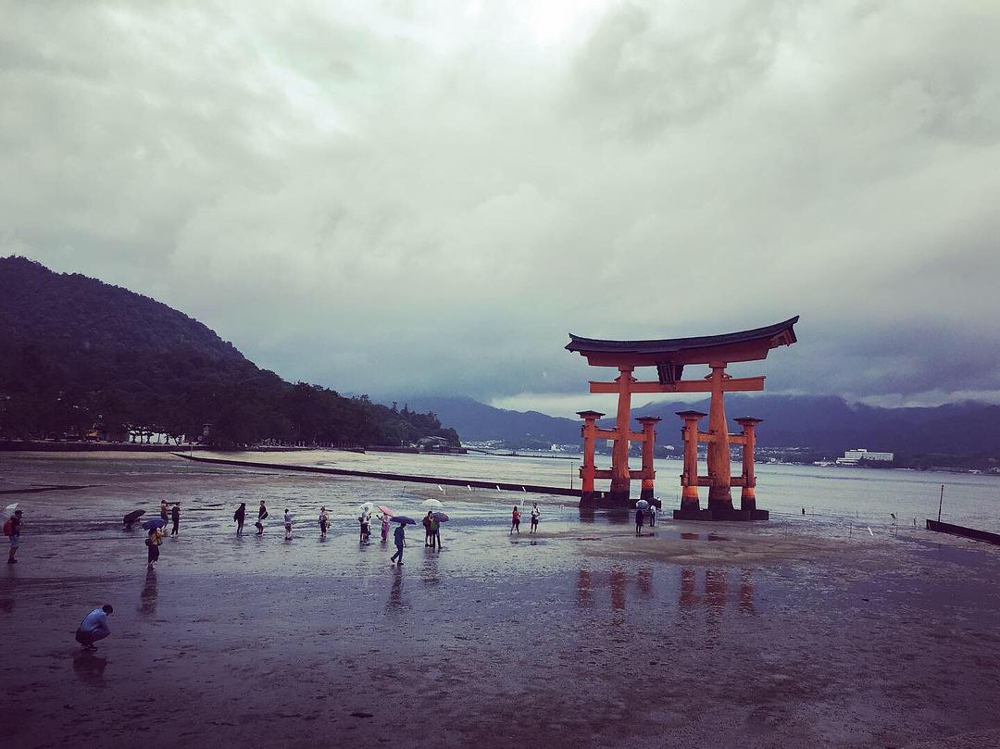

original link: https://www.douban.com/note/728267844/

前情提要： [其一](https://www.douban.com/note/728217071/)

## 7.21 广岛一日游（缩景园，核爆和平纪念公园，严岛神社） 上午大雨☔️，下午阵雨🌧

那么来继续扯淡 Day2。

7点半起床，去坐 8：05 的新干线去广岛，从 JR 站腿 10 分钟左右就可以到缩景园，缩景园是 9am 开门，于是正好做了当天第一批游客。缩景园相比后乐园来说，就非常正常的日式园林了。在缩景园逛的时候，广岛开始了下大雨，当然在园林里看雨也并没有很大问题，园子在雨中也有不一样的好看。

走去缩景园的路上，看，好多好多乌云☁️

缩景园，正常的园林

下雨的时候

有一阵雨大的时候，坐在园中的亭子里听雨，发现池子里有好多只🐢

从最高点看

缩景园大概 1 个小时就可以逛完，然后可以顺路经过广岛县立美术馆、广岛城、广岛美术馆，到达核爆纪念顶 Dome。因为时间不太够，美术馆和广岛城都没有进去。总共这一段也走了可能快半个小时。核爆 Dome 以及纪念碑、和平纪念资料馆都是在和平纪念公园里面，这是个挺大的一片区域，没有下雨的话挺适合散步的。为了去赶严岛神社的涨潮时间，和平纪念资料馆也没有时间进去淆习淆习了。在公园里顶着雨大致走了一通后，就坐巴士转JR再转 ferry 去到了严岛神社。

核爆 Dome

世界和平🙏🏻

从宫岛口到宫岛的 [ferry 时间表戳这里查](http://jr-miyajimaferry.co.jp/timetable/peak/) 宫岛的涨落潮时间推测表[戳这里查](http://www.miyajima.or.jp/sio/sio07.html#calendar)

[按照安娜的说法](https://www.douban.com/note/529074735/)，「神社最好涨潮去看，浮在水面上很美好，然后等到退潮可以走到大鸟居下面，感受一下它到底有多大。严岛神社浮在海面上是潮水位置高于250cm以上，可以走到大鸟居下的时间则是潮水低于100cm以上。」

所以在查过当天的涨潮退潮时间的时候，才决定一定要 12 点半左右到达神社，先参拜一下还浮在水上的神社，然后就继续在岛上待着等大概 5-6 点的退潮，可以考虑坐缆车上山顶登高望远一下~

坐 ferry 靠近时已经可以看到大鸟居⛩

中午 12 点半的样子

虽然已经不是最高潮，但神社大体还是在水里的

从神社望鸟居

抽了个签，难得有大吉！

如果是已经退了很多的时候来看神社，大概就是这种感觉了噗w 所以还是推荐水位高的时候过来

参拜完神社就去旁边的商店街觅食了，这边的特色还是あなご和牡蠣，所以中饭就是这俩了。因为吃完饭其实已经 2 点多了，下午也还是不时阵雨，本来想说坐缆车去山上转转也放弃了，毕竟这个天气，可能到山上啥也看不见，于是两个人开始愉快地逛起来商店街消磨时间。

炸牡蠣定食

这次是同行友人吃あなご

岛上的特产还有一个是木制饭勺，手感真的很不错~

各种各样的勺子

另一个特产，もみじ饼，可以理解为做成红叶形状的有各种味道的铜锣烧，还挺好吃的

在一家老店看到它们的产品编年史~

又一家神奇的酱油店，真的有很多种酱油，可以闻出非常不一样的味道，还有渍物、酱、仙贝之类的特产都很有意思，好多种还可以试吃

本以为至少要等到 5 点半~6 点才能等到潮退到可以走到大鸟居，结果再商店街全部晃完无事可做的时候，5 点不到的时候发现走到大鸟居的路已经完全 ok 了。然后就欢快的走过去和大鸟居合影了，完成了今天的打卡任务，噗。最可惜的是今天是完全的阴雨天，要是大晴天的话，大鸟居就更好看了，也许会想等到夕阳的时候看。

下午 5 点前已经可以走到大鸟居了

都是各种裙带菜，感觉很好吃

走到跟前真的很能感受到⛩的大大大大大

抓拍到一只乌鸦

以及一个远处在拍什么的摄影师

和大鸟居合完影就准备往回了，顺路看到一家卖咖喱牡蠣面包的，买了一个吃，好吃~

本来计划这一晚在广岛吃个广岛烧当晚饭的，可是中饭吃的略晚，在商店街也吃吃喝喝了不少小吃，于是放弃吃广岛烧，在广岛站的商店里逛了很久，买了一些和果子当手信，还有一些小零食当晚饭。

那个丑丑的脸就是因岛的特产八朔🍊 jelly，个人感觉八朔不太酸不会很甜带一点苦味，おとなぽいw 今天才看了上上周的 jio 岚，发现 aiba 才骑车经过了因岛

柠檬味小蛋糕，好吃，濑户内的特产柠檬🍋~

这天回到酒店大概也是 8 点的亚子。。。

Day2 磕完。待续。

<<< [Day1 冈山后乐园 + 兔子岛](https://www.douban.com/note/728217071/)

\>>> [Day3 岩国锦带桥 + 尾道](https://www.douban.com/note/728415477/)
