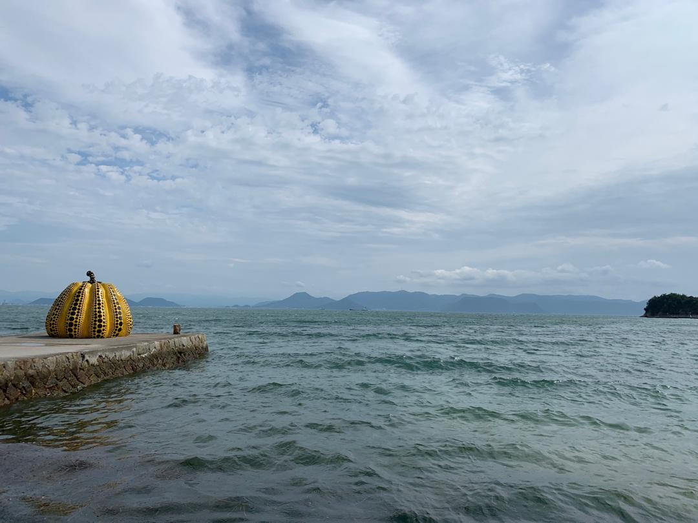
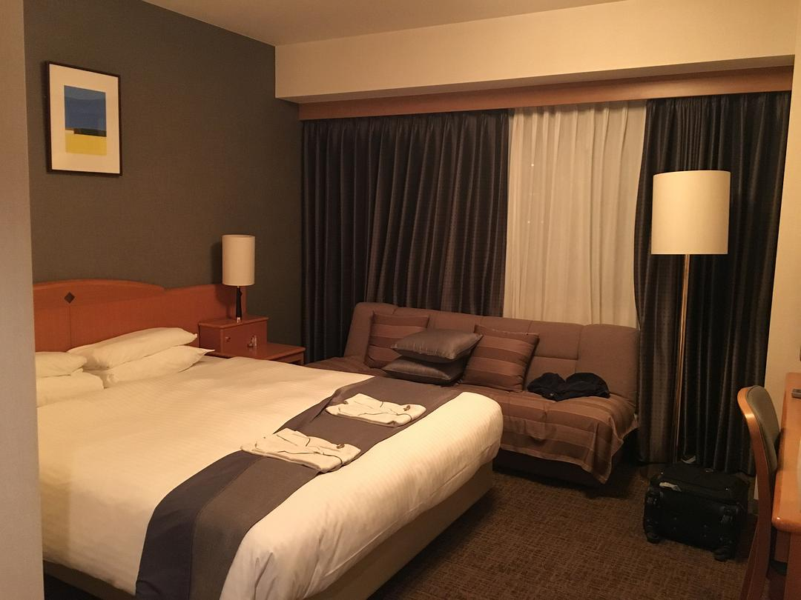

original link: https://www.douban.com/note/728579087/

前情提要：
- [其一](https://www.douban.com/note/728217071/) 冈山后乐园 + 兔子岛
- [其二](https://www.douban.com/note/728267844/) 广岛一日游
- [其三](https://www.douban.com/note/728415477/) 岩国锦带桥 + 尾道

## 7.23 直岛 大晴天☀️☀️☀️

终于要开始讲扯艺术节跳岛了！兴混！想来艺术节玩其实是大概 2 年前（还是 3 年前）与旁友相约的，毕竟三年才一次，还是不想错过的~ 经历了三天阴雨，后面跳岛的四天全都大晴天，总之热热热晒晒晒，每天衣服都不知道汗湿透几次。

艺术节官网

首先，有关艺术节的所有信息基本都可以在它的官网上找到：[https://setouchi-artfest.jp/](https://setouchi-artfest.jp/) 最重要的信息之一是来往船的班次时间以及岛内交通情况，其次是展馆的开放时间，以及是否需要提前预约或领取整理券等，其他还有比如食宿、活动信息等等等等。因为把官网翻来覆去看得差不多了，我并没有装官方的 App，后来途中遇到一个台湾妹子，聊天的时候才知道这个 App 还是挺有用的，没装 App 也算我的失策之一。直岛整体安排都是这一程里最失败的一天，甚至是我自己做行程以来最失败的一天，等我慢慢吐槽 😂😂😂😂😂

本来想艺术节跳岛的第一天去犬岛的，也是为了去犬岛才在冈山住的，犬岛应该是唯一一个在冈山住会比较方便去的岛。但是不巧，23 号这天是星期二，犬岛和丰岛都休息，于是 23 号的行程安排只能是直岛了。

从冈山去直岛的话就必须去宇野港了，虽然 JR 只有一条很慢的普通车宇野线，但毕竟还可以用 pass，就还是很开心的~ （所以说 pass 真的值w）早上又是 7 点起床，去赶 7 点 40 的车去宇野港，8 点半才到达。然后去宇野港的案内所里兑换了事先购买的艺术节的 passport，其实是一本小册子，可以理解为所有作品鉴赏打卡 stamp 收集册。怎么说呢，有了这本小册子，突然对于去到每一个可以打卡的地点这件事有了兴趣（适合热爱收集以及有点强迫症的人哈哈哈哈哈哈哈）。但其实，每个岛的所有 stamp 都是一样的，有部分 artwork 是露天自行随意打卡的，所以其实你可以伪造自己所有地方都去了的假象，但这又有什么乐趣可言呢！

宇野港

宇野港案内所，早上 8 点就开门了

基本上艺术节的案内所都会在每个港口附近树一块这样的白板，提示大体需要重点注意的事项

比如地中美术馆是需要提前预约的，丰岛今天休息了

艺术节作品鉴赏 passport 其实相当于一个通票，也就是你花 4k yen 买了一个通票，然后包括在其中的各个大小艺术展馆等都可以凭它入场，所以当然去得越多越划算。不过最出名的两个也比较贵的不包括在通票中，一个就是地中美术馆，一个是丰岛美术馆，这两个都推荐提前网上选好时间买好票，存个二维码到时间直接去就可以了。

艺术节购票方法的话，对于歪果仁，最简单的就是到场直接买，比如宇野港案内所就可以直接购买，或者在官方指定的一个叫 Peatix 的 app 里面购买，到案内所直接出示 App 里的二维码就可以兑换 passport 小册子了。详见 [https://setouchi-artfest.jp/visit/passport/purchasing.html](https://setouchi-artfest.jp/visit/passport/purchasing.html)

夏季艺术节 passport get！外面那个 case 可以挂脖子上，是这次艺术节最实用的周边，没有之一

这个 case 是正反有两个小袋子的，所以相当实用，船票门票之类这种小小的容易搞丢的东西全部塞在里面就好

宇野港看到的装置

井盖 4 号

对了，前面没说，其实第一天白鞋被泥巴搞脏了以后，回酒店拿牙刷+洗手液狠狠的搓了一阵，然后用吹风机怼着吹，于是第二天正常穿了，后面终于不用看着脏鞋不爽哈哈哈哈哈哈哈

来回船票~

宇野来回的船是这几天坐的最舒服的！又比较少人~

对窗有专门的看风景座位，相当贴心

接近宫浦港的时候在船上已经可以看到南瓜 1 号了~

走近看 其实不会太密恐，它就是 na01 stamp

这个有一大片顶的其实是 na02 海の駅「なおしま」 被同行友人科普是建筑家妹岛河世的作品，抱歉，我总是会想成妹尾河童。。。😅

海の駅 其实就是宫浦港的案内所+卖船票+特产壳店的地方，同行友人科普说妹岛河世的特点就是通透感，喜欢用薄铁板搭配很细的支柱，感觉很轻盈，再加上用整面整面的玻璃，所以显得非常通透，所谓穿透性风格

南瓜2 号的巴士

坐 9 点 22 的船，20 分钟就可以到达直岛的宫浦港。我预约的是这一天的 10 点半进入地中美术馆，所以 9 点 42 到达直岛后，从宫浦港去到地中美术馆在我的计划里时间上应该是绰绰有余的。

直岛岛内的交通的话，是有两班巴士的，一班是从宫浦港到本村港再到つつじ荘，另一班是在地中美术馆、李禹焕美术馆、Benesse house musuem 之间行动的。非常让人费解没有从宫浦港去地中美术馆的巴士，就像△缺了一条边。

另一个选择是租自行车。自行车或者徒步的话，直岛旅游网上提供过[一个 roadmap](http://www.naoshima.net/wp-content/uploads/2018/04/d1ab9d1443a42bfa152243a3299a8f08.pdf)，我想我大概是不想仔细规划巴士的时间，看着地图上面写的从宫浦港到地中美术馆徒步的话 30 分钟，自行车 15-25 分钟，我就想着，不如租自行车吧，到各处就时间上比较随意了，不用为了等车而在大太阳下暴晒什么的。直岛旅游网上也提供了[有几家提供租自行车的](http://www.naoshima.net/access/rental/)，每家大概有几架车多少钱可不可以预约，然后对比一下有多少自行车以及价钱，预约了其中一家叫 TVC 的普通自行车，也主要是他们家填表发个邮件过去就可以了。

下了船之后走几步就找到了 TVC 取了车，每辆自行车上都附着全岛地图，取车的时候 staff 指着地图说，这一部分画圈的部分都是上上下下的山路比较危险，请小心点哦~ 指的正是马上要去地中美术馆的一部分路。我这时有点惊讶，但还以为不是很大问题，欢快地咻骑走了。不久后，我马上体会到什么叫上上下下的享受（上海三菱电器~~）从港口到地中美术馆，应该 70-80% 都是上坡，我一个平时不运动的人，是 why 骑自行车爬山找罪受！！！其实当时我就应该想一想的，why 步行 30 分钟，自行车写的是 15-25 分钟，如果是平路，其实自行车也就 10 分钟就够了吧！！！是的，我是个傻 b，为什么要租自行车！！！我完全没有想到是有这么多山路。。。。这还只是开头。上坡上到骑不动的时候，只好下车推车上坡，再一次发出灵魂的拷问，我 为 什 么 要 租 自 行 车 😣😵😱🤯 赶到地中美术馆的时候，衣服已经全部汗湿。逛一逛美术馆让自己冷静一下。。。 地中美术馆预约购票地址： [https://www.e-tix.jp/chichu/](https://www.e-tix.jp/chichu/)

众所周知，出名的美术馆大都不让照相，所以[去官网看看图片](http://benesse-artsite.jp/art/chichu.html)就好。

大门拍个照还是可以的

地中美术馆还是蛮好看的，不管是建筑本身，还是其中的一些艺术品，都挺值得票价的，一种特别的体验是换上拖鞋进入画室看莫奈的画，可能因为这样会让画室更加安静下来，走路都不会有声音。我极其喜欢莫奈画室地面的马赛克，专门买了手信也是马赛克的 folder 和明信片。

总的来说也不大，实在累了，在地中的 cafe 买了甜品和饮料吃，甜品都非常好吃，就连盘子上的那些看上去很腻色素很多的果酱都很好吃，因为其实一点也不腻，黄色的是橘子酱，红的忘记了味道。两瓶饮料一瓶是 olive cider，一瓶是盐味 cola，都好喝，清爽~

结果上面的甜品算是中饭了。。。。从地中美术馆出来应该已经 12 点半了，马上往李禹焕去了，结果发现此程最坑爹的地方，如下图：

李禹焕美术馆和 Benesse House 的一大片都属于 Private 区域，自行车不能入内，在这一块除了走路，唯一的交通工具就是蓝色那条巴士线，而我的功课做的最失败的一点是，事先没认真看到这条蓝色线其实是免费的！！！红色的巴士线是町营巴士，每次单程 100yen，不管你从哪里坐到哪里。蓝色的是 Benesse 自己运营的 shuttle 小巴士，就一车大概就 20 个人的那种。再次感叹，何 必 租 单 车！

么办法，在李禹焕北门把单车停下后，直接徒步去了李禹焕，逛完再徒步去了 Benesse House Musuem，逛完再坐了躺巴士返回李禹焕，取回单车。然后因为不能走 Private 区域的路线，带着单车的我们只能继续往山上走，翻过山顶再下山回到南瓜 2 号的沙滩。整条路几乎没人，车也极其少，真的傻子才走这条路。。。。上坡上到怀疑人生，虽然下坡稍微有爽到一丢丢也有非常不错的风景，但balance 不掉上坡的痛苦。。。

@李禹焕美术馆

@李禹焕美术馆，也是安藤忠雄作品

途径一个不明所以的海边🛁 装置，还和风水相关

Benesse House 偷拍了一个平台

也不记得是啥的 artwork

seen/unseen known/unknown, 在地图上海边的一个 artwork，据另一友人说是环保主题，「讲人造品与周围环境特别是海之间的关系」，看了它们，我还是一头雾水

经过一阵疯狂的踩单车，也没注意到底踩了多久，中间夹杂推车上坡，最后大概快 3 点的时候才终于到达南瓜 2 号的沙滩，但是鉴于排队拍照的人太多，没有上去等拍照，也忘记去盖章。。。然后迅速的往本村港赶过去，因为发现不少展馆都是 4 点或 4 点半关门。。。。真的很想吐槽，冬天也就算了，大夏天的为啥关门这么早！！！也因为这样，有很多「家 project」项目的展馆我没看到，也没盖章。。。直岛最终成了stamp 收集最不全的岛（去过的）非常桑心💔

下山途中已经能看到南瓜 2 号

就很多人排队等拍照

我就旁边这样拍一下就算了，只是忘了去盖章。。

骑单车唯一的好处可能就是看到好看的景色可以随时停下来看看，这天阳光海岸一切都很对就是了~ 🏖

就是这样的普通单车，连电动车都不是。。。

努力赶到本村港后，只去到几个馆，以及去到南寺才知道需要事先领取整理券，当日的整理券已经派完了，虽然我在闭馆前赶到了，还是进不去了。。。这又是我的功课没做足，事后遇到的台湾妹子告诉我们说就是可以用 App 看当天的整理券派发情况。

na09 直島港ターミナル 给登船的旅客的等待室

na08 直島ホール 赶到的时候 staff 正好在眼前锁门。。。。。。。🤦🏻♀️

na07 The Naoshima Plan 2019「水」 难得关门晚一点，还可以泡 jio 休息的地方，也蛮漂亮的

jio 入镜 🦶🏻

真的蛮喜欢这个 project 的

赶到的时候也正好关门的 na16 岂可修。。。拍了个外观

na04 直島パヴィリオン 适合夜晚看的装置 https://setouchi-artfest.jp/artworks-artists/artworks/naoshima/99.html

na03 BUNRAKU PUPPET 也适合夜晚看 https://setouchi-artfest.jp/artworks-artists/artworks/naoshima/101.html

反正都关门了，于是就坐 5 点半的船回到了宇野港，发现宇野港周边其实也有一些 artwork，但已经累到不想说话。。。还很饿

宇野站的外墙设计也是其中一个 artwork，可以顺路盖章

因为宇野实在没啥东西，还是回到冈山吃的饭。

とんかつ定食，感觉整个人活过来了。。。

🍊ice

最后，推荐一下冈山的这间酒店，叫冈山后乐酒店。离冈山站虽然不是最近的，需要走 7 - 10 分钟，但是性价比高，没有 daiwa 贵，但是房间很大很舒服，干净整洁服务之类的都没有问题。

房间真的挺大的了~

这天因为骑单车暴晒，以及狂出汗没来得及补防晒，手臂久违的晒伤了，吃晚饭的时候才发现发红发烫。临时去酒店楼下的药妆店没有看到芦荟胶一类的东西，就去提了一小桶冰块，用毛巾包着来冰敷手臂降温。酒店有制冰机还是挺好用的。脸上没事，因为这天一直戴着帽子。

回想这一天的安排真的非常失败，大夏天真的不应该租单车，或者至少应该租电动单车。后一天遇见的台湾妹子听说我们骑的普通单车玩直岛也是惊呆了😅😂 妹子自己一个人来玩，是直接租机车骑来玩的 真的 🐂🍺 其实租单车一天 500yen，电动单车一天 1000yen，而巴士单程 100yen，如果从钱和力气两方面考虑，真的坐巴士完全 ok，整个岛玩下来 5 程巴士也是足够的，租单车骑其实也并没有划算，反而耗费很多很多体力。

如果让我重新规划，我可能会想这样计划：

早上最好是坐船先到本村港，到宫浦也可以直接巴士先去本村港， 然后先去领取南寺的整理券，然后坐巴士（+100yen）去到南瓜 2 号。换乘免费 shuttle bus 去到 Benesse House，顺路往下去李禹焕 和 地中美术馆（提前预约大约中午12 点或 12 点半的样子）出来坐 shuttle bus 回到南瓜 2 号，再换町营巴士（+100yen）坐回本村，本村集中了一堆「家 project」的各个展馆，南寺可以预约大约 3 点左右的样子过去，在本村区应该足够时间在关门之前逛完。然后坐巴士（+100yen）回到宫浦港，宫浦港附近的 artwork 基本都是露天随时看的，还有两个是适合晚上看的，另外还有一个很特别的[直島銭湯「Ｉ♥湯」](https://setouchi-artfest.jp/artworks-artists/artworks/naoshima/2.html)，是另外付费进入真的可以洗澡的澡堂，如果有兴趣也可以进去泡一下，不过大概最好是有提前带衣服，跑了一天估计也都是汗味，泡过澡堂换套干净衣服再从宫浦坐船回去，似乎也挺不错的www

结果只用坐三、四程巴士也基本足够了。。。。。我真的傻了，租 单 车 干 嘛。。。卒

艺术节第二天是犬岛，待续。

<<< [Day3 岩国锦带桥 + 尾道](https://www.douban.com/note/728415477/)

\>>> [Day5 犬岛](https://www.douban.com/note/728934373/)
