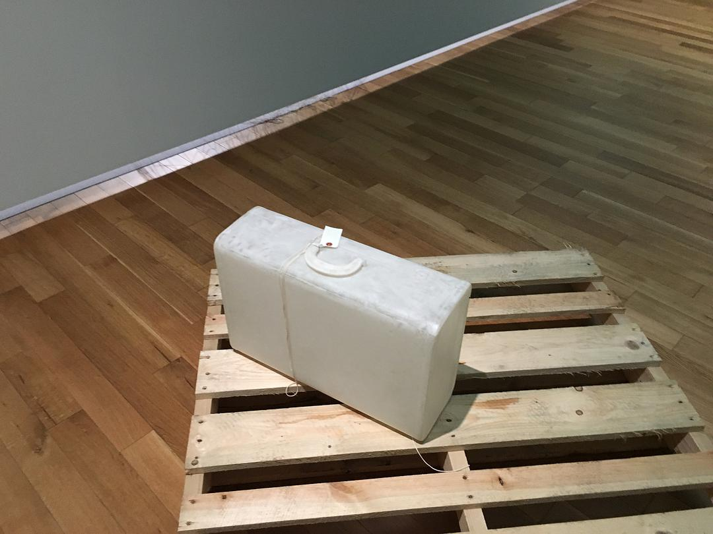

original link: https://www.douban.com/note/728934373/

前情提要：
- [其一 冈山后乐园 + 兔子岛](https://www.douban.com/note/728217071/)
- [其二 广岛一日游](https://www.douban.com/note/728267844/)
- [其三 岩国锦带桥 + 尾道](https://www.douban.com/note/728415477/)
- [其四 直岛](https://www.douban.com/note/728579087/)

## 7.24 犬岛 大晴天 **☀️☀️☀️☀️☀️**

虽然是 Day5，但是是艺术节跳岛第 2 天。这天的目标是犬岛。

其实如果没有特别被推荐过犬岛，单看交通状况，可能第一个舍弃的就是犬岛。

https://setouchi-artfest.jp/access/

图上可以知犬岛非常靠近冈山县一侧，要去犬岛只有 4 条船可以到达，4、17、18、19。

最直接最短的是 17 号线，从宝传港 10 分钟即可到达，300yen。另一条直接的线路是 19 号，从牛窓港或者京橋港出发。18 号线是去到小豆岛，4 号线去到丰岛。如果并没有订到岛上的住宿，那么必定要从小豆岛或者丰岛继续安排船的时间回到宇野港/冈山或者高松港。大部分人其实一般都会选择住在高松港附近，高松港口较大，有较多航线去到各个小岛。但是如果想去犬岛，从高松没有直接的办法过去，必须从小豆岛或者丰岛中转，其实船的航线选择不少，如何根据时间好好组合安排行程还是挺费脑细胞的。大概就是因为组合航线需要考虑的内容太多，我和友人在大半夜一起商讨行程到大脑当机后，双双决定放弃组合航线，选择最短最直接的 17 号线路去犬岛。这也直接导致了前 4 天都住在冈山的情况。

犬岛这天的行程总体其实是轻松的，这天是唯一不需要早起的，宝传港去犬岛的船最早一班是 11 点的，而从冈山站去到宝传港，是有一条直达巴士的，[両備バス专门为艺术节去犬岛增设的巴士](https://www.ryobi-holdings.jp/bus/rosen/setouchi2019/)，早上 9：52 从冈山站巴士站开出，10：45 到达西宝传，走路 5 分钟即可到达宝传港口。所以这天难得的大概 8 点半还是 9 点才起床。收拾东西退了房，吃了个早饭，带上行李去坐巴士到宝传港。

但是惊险的是，这班巴士竟然在中间堵车了一小会，明明看着都是乡间小路，竟然会堵车。。。堵车导致大概比预计的时间晚了 11 分钟到达港口，一车的人（其实也就 10 几个人）都下车一起往港口狂奔，再晚个几分钟的话，船就到出发时间了。

宝传港口真的是个非常小非常小的港，感觉就是小渔村的临时停靠处一样。当然，当时也认为，坐这辆巴士的人应该都是一样的目的，去坐船去犬岛，所以觉得开船那边的人应该也会稍微等这一车的人全部到达，毕竟是不可抗因素导致迟了，但是这班船如果没赶上，就要等两个小时后等下一班，整个一天可能都费掉了。终于ギリギリ赶上了船，真的是很小的船。实际也稍微晚了 2、3 分钟才开出。10 分钟即可到达犬岛。下车狂奔的一小段，又是一身汗，我们还是带着行李狂奔的。。😂😂😂😂😂

宝船-犬岛 船票~

11：13 到达犬岛，右边那个白色顶的小棚子后面的小屋子是艺术节临时设置的行李存放处。之前在官网上面确认过犬岛没有 coin locker，本来还担心在犬岛玩还需要背着行李，但艺术节还是贴心的，另外设置了行李寄放处，而且是免费存放，只是存放有时间限制而已。

INUJIMA~

被推荐的就是下面👇这个犬岛精炼所遗址改成的美术馆，也是我们这次无论如何不想放弃犬岛的原因。逛完之后也的确觉得挺值得，好看~ 具体的 concept 介绍也可以[看 Benesse 的说明](http://benesse-artsite.jp/art/seirensho.html)，大体意思就是以曾经的精錬所的遗迹为基础，利用太阳地热等能量以不给环境造成负担为目标构建一个系统，将艺术作品与建筑结合展示出「遺産、建築、艺术、環境」的循环型社会（翻译水平太差就这样吧。。。）

不了解这些 concept，也并不影响观赏，首先单纯看遗迹就很好看，特别是那个大烟囱。

精炼所是有几个室内的艺术装置的，很特别的一个是进入一个黑暗的空间，发现前方有一门镜子，看得到光，通过镜子看得到前方的人的背影，但是实际上是 7-8 扇镜子的反射，实际在走的通道应该有 7 - 8 个拐角，具体是怎么构造的，在黑暗中走的时候转弯过几次之后就完全忘了。大致如图示：

每个拐角都是一面很大的镜子

直到快要走到尽头的时候，还有另外一面镜子反射的是楼顶的人，经过的时候顺便和楼顶的挥了挥手👋 也不知道对方有没有看到，总之体验还挺有趣的，也因为黑色通道里面好凉快wwwww

玻璃房里的其实是有一套艺术装置的，但是并不能走进去，只能从一个小窗户往里窥视，有很多不同方向的大大小小的窗户

海的颜色映衬遗迹的那些泛红黑砖，就很好看，中午太阳太大，且直射，只有破手机的我，拍照水平也就这样啦哈哈哈哈

烟囱~好看~

遗迹长满杂草也挺好看~

逛完精炼所这个犬岛最大的最重要的项目，再去腿其他的 artwork，总共其实 3 个多小时是可以全部腿完（也没几个）。

in06-B 石職人の家跡/太古の声を聴くように、昨日の声を聴く

in02 S邸/コンタクトレンズ

in03-B A邸/イエローフラワードリーム

in08-B 中の谷東屋，这个又是妹岛和世的作品，是犬岛我第二喜欢的，毕竟它除了是个 artwork，也是个实用的休息所，棚子底下相当凉快

in09-B 犬島 くらしの植物園

在去找这个植物园的路上认识了一个台湾妹子，妹子很厉害，一个人来玩艺术节，而且已经玩了 7、8 天了，基本上去到了所有的岛，犬岛是她的最后一个岛，第二天就回台湾了。妹子更彪悍的一点是会去租机车骑，因为比较快，以及上山也开得动，省力省时间，另外聊了一些艺术节其他小 tips，主要是我们后一天要去丰岛，妹子说了几个推荐的点和注意的地方，其中说到丰岛编号 01 的 artwork 她找了半天没找到，最后还是问了人之后找到了，结果很吃惊。

这个狗头并不是 artwork，据台湾妹子说是这户人自己做来玩的，自称世界最大狗头w

近看还是很大的 www

2 点多全部逛完的时候在港口附近一家店吃了个犬岛丼，非常家常菜饭味道，渍物很好吃，右边那个黑色的甜品一开始以为是类似冰粉烧仙草一类的东西，吃了几口才明白是 coffee jelly，非常咖啡味，就真的是用手冲咖啡制作出来而非工业制作产品的感觉，略带苦味，又一次的おとなぽいw

这家店看上去也是很老很昭和风了，甚至是有点脏脏的那种

然后悠闲的休息了一阵后坐 15:47 的船先去直岛，再转 5 点的船去高松，6 点到达高松港。

犬岛到直岛的船是这次坐的所有船里最贵的 😂

本以为高松订的酒店离高松港口很近，走个 7 - 10 分钟就可以到的，结果，大概地图比例尺观察失误，实际上从高松港步行要 20 分钟才能到订的酒店。在走去酒店的路上，发现可以经过高松市美术馆，并且有个打卡地点，然后艺术节期间正好是 7 点从关门，提前半个小时最终入场。我们神奇地在 6 点 25 赶到了美术馆，因为美术馆几乎没人，所以和 staff 沟通把行李先放在了门口 counter。然后冲了进去看展，这边的展览虽然可以打卡，不过是需要另外付钱的，只是用艺术节 passport 可以打 8 折而已。但这个展览倒是也不难看，好几个展品都感觉是以特殊材料制作的像玻璃一样晶莹剔透，也挺好看的~

展览名字：[宮永愛子：漕法](https://setouchi-artfest.jp/artworks-artists/artworks/takamatsu/330.html)，一部分可以照相的贴点图感受一下。

虽然没太看懂表达的啥意思。。。

在美术馆看完这个特别展，也顺路看了下常设展，然后在马上闭馆前离开了。走回酒店入住休息了一段时间后，在酒店附近的商店街里找了家店吃晚饭。

因为同行友人不知为啥看中了锅物，所以点了个味噌もつ鍋

还有几串烤鸟以及煮物，都挺好吃的~ 另外其实点了一杯かおり茶，因为我以为是一杯茶。。。结果喝了才知道是茶+烧酒，我只喝了几口马上上脸+似乎有点头晕，其余交给友人解决掉了😂😅

好吃哦~

犬岛终于写完惹。虽然交通真的不便，但真的还挺喜欢的，推荐本来觉得不好去而放弃的人下次去一下鸭~

再接下来是丰岛，待续~

<<< [Day4 直岛](https://www.douban.com/note/728579087/)

\>>> [Day6 丰岛](https://www.douban.com/note/729118519/)
