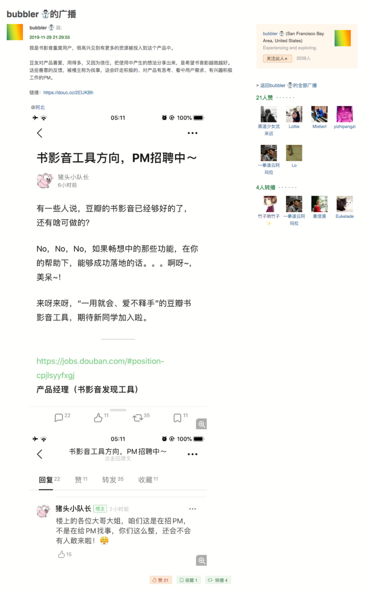
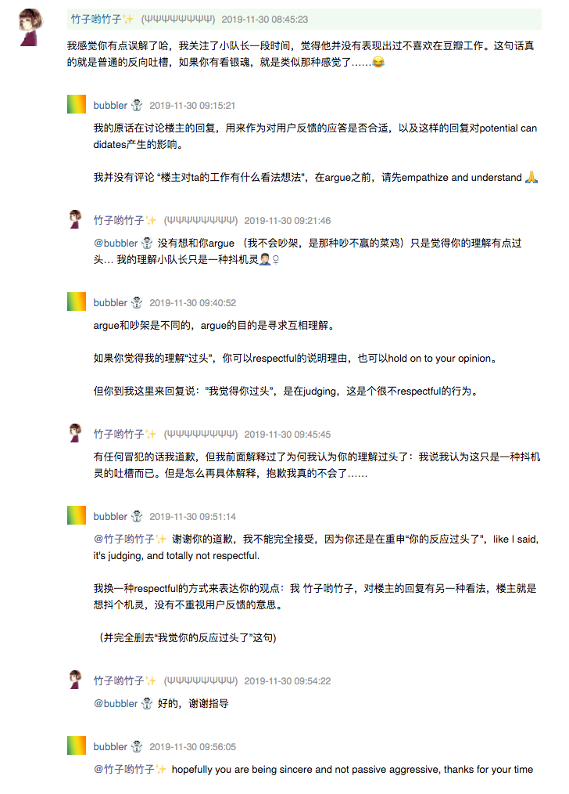

## 起因

https://www.douban.com/people/rainbowmimi/status/2711261768/

## 初衷

猪头小队长这个友邻是豆瓣的工程师或者 PM，我在参与内测发现 bug 的时候，他和我主动联系解决了问题。
另外，我关注了他的这段时间，我个人看法他本人就是普通的豆瓣用户，说话也没有任何让人不舒服的地方。
之前笔记功能出现特别好笑的随机图片 bug 的时候，他还会去主动回复告知 “bug 修好啦~” 这样。
他并没有关注我，我猜他只是给所有转发了那条发现 bug 的 post 的人回复告知 bug 已经修复。
经常还会看到他的某些广播很明显是豆瓣工程师们在做测试，比如某个没人用的小组，里面全是测试 post，
胡乱发的内容那种，想想还觉得有点可爱。

所以纯粹想帮小队长解释一下，他说的话明显只是抖机灵的吐槽，想象一下银酱的口气：

> “喂喂喂！这么多事这么多需求哪里还招得来 PM 啊喂！岂可修！！”

这不是很可爱的吐槽么😂 可惜这位原 po 真的完全 get 不到，甚至觉得生气。。。哎，真的*不在一个次元* 🤦🏻‍♀️

## 然后、我被教育了 🙃

虽然和朋友说了之后，一位朋友说，这个人就是装逼啦，中英夹在好讨厌的感觉。我一直对这种说话方式没有太介意，
我看这位原 po 住在美帝湾区，会有这种说话方式也许是正常的吧。我是个怂人，所以我闭嘴了。

**人类真的无法互相理解。**
