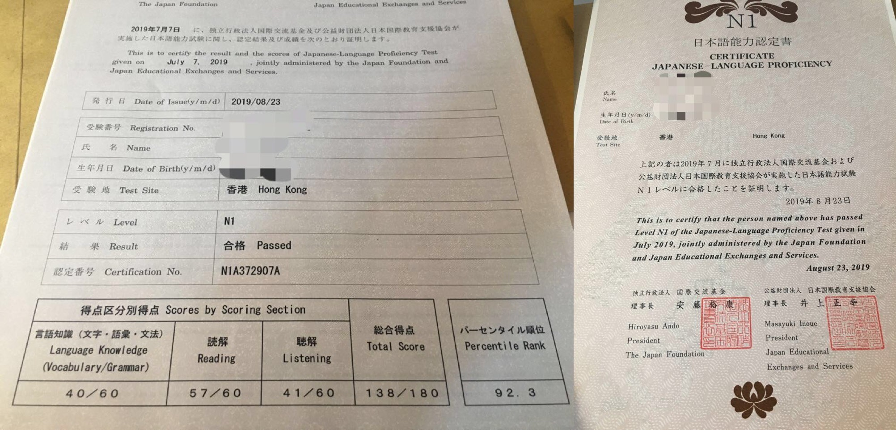
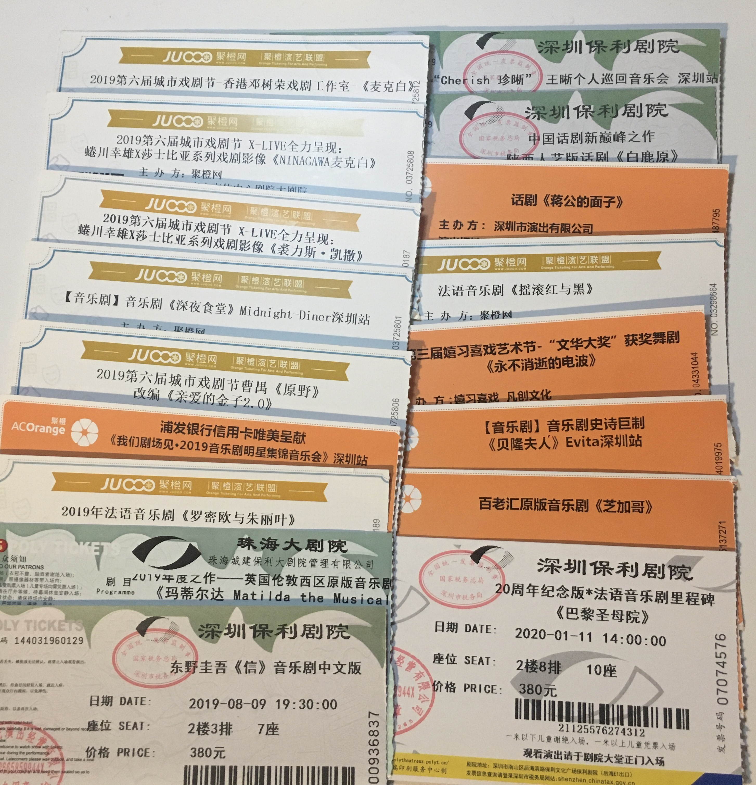

2019 过得平淡无奇，赶脚没啥可写的，但这个系列都年更了，还是不想断，所以还是来补完吧 😅

well，2019 年三十岁惹，仍然一事无成。。。 ┓(´∀`)┏  没发大财没房没车。

## home office 即将结束

2019 还是 home office 了一整年的。
上周老板和同事们齐聚到深圳 annual meeting，不是那种去玩搞表演晚会啥的年会，穷苦小厂只是大家面对面沟通一下来年工作事项，集中干活几天而已。。。
然后老板迅速看定了一个 office，2 月开始租。于是年后开始我就要去公司正常通勤上班了，2 年多自由轻松的 home office 生活就要结束了，好不舍得啊！😿

不过老板之前曾问过我喜欢怎样的工作模式，我说希望每周能 3 天去公司上班，该开会该讨论该交流的集中搞定，2 天能在家一个人工作。
老板表示赞同，说他以前在美国的公司上班时也有这种模式，虽然他个人不需要用。
等下一次老板从美国回来的时候打算问一下，“每周五可以自由选择是否 home office 吗？🥺🙏🏻”

说到通勤，新租的 office 地点离我现在住的地方不算远，大概 5 公里多。
但非常不幸的是没有直接的交通工具可以到达。
- 要不然需要步行 900m + 地铁 3 个站 + 步行 1.6 公里，
- 要不然步行 1.1 公里 + 公交 6 站 + 步行 600m，
- 要不然两程公交需要转一次，但总共步行只有 600 米，
- 要不然全程骑自行车 30 分钟。

鉴于夏天的时候我骑摩拜单车骑到一辆刹车失灵的，导致我在路口撞上了一辆路虎，产生阴影，我可能之后除非逼不得已都不会选择使用这类共享单车。
全程骑车当然说的是自己买辆好的单车骑，但是停放是个需要提前考虑和了解的问题。以及夏天骑 30 分钟也的确有点长，会很热。

所以前两天开始琢磨起能轻松带着走的代步工具，就还是可以去坐地铁的。
我想到的是滑板🛹 看上去很青春✨，滑板又比较轻，不会占空间，挤地铁也没压力，唯一的问题就是我需要淆习一下，上手起来大概并没有那么容易，作为一个平衡感并不好的人，也害怕摔跤😂

## 日语

2019 年唯一正经干成的事大概就是 N1 过了。当然这其实也不算什么，毕竟我心里清楚我的语法知识还是一坨 shit 😂😂
而且对比[一位某省高考状元学姐的满分](https://www.douban.com/people/neverbutterfly/status/2373184972/)，强烈感受到智商和语言天赋上望尘莫及的差距。。。心塞塞 😔

上半年过年后的空闲时间都用来复习日语准备考试了，以致于追番和日剧都大面积搁置了，到现在都没能补完 （不，去年也大批没补完的东西 🤦🏻‍♀️
考完试下半年就清闲了很多，但基本上没干任何正经事，今年真的很废柴。。。

虽然现在的破日语水平看本生肉小皇叔能懂 80% 以上，但是觉着就这么下去好像毫无提高。
语言这种东西不使用起来是铁定会忘的，比如我的粤语，离开 hk 后就很少讲了，说的能力直线下降，听的能力也是缓慢下降中，有点堪忧。。。寻思着好不容易考了 N1，不想就这么止步不前了，明年开始得想法子继续巩固加强啊少年！

有关怎么加强，其实大概也只能尽量多去使用，比如看综艺的生肉。本来也想试着看书，但是总觉得中文书都经常看不下去，我还是别给自己太大压力，我还是继续找生肉漫画看吧。漫画的小问题就是，图片上的文字不太方便复制出来去检索意思或者读音。晚点再去想想办法吧~

（另外豆瓣友邻提到还可以听抓锻炼，这个完全可以考虑~）

## 工作技能

赶脚毫无长进。。。。。一直在原地踏步的样子。转行做前端也已经 3 年多快 4 年了都，但还是赶脚自己啥也不会，内心惶恐非常虚。
今天老板也跟我说下个月开始给我涨工资，又是一阵惶恐，自己这种菜🐔如果离开现在的公司大概没人会愿意出这个价钱了吧？？？（涨了工资其实也并不高，但只好抱紧大佬大腿了😳）
书架上有 N 多本应该看的专业书还没看，2019 了结了考过 N1 这个计划，是不是该重新好好正视自己的专业技能了呢？？？

## 综艺

去年年初的时候因为几个朋友都看起了《声入人心》，于是我也跟着去看了，然后怎么说呢，前两年还有点排斥看祖国综艺的，结果 2019 很开心地看了起来。
后来还追着看完了《声入人心 2》和一部分《歌手》，虽然和 声 2 和声1 比起来很难看。
然后还吃🍉式的看了一部分《中餐厅》第二季和第三季，然后因为自己兴趣看了一部分《这就是街舞 2》，然后花了很多时间补完了《明星大侦探》前面四季，正在追看第五季。

于是又是一大波想追的新番和日剧没看或者忘记补完。。。。。

综艺真是消耗时间最可怕的利器。。。

## 舞台

因为看了《声入人心》，于是又开始对舞台感兴趣，2019 年陆陆续续看了很多音乐剧、还有几个话剧和舞剧、音乐会。

最想推荐的是以下几个：

- 陕西人艺出品的陕西话版话剧[《白鹿原》](https://www.douban.com/location/drama/10540051/)

《白鹿原》小说本身就是以陕西为设定背景的，用原汁原味的陕西话来表演，真的是非常适合。
各种很有趣的陕西土话情话黄色笑话骂人脏话，很让人入戏，“就是那个味儿”~ 当然，因为小说情节太多太长，这出 3 个小时话剧已经大幅度缩减了，但还是可以对白鹿原的大概剧情走向有个大概了解的。
另外我个人非常喜欢配乐，秦腔唢呐本来就非常 bug，再搭配点电子迷幻，整个人头皮发麻w

- 上海歌舞团出品的舞剧[《永不消逝的电波》](https://www.douban.com/location/drama/30360647/)

这是个获奖的节目，看这个剧之前我也并不确定舞剧是指什么。
最开始听说的时候，对剧情简介有点介意，因为是非常红砖的。
但是评价的一致好评又让人抵挡不住好奇心去看了现场。然后就真香了🤣
剧情本身没啥特别的，而且其实剧情也不用那么介意，只看美轮美奂的舞台就非常满足了。

作为一个也看过不少舞台剧的人，诚心诚意夸赞一下电波的舞台效果，真的就是**赏 心 悦 目**。
我是第一次看到做出如此丰富层次感的舞台，光影效果简直可以媲美出色的电影。
这些光影效果也不是孤立的，是为了烘托整体气氛，是能够服务剧情本身的。
另外巧妙地利用多重景深的遮板 将整个舞台空间切割成不同层次，brilliant！
还有一些道具比如黑伞的运用，都让这个舞台很有美感。
最美的当属一众婀娜多姿的旗袍小姐姐跳舞的段落了，这部分个人觉得其实没啥特别剧情，单纯享受，旗袍小姐姐们太美了太美了太美了啊！
如果今年还有巡演，还想再看一次呢~

- 法语音乐剧[《巴黎圣母院》](https://www.douban.com/location/drama/1765426/)

上周六去看的，也算在 2019 年总结里算了。
今年也看了不少经典和出名的音乐剧，但很多也都不怎么喜欢。
想了下最喜欢的大概是《巴黎圣母院》，幸好赶上了 20 周年巡演。
也不知道为啥，最后一首卡西莫多唱的 Balla mia Esmeralda 让我抹泪了🥺😳 （可惜没有听到 Angelo 的卡西莫多，但 B 卡竟然也让我哭了，我真是容易被煽动 😑

贴个 Angelo 版本的 Balla mia Esmeralda 感受一下 https://www.youtube.com/watch?v=XkJKuMzja7s

## 最后

想起来今年又去了两次霓虹。一次是夏天的濑户内周边以及艺术节跳岛游，写了乱七八糟[一堆流水账](https://www.douban.com/note/728217071/)。
还有一次是 12 月的纯粹消耗假期很随意的[东京3日游荡](https://www.douban.com/note/745990626/)。

另外，因为看起了明侦，于是最近也开始喜欢去玩密室。明年大概会去更多密室，或者实景搜证玩剧本杀。
然后我也许就可以做推荐深圳所有非恐怖系偏推理悬疑的密室评测了。。。23333
结果写完发现，新的一年其实脑里还是想的各种玩乐而已 🤦🏻‍♀️

要说 2020 有啥计划的话，好像也没啥特定的计划了。不过先许下愿望，**未来 2-3 年内买房**，然后就能过上愉快自由的独居生活！（当然是爸妈出钱，我真是废渣 🤦🏻‍♀️）

附前几年总结: [2018](https://www.douban.com/note/702384268/) [2017](https://www.douban.com/note/650747131/) [2016](https://www.douban.com/note/600437210/) [2015](https://www.douban.com/note/532445213/) [2014](https://www.douban.com/note/475347560/) [2013](https://www.douban.com/note/329611675/) [2012](https://www.douban.com/note/255202347/) [2010](https://www.douban.com/note/125442027/)
