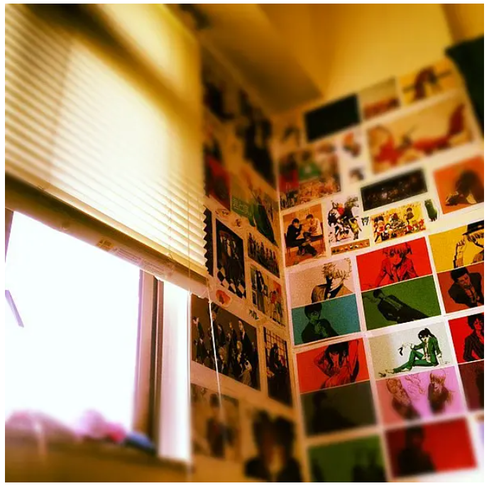

幾年前就知道這本小說，[陳浩基的《13.67》](https://book.douban.com/subject/25897884/)，聽說作者就是中大畢業的，然後就一早列入了想看的列表。
但我已經很多年沒認真看書了（說真的，不管紙質還是電子書，都看不進去，連毫無負擔的網文甚至小基文我都很久沒看過了），
所以也一直沒有真正行動過。

直到今年，暴君讀過之後和我說，“我看到很多香港地名，可惜都不太熟悉，如果是你的話，估計可以直接觸景生情”，
一下子重新產生興趣，再加上今年我終於重新培養出好好讀書的耐心和習慣了，於是立馬去買了書回來翻。

沒拿到書之前還在擔心，我也很久沒看過豎版的繁體字的書了，會不會又堅持不下去。
當然，這個疑慮在翻開書的 10 分鐘後就蕩然無存了。

大概因為其實陳浩基是在台灣出版的，所以他寫的文總體還是會考慮的台灣讀者的。
（我不知道這麼想對不對，就我感覺文章是用普通話可以輕易讀出來的，我看書有默念的習慣。）
以前看過在香港出版的翻譯日本作家的小說，字詞的選用就會有點香港官方中文的彆扭生硬感，不像用是普通話能直接讀出口的。
就像現在如果有在看我寫的這篇，我雖然用的繁體字，但我的語言習慣依然是普通話，類似這種感受。

說回小說，雖然我的感受是如上，但其中也有很多特殊字眼、黑話等，還是有保留濃重的粵語語感，加上還有不少注釋，有些是我也不曾了解的細節。就如暴君所說，看著好多熟悉的地名，多少想象得到那個畫面，加上近期還補了兩部 tvb，非常代入感。

想到很多人並不特別熟悉書裡提到的地點，我就簡單標記一下地圖，就像作者後記裡說的那樣，如果有讀者想到故事裡的地點巡禮一下，他也會非常高興。

<iframe src="https://www.google.com/maps/d/u/0/embed?mid=1CzspixynEByRW9EWkrYTW5te7txdhqcP" width="100%" height="600"></iframe>

> 沒看小說的話，下面的很多敘述大概包含劇透

# 黑與白之間的真實

這篇講的是一篇富豪家族內的兇殺案。

- 東九龍總區總部
- 將軍澳和仁醫院：非真實醫院，地圖上只標出了將軍澳地鐵站所在位置
- 西沙小築：會住在西貢的人，一般也都是富人，畢竟出入估計都得開車，不通地鐵，開發較少，比較原生態。案發現場的豐盈小築估計是取名自這裡的西沙小築，沒想到西貢竹洋路倒是真實存在的。
- 清水灣道：會發生墜崖事件的地點具體會在哪裡我就找不出來了

此篇故事主要發生於 2013 年，地點大致是東九龍（駱小明是東九龍重案組組長），將軍澳和西貢（其實屬於新界東），是我並不熟悉的區域。最後一次去將軍澳應該就正好是疫情前去香港看了快要下線的 Joker，就是因為快要下線，排片很少，才不得不跑到对我来说比較遠的將軍澳去。

然後清水灣屬於富人區，清水灣沙灘是熱門景點，但我只有 07 年第一次到香港時學校組織的活動有大巴安排去看過一次，之後那麼多年一次都沒有再去過。
西貢的海也很美，但我的印象裡也只去過一次還是兩次，和清水灣一樣，都屬於比較遠，交通不算方便的地方。如果喜歡或想嘗試潛水之類的，在西貢的海這邊玩一定會滿意的。

我屬於不愛水上運動的，我對西貢最大的印象是和朋友第一次去的時候，去到了滿記甜品的總店。是很大的一家店，外表看上去很樸素，甚至長得像深夜大排檔，而非現在在大商場裡常見的精緻甜品店（10 多年前的照片還是諾基亞 N95 拍的，實在找不到了，沒想到當時店鋪特別樸素的樣子比現在能搜到的遊客照片有意思多了）。
因為足夠大，當時的店還特別分開了兩個區域，榴蓮區和非榴蓮區，實在受不了榴蓮味道的顧客可以選擇坐到非榴蓮區，非常有意思。當時一夥的朋友裡，只有一個人完全不能接受榴蓮，就孤零零一個人跑去坐在非榴蓮區避難了🤣

# 囚徒道義

此篇時間是 2003 年，主要地點在西九龍，也就是油尖旺一帶，這一帶就算對多數遊客也都很耳熟了。
西九龍重案組，在多少 tvb 或者港片裡都聽過。
這篇講的是用偽造的追殺視頻，打擊黑社會的故事。

- 西九龍總區：小明升職為重案組第二隊指揮官
- 旺角、油麻地、尖沙咀警署都屬於西九龍總區總部管理
- 麥花臣球場：師徒二人喝酒地
- 太子道西，文中說關振鐸住在這條道上，其實離旺角警署也非常近，當然具體哪裡就不知道了，地圖上沒有標記
- 筲箕灣，駱小明家位置
- 观塘，唐颖公寓地址
- 佐敦道渡船街，填海区，行人天桥
- 青山湾，发现女尸地点，屯门附近了，离佐敦和观塘都很远
- 上环永利街，safe house

有关旺角真的是有太多印象，先插入一首 [mla「介乎法國與旺角的詩意」](https://www.youtube.com/watch?v=uAC1hJxRHAI)吧。
## 小巴

在深夜 12 點後旺角附近有很多班不同的小巴去往各個地方，因為地鐵一般 12 點半左右關停了，半夜需要依靠小巴移動。
小巴有約定的上下車點（但有點不太明顯，容易找不到），需要自行到地點去排隊。
當然也不是說只有深夜小巴，其他各個地方、白天也有各種小巴穿梭。
小巴一車限載 16 個乘客，不能超載。
小巴一般車速比較快，車上一般都會有個顯示屏，顯示當前車速，車速超過 80 的話，還會一直響鈴提醒。
小巴不同於大巴還有一點是，你要下車前需要直接跟司機知會一聲“前面有落”，落即落車，下車的意思。
要不然，有些約定的站點司機看沒人要下車的話，就飛速衝過去了。
這一點讓很社恐且一度很擔心自己粵語不好的我，很少去坐小巴（當然也並不是那麼必需）。坐普通公交大巴的話，你只需要去按鈴就能通知到司機。

[旺角去往筲其灣的小巴](https://www.16seats.net/chi/rmb/r_kh22.html)，上車地點應該就是永隆銀行中心附近，這也是山東街和彌敦道的交界處。

一般如果坐地鐵的話，旺角要先坐荃灣線到金鐘，換乘港島線到筲其灣。金鐘換乘在上下班高峰的時候還是很痛苦的，記得 mla 的那首[「給金鐘地鐵站車廂內的人」](https://www.youtube.com/watch?v=1DPOq27DBmQ)嘛wwww
但是坐小巴的話，可以一直坐著，不用換乘，小巴會經過紅磡的海底隧道（通稱紅隧），可以直接到達銅鑼灣，再繼續往東。相對來說，還是挺舒適的。當然，紅隧在上下班高峰時段也因為車流量比較大，容易擁堵，畢竟這是過海的主要通道之一。

## 加連威老道

在尖沙咀。和彌敦道的交界處就是商場 The One，樓上有個不錯的百老匯電影院，所以來過很多次看電影。
隔壁的金馬倫道上有一家好幾層樓的通利琴行。通利琴行雖然叫琴行，但是很多演出票務都是他們家在做的。
比如以前看的各大歌手的演唱會也是他們賣票，然後每年的各種藝術節票也是很多由他們出售。
當然，尖沙咀這家最大的通利琴行，還是有賣樂器、音響一類的。

彌敦道對面就是九龍公園啦（其實它也算是就在尖沙咀警署旁邊）。這裡插入[「九龍公園游泳池」](https://www.youtube.com/watch?v=8kla1Swx5tU)。
我其實都沒有認真逛過九龍公園，pokemon go 最火的時候，據說非常多人在九龍公園站著，想想覺得有點好笑。下次能去香港的時候想去九龍公園晃晃。

## 佐敦道 渡船街 填海區

視頻裡提到的地方佐敦道近渡船街的地方，再往前是填海區的。現在在地圖上能看到就是柯士甸站、九龍站、往上還有奧運站，這些都是填海工程的一部分。
柯士甸站是 2009 年才開始啟用的。也就是後面提到過的這一帶曾經是佐敦道碼頭。
但是這裡的另外一個作用是為了西區海底隧道（通稱西隧），九龍直接通到了港島西環。
因為我曾經在西環住過一年半，這條隧道坐車經過過很多次。
從旺角坐小巴回西環的話，走西隧可以非常快，比地鐵方便多了，另外西環一帶的地鐵站也是近幾年才通車的，我還住在那邊的時候，還得從上環再另外搭巴士或者叮叮車才能到西環。

对渡船街一带的很大的印象，就是感觉有很大一片工地被围起来，晚上街上几乎没人，然后红绿灯的叮叮声就非常明显。
那时经过这边，一般都是佐敦站出来转去柯士甸站，或者是柯士甸站走到九龙站上方的圆方商场看电影。
柯士甸站、九龙站、西九龙高铁站，这些都是行人天桥连通着的。
没有找到天桥+工地围栏的照片，现在从 google 街景看，围栏已经都拆除了，可能高铁站开通，这些就都算是完工了。

另外，圆方的戏院也是百老汇，每年的 HKIFF（香港国际电影节）会有不少场次安排在这里。
没记错的话，我就是在圆方看的 Logan。不想在国内看删减版，又是快下线了，朋友都看过了，只好一个人去看，看到最后一直在哭，大概是近年最喜欢的超级英雄片。

渡船街还有个美好的回忆，是美食！我第一次吃大盘鸡就是在这边的一家陕西菜馆，哈哈哈哈！
陕西菜馆当然还有 biangbiang 面，但结果我觉得大盘鸡超绝好吃（可能有滤镜，以及我又找不到照片）。
努力回忆了一下名字，发现它没有倒闭，甚好，叫[有緣小敍](https://www.openrice.com/en/hongkong/r-yau-yuen-siu-tsui-jordan-shanxi-shan-noodles-rice-noodles-r185837)。
想想也快 10 年了，希望它能坚持到我再去光顾一下。

## 上环永利街

应该没去过，但是看街景总觉得经过过，或者 tvb 场景🤣

# 最長的一日 The Longest Day

時間是 1997 年 6 月 6 日，關振鐸退休的日子。不到一個月後，香港回歸。
這篇講的是重犯石本添想從醫院逃走並毀容隱藏身份，但卻被識破的故事。

- 西環公寓火災。
- 中環德輔道中，化學原料貨車翻車車禍，影響交通
- 旺角通菜街，高空投擲強酸事件。
  - 這個是真實發生過的事件，只不過並非是通菜街，而是隔壁的西洋菜南街，另外也並非 1997 年，而是更近一點的 2008、2009 年，一共發生 3 次，至今沒有抓到犯人，詳見 [wiki](https://zh.wikipedia.org/wiki/%E6%97%BA%E8%A7%92%E9%AB%98%E7%A9%BA%E6%8A%95%E6%93%B2%E8%85%90%E8%9D%95%E6%80%A7%E6%B6%B2%E9%AB%94%E5%82%B7%E4%BA%BA%E6%A1%88)。
  - 不過不管是通菜街、或者西洋菜南街，都是人群很密集的地方。
  - 通菜街的其中一段，其實就是著名的女人街。我並沒有真正在女人街買過什麼東西，但倒也很喜歡逛的，因為很有煙火氣。然後女人街擺攤的小商販把路面占了大半，而它們的背後其實也藏有很多小店鋪和食肆，有不少挺好吃的小店。
  - 其實繼續沿通菜街往太子方向走一段的話，就會來到通稱為金魚街的另一段通菜街。有各種熱帶魚賣，完全可以當水族館逛了，也有部分其他的寵物店。此處不知為何在想《重慶森林》。
- 嘉咸街市場，沒有去過
- 瑪麗醫院，石本添逃跑的地方。雖然沒有去過，不過知道是歷史很久的醫院，規模也很大了。
  - 瑪麗醫院在薄扶林道上，如果沿著它一直下山，就能到達香港大學主校區。瑪麗醫院本身也是港大醫學院的教學醫院。
  - 從醫院逃跑的車輛也是一樣沿著薄扶林道下山的
- 薄扶林道與山道交界處設置路障，路障位置估計計算算是靠著港大主校區。
- 般咸道，薄扶林道基本算是和般咸道接著的。般咸道轉過來一個彎彎就可以看到港大的正門校門，並不是很大很宏偉的那種。

## 西環

西環大致上包括西營盤、石塘咀、堅尼地城三塊。我分別在堅尼地城和石塘咀住過一年和半年。
說實話，個人覺得西環還是算很宜居的。

下面是一些個人的回憶碎碎唸，和小說裡的地點並沒有太大關係，只是比較靠近+我突然想寫而已。

### 山市街
2012 年初的時候離開學校宿舍第一次在香港租房就住在了堅尼地城。和朋友一起找房子的時候，找了一圈，要想自己能負擔，
又各方面合意的房子，當時就住到了山市街。山市街很特別，是真的沿山往上建了一排房子。

上圖似乎是 2007 年的 google 街景，角度問題只看到一半樓梯的樣子，但當時租的房子就是在右手邊的房子裡中間往上的某一棟。
街景其實相對也比較落後了，現在樓梯右邊的樹木已經不存在了，而是一個升降電梯。往右轉走兩步，就是堅尼地城地鐵站的一個出口。
堅尼地城、香港大學、西營盤這幾個地鐵站是港島線西延工程，是 2014 年才通車的。
說回山市街，當年搬到這裡的時候沒有電梯也沒有扶手梯，先要爬大概幾十個階梯，再來一大段斜坡。每次出門都是種考驗。
也因為這種不方便，房租才能稍微便宜一些。

我在山市街住过一間次臥，只有 4 平，月租 3400hkd。當時為了買正好合適這個小房間的家具（租的完全空的房，任何家具都沒有），
仔細地量了每一個地方的尺寸，然後跑家具市場去找尺寸正好的家具。比如我大概記得床買了個只有 1m8 還是 1m9 長度的，因為只能放下這個長度的床。
所幸我反正矮，不會覺得有問題。

當時還因為離開了學校不知道去哪裡打印而買了打印機，但也很少有需要，在擔心墨盒快乾掉的時候，找了一堆喜歡的同人圖打印出來貼了一面墻。
於是，後半年住在這個房間的時候，就變成一起床面對一面墻的同人圖，心情好像會變好。
下雨天、颱風天的時候在房間裡聽風聽雨看看窗外其實還蠻不錯的。
現在都還能大概記得睜眼看著 4 平米的房間頂是種什麼感覺，但真的再也不想住了。

2012 年下半年開始，我開始去港大上學。第一個學期的時候也都是從山市街這裡直接走到學校的。

地圖上看著離得並不遠，但是有高度差的。
實際如果想從平地部分的山市街要想去到港大使用公共交通的話其實是很繞的，港大校區部分其實算是山腰。
最近的路其實是直接爬上山，爬到和港大同一個水平線上的薄扶林道。

而從山市街上到薄扶林道，是有近道的，那就是在中間左轉繼續往上爬到達青蓮臺，經過魯班先師廟，從旁邊的樓梯再繼續往上爬就到了。
於是，我第一個學期依然每天爬山去學校上課。

當時，我還是個 120 斤的肥仔，並沒有因為爬山就瘦了，只是想說，真的每天去上學都要深呼吸一下去爬山🤣
但是，這一段山路並不無聊，因為每次爬到頂，也就是到達薄扶林道時，往海的方向看一下，都會見到不一樣的景色，讓人心情舒暢地繼續前往學校。
（4s 手機裡的照片我是真的不記得存在哪裡去了）

下面兩張圖偷自當時住在青蓮台的朋友的豆瓣相冊wwww
另外推薦朋友的另一個[香港物事的相冊](https://www.douban.com/photos/album/68425804/)，朋友當年是讀建築的，這裡面有很多我沒有去過見過的有趣的建築或景致。

這張是站在山市街的斜坡中間看海的方向

這張是馬上要達到薄扶林道的樓梯，每次爬到這裡會有種期待，今天會看到什麼樣的景色呢？

### 石塘咀

後來山市街的扶手梯和升降電梯都修好了沒多久，房東就說他太太懷孕了，需要換大一點的屋，正好山市街也有電梯了，想收回房子自己住了。
於是，我和室友們只好一起搬到了兩站公交車距離外的石塘咀去了。

因為有家具一起搬家，所以第一次在香港找了搬家公司，就是有大貨車過來的那種。雖然距離很近，但是要打包和搬家具，
還有一些斜坡和樓梯，搬家總共花了 3k 的樣子，全程的服務還是很好很到位的。

新家離石塘咀街市很近，也就在馬路邊，超市很近，餐館也都不少，生活反而是更方便了。
從這裡上山到薄扶林道，其實是可以直接利用一條公共登山電梯，就在西寶城，完全不費力就可以上山了wwww

網上找的圖，大概就這樣子的有 3 段還是 4 段的登山電梯。

對石塘咀另一個十分好感的地方是，石塘咀街市裡有一家店做的烤魚非常好吃，很香辣的那種，很適合幾個人一起去大快朵頤。

再以及，小說裡有提到的山道，不過說的是和薄扶林交界的一端。
這邊石塘咀是山道的另一端，我當時住的離這一端很近，就隔一條街吧。

現在的山道大概這個樣子。

住在那邊的時候沒意識到，直到後來我又看過一次《胭脂扣》後，才後知後覺，記者和如花聊天散步的路就是在山道這裡拍的。

曾經石塘咀是風月區，有很多妓院，所以如花才會 50 年一直在石塘咀一帶遊蕩等待。
現在山道天橋下，似乎每年都會有戲班搭檯唱粵劇戲曲。

# 泰美斯的天秤 The Balance of Themis

時間是 1989 年。關振鐸是刑事情報科（CIB）B 組主管。
這篇講的是對重犯石本兄弟跟蹤追捕行動時發生的慘案。

- 新填地街： 此章故事集中於旺角嘉輝樓，新填地街是存在的，離朗豪坊很近。嘉輝樓是杜撰的大樓名字，但是描寫的這種每層很多小單位、小商鋪，走廊曲折的大樓在香港有很多。以前喜歡去的信和大廈就是類似的。此處插入[「去信和賣碟」](https://www.youtube.com/watch?v=gQHmVvwagZw)。
  - 順帶提一下朗豪坊，很有人氣的商場，處於旺角鬧市區，也去過很多次，也是主要看電影還有吃飯。這裡讓我一直印象很深的就是朗豪坊裡有兩段非常長的扶手梯，每段扶梯都可以讓人一次性上 4 層樓，還蠻神奇的。
- 中環太平館餐廳：估計就是文中的“太平餐廳”，看上去是家評價很不錯的粵菜老店，有機會去試試
- 深水埗鴨寮街：現在也算挺出名的了，出名是以售賣電子產品為主。但其實也不止賣電子產品，這裡給我的感覺更像是雜貨市場，你可以在這裡買到很多奇奇怪怪的東西。
  - 比如大學時候我在話劇社玩，第一次公演的時候沒什麼錢買燈光，最後就是在鴨寮街找到一款便宜的小型手提聚光燈（好像是戶外用的那種）。公演的時候，我和另一個妹子在 2 樓輪流手動打光。效果當然一般般，但也比沒有的好😆

朗豪坊的 4 层楼高的扶手梯大致就是这么一个感觉吧。

另，看這篇的注釋才知道為什麼會有“一樓一鳳”，原來香港法例規定任何場所有兩名或以上認識用作賣淫用途，便屬於違法，
但如果只有一名妓女，則不會被起訴。所以才發展出很特別的一個單位只有一名妓女獨自經營的賣淫行業。

# Borrowed Place

時間是 1977 年。關振鐸是九龍區刑事偵緝部（CID）的高級督察。
這篇故事是一個偽綁架案。

開頭說的夏夫人做夢夢到的英國科幻劇集「博士」，肯定是指 Doctor Who 了吧😂

- 楠氏大廈： 按作品後記說明，是故事裡南氏大廈的藍本，並非在九龍塘，而在旺角
- 九龍塘： 就標記了一下地鐵站的位置。
  - 九龍塘附近是香港城市大學和香港浸會大學，大致都因為一些原因去轉過。
    - 城大教學樓基本上就是一整棟大樓，幾乎不能算是有校園的那種。浸會大學會相對大一些。
    - 我們學校的話劇社和浸會大學的話劇社當年因為什麼原因開始有聯繫，曾經被浸會的邀請去看他們的公演
    - 再後來，可能就是 2015 年的香港電影節，有[《心迷宮》](https://movie.douban.com/subject/25917973/)的上映。其中一場在浸會大學上映，並且有請來導演忻钰坤搞了個小型座談會。電影敘事精巧，看得出來低成本，但是很有靈氣。半年後，電影上線了全國院線，叫好又賣座。雖然院線版本比我在浸會看的版本加了一點結尾（為了過審），但還是很欣慰，覺得好作品能被人欣賞，能賺錢，就挺好的。
  - 富人區，這是一直以來的印象，九龍塘一帶應該真的住了很多有錢人或者明星或者其他名人。所以不難理解綁匪認為夏家一家是富商
- [油麻地果欄](https://zh.wikipedia.org/wiki/%E6%B2%B9%E9%BA%BB%E5%9C%B0%E6%9E%9C%E6%AC%84)： 曾經經過過，知道歷史很久了，但重新看 wiki ，才發現竟然堅挺了快 100 年了！
  - 隔著一條街，另外有一個也很有歷史的[油麻地戲院](https://zh.wikipedia.org/wiki/%E6%B2%B9%E9%BA%BB%E5%9C%B0%E6%88%B2%E9%99%A2)，1930 年建成的，雖然現在看街景覺得很新，是因為復建過一次。這裡上演的是粵劇哈，不是指電影。
- 北角警察宿舍： 阿麥住的警察宿舍。查了下這個宿舍是真實存在的，在北角單拿道，1963 年建的，2007 年已拆，原因是怕破壞山脊線，所以對樓高有限制，大概宿舍建立的時候沒考察清楚就建得太高了。有人留下的曾經的圖片[見此處](https://blog.xuite.net/lwy33339/hkblog/151528948-%E5%8C%97%E8%A7%92%E4%B8%B9%E6%8B%BF%E9%81%93%E8%AD%A6%E5%AF%9F%E5%AE%BF%E8%88%8D)。
- 樂香園咖啡室（蛇竇）： 又是一家很有歷史的茶餐廳，[wiki 頁面](https://zh.wikipedia.org/wiki/%E6%A8%82%E9%A6%99%E5%9C%92%E5%92%96%E5%95%A1%E5%AE%A4)都有。不過 wiki 寫明，08 年在威靈頓街的店雖然沒了了，但是換到了另一個地址又營業了 10 年，直到 2019 年才正式結業。那麼作者在 2014 年寫的後記說它結業了其實也並不準確呢。
- [堅尼地城游泳池](https://zh.wikipedia.org/zh/%E5%A0%85%E5%B0%BC%E5%9C%B0%E5%9F%8E%E6%B8%B8%E6%B3%B3%E6%B1%A0)
  - 故事裡提到的當然是指舊址上的泳池，也就是現在的堅尼地城地鐵站的位置。
  - 新的地址位於海旁，而且有特意設計過，外觀比較特別。新館是 2011 年開放的，我恰好在 2012 年搬到堅尼地城。當時聽說這個公眾泳池是新開放的，覺得應該很干淨，所以非常難得地去過幾次。體驗真的是蠻好的。這裡還要多說一句，現在覺得香港的公眾泳池真的是很好的服務，一個是基本上都很衛生很清潔，再一個是很便宜，我不太記得我當時是多少錢了，但能查到的現在的價錢是平日 17 港幣，週末 19 港幣，可以享受優惠的人群（長者、學生、殘疾人士之類的）都是半價，仍然非常划算。

重修過的油麻地戲院

重修過的堅尼地城游泳池。

# Borrowed Time

時間是 1967 年。關振鐸只是個普通的巡邏小警察。這篇還蠻特別的，直到結尾才明白敘述的主視角是王棠。
王棠是第一個案子裡的棠叔，相信讀到結尾的人幾乎都會重新翻回第一個故事，重新看一看人物關係，最後大概都會不禁一陣唏噓。
這篇講的是王棠和關振鐸一起阻止了一次針對警務處處長的炸彈襲擊。

小紙條上的偽造炸彈地點：
- 銅鑼灣裁判司署： 位於電氣道 20 號，1987 年已拆。
- 尖沙咀警察宿舍： 沒有查到具體在哪裡，現在能查到的離尖沙咀最近的警察宿舍是在何文田的督察級警察宿舍
- 中央裁判司署： 在中環，裁判司署結役後，後來還做過最高法院、入境事務處、警務處。再然後，建築物完全保留下來，活化成了現在的[「大館」](https://zh.wikipedia.org/zh/%E5%A4%A7%E9%A4%A8)，古跡及藝術館，可以參觀、休閒玩耍的地方。
  - 修好的大館是 2018 年大館開始正式開放的。2019 年的香港國際電影節期間我去大館的戲院看電影，而轉過一圈，基本上來說很喜歡。當時沒有能好好完全轉到滿足，結果到現在都沒有機會再去。
- 中環[美利樓](https://zh.wikipedia.org/zh/%E7%BE%8E%E5%88%A9%E6%A8%93)： 這段故事我翻 wiki 才重新學習到了，似乎曾經聽過但是忘了。舊美利樓的原址其實就是現在中環的地標中銀大廈的位置。美利樓曾經是多個香港政府部門的辦公室，所以後來地皮賣給中銀之後，政府還是把美利樓的零件拆除然後搬到了赤柱。赤柱的美利樓現在也是熱門景點，也還是蠻值得一看的。
- [沙田火車站](https://zh.wikipedia.org/wiki/%E6%B2%99%E7%94%B0%E7%AB%99)： 查 wiki 被震驚到，沒想到沙田站是 1910 年就開始啟用了，竟然已經 111 年了！！！位置也從未變過，只是擴建重修過。作為中大人，沙田站那自然是經常去的，出來行街最近的地方。

地圖上的一些標記：
- 租庇利街和德輔道中交界的第一大茶樓： 已結業
  - 另外提到的兩間茶樓，只有蓮香樓依然健在。
- 中環統一碼頭： 已拆，大致是現在的國際金融中心一期，現在都是用中環碼頭了。
- 佐敦道碼頭： 現在的柯士甸站
- 北角清華街

下面幾張是 19 年去大館的時候拍的，沒有逛完，很想再轉轉的

在網上還找到了第一大茶樓的老照片

