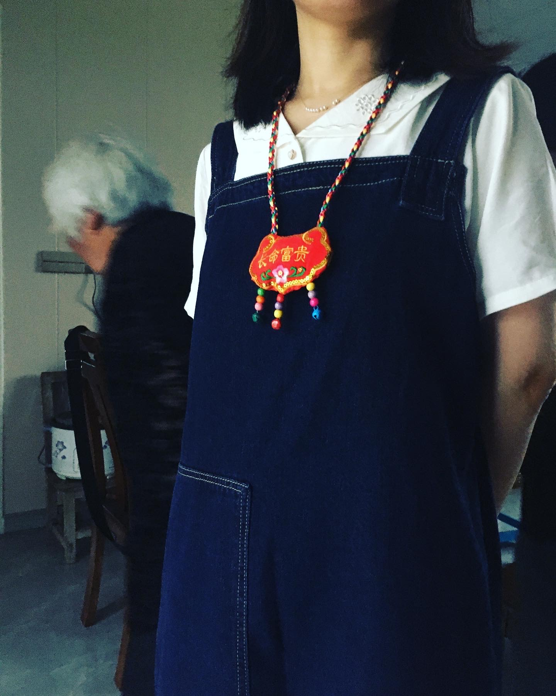

老实说，2021 真的过得很平淡了，我翻手机相册翻了好久，然后真的觉得好像今年没发生什么特别的事。

## 出远门

上半年回过两次武汉，一次是表哥结婚（当迎娘），一次是表妹结婚（当伴娘）。
表哥和表妹的对象，似乎都挺好的。然后，还好他们都不会来干涉我自己的事，当然也因为就我一个人不在武汉。
一直以来，我都觉得自己算很幸运的人，亲戚们从来都不是 SNS 上看到的那些很可怕的例子的样子，
大家都是有心的，我从没有反感或者惧怕过年回家见亲戚这回事儿，不知道是不是少数派。

今年出门玩的话，勉强算有两次吧，都是和父母一起。

一次是 6 月份表妹结婚仪式结束之后，就去了江苏我爸的老家看望奶奶。
久违地回到了乡下宅基地，翻修过后的平房，也挺舒服的。
不过本来很乡下的地方，对面开了个工厂，好像是造船的零件，工作日的噪音还是相当大的。
然后几年前大伯被诓骗，在房子后院很近的地方被架上了高架电缆线，近看总觉得很危险。
总之，没有小时候印象里的那般宁静和开阔，但空气还是很清新。
奶奶开始在自己的小菜地里种各种蔬菜，还有玉米，全都很好吃。
有一天，奶奶还起早去集市买了好几斤小龙虾，那天吃小龙虾吃到撑。
再一天，老爸非要拉着我和老妈去镇里走走，该怎么说呢，真的比起以前还要破败，没人气，连个公交车都没有。
然后，好不容易看到个超市，里面也依然没啥人的感觉。

这次看望奶奶，最大的感受是，有点想重新学会海门话，至少听懂。
1-2 岁的时候被丢在这边差不多一年，我妈说那时我说得可溜了。
但是之后就回武汉了，就真的完全忘光了，这么多年再也没有听懂过。
奶奶一直被我婶夸，是个精明有智慧的老太太，即使实际上奶奶没读过书，半文盲。
想至少能听懂奶奶讲话，然后以后能和奶奶多讲讲话，趁老人家还非常健朗的时候。

奶奶送了个很可爱的香包挂绳 🤣

再有一次出门就是[国庆节去了南京](../2021-10-05-nanjing/)，本来是 8 月的行程，因为南京发生疫情给推到了国庆。
其实主要是去看望刚出生的小侄子，叔叔婶婶诚意邀请我们去玩，还包吃包住包接送的，招待太过周到 😂

其余自己出门玩就完全没有了，希望明年能出国玩 🙏 我还一直念念不忘去爬富士山的🗻

## side project

今年总算做了一个 side project，自己琢磨了一套[豆瓣备份条目和同步到 Notion 的方法](../2021-06-05-douban-backup-sync-notion/)。
算是满足自己要求的 workflow，虽然不太确定有多少人会真的用我的方法自己折腾。

如果想更傻瓜的方法，还是推荐使用[豆坟](https://blog.doufen.org/)。
或者愿意转移使用长毛象的话，也可以用 [NeoDB](https://neodb.social/)。

虽然我和多数人一样，对简中互联网不抱任何希望，但还是希望豆瓣能尽量活下去，我依然会愿意给豆瓣花钱（某些人爱骂就骂）。
我真的会拭目以待 real 关门关站的那一天，到底什么时候来到。

## 读书

2021 年年头的时候，不知道哪条线搭上了，我突然就对自己说，想要认真读点书，不管读什么，只要是文字，不包括漫画，看看能不能坚持一下。

我一直都有很多实体书在家放着没看，自从大学时的某一年开始，我完全看不进去书，文字看着看着就走神，就连毫无营养的网络小说都是如此状态。
然后就一直逃避到今年。

决定就从手边有的书开始，开始第一个月，我的目标就是每天睡前读书 5-10 分钟而已，并且会给自己计时。
前两天真的会还没两分钟，就开始走神，看下时间过了多久，还有几分钟到 10 分钟之类的。
但，强迫自己静下心来继续看，也就一两周后，就完全习惯了，在发现看完一个篇章，然后已经快半个小时了，
我就知道自己习惯已经基本养成了。在此之后，我不再给自己计时了，大致精神好的时候就看半个小时到一个小时，
精神不太好的时候，可能就 5 分钟就累了。也就这样放过自己就好了。

我发现我还是看实体书更能集中精神，还是没找到能专注读电子书的方法。
2021 年就这样的习惯养成下，竟然总共看了 26 本书。
其中最喜欢的是[陳浩基的《13.67》](https://book.douban.com/subject/25897884/)以及
[中岛敦的《山月记》](https://book.douban.com/subject/30394154/)。

1367 是个非常香港的故事，勾起我太多怀念，[甚至自己标了个地图](../2021-10-23-1367-map/)，想着通关之后也许能故地重游一下。
《山月记》挺相见恨晚的，但是毕竟是真的经典，从没有想到中岛敦这么戳我，除了《山月记》这篇，还非常喜欢《李陵》篇的描绘的司马迁。
不过也很伤感，中岛敦很年轻就去世了，留下的作品就这么点了。

2022 年的话，并没有想一定要读多少本，但求能继续保持这个习惯就好。
然后，要是能真正习惯读电子书的话就更好了。Kindle 吃灰很多年了。

## 工作

工作的事情，不知道该怎么总结。我司小公司，下半年的时候接连离职了两个最早的员工，我那段时间很是恐慌，
两位合作好几年的同事离职了之后，我变成公司最老的员工了。。。

猜测同事离职肯定是因为有更好的机会了，我那段时间也在想是不是我也应该走了，我是不是待得太习惯太舒服了？
这个问题，直到现在我也在考虑。就有点迷茫吧。。。

朋友或者我妈好几次问我，觉得公司发展前景如何，我每次都说“不知道”，因为我真的不知道啊，我司老板很少画饼，
而且我也从来不信别人画饼，左耳进右耳出，根本就不当回事儿。
但是两个老同事离职，会不会反应了点什么呢？我是真的想不清楚。以及，我可能真的害怕换工作吧。
害怕找工作，害怕特别清醒地认识到自己其实转行了几年也还是个辣鸡。

后来让我镇定下来的是，后来很快招来了还算比较靠谱的新同事。

对自己的不自信一直如影随形吧。但是镇定下来想，还是先继续待着吧，然后我司的主要核心技术其实都在后端，我是不是
怎么着也了解点皮毛再考虑离开？否则，现在离开，我其实对公司的核心一无所知，是不是变成白待了这么好几年了？
好像又有点不甘心啊。

最近老板突然找来一个做 product growth 的人，好像很会包装产品和宣传，也很靠谱的感觉，也许能带来些不一样的发展。

## 看番剧推荐

今年看得不多，追番追剧已经几乎失去兴趣，都是差不多播完再一起看评价好的。
随便列一下喜欢的就完了，也有一些是补番：

- [异兽魔都](https://movie.douban.com/subject/30377019/)：补番，很爽的 b 级片氛围的番，又猎奇又萌又沙雕，特别有意思
- [昭和元禄落语心中](https://movie.douban.com/subject/26277363/)：补番，有两季，声优（特别是石田彰）太神了，故事很感伤，特别是第二季后半我几乎一直在哭
- [黄金神威](https://movie.douban.com/subject/27102516/)：补番，暂时共三季，一起补的，爽的不行，很少见的那种随着剧情展开越来越好看的多方角力的戏，有个性的角色也是一大把，真的会让人拍案叫绝。马上要来第 4 季了，是我愿意追着看的番~
- [奇巧计程车](https://movie.douban.com/subject/35332568/)：感觉今年看过的人都会推荐这部，非常特别，只适合用动画形式做出来的日剧故事，顺便从第四集 get 到了斋藤壮马。
- [摇曳露营△ 第二季](https://movie.douban.com/subject/30358098/)：旅行、行きたいな～ 回家之前的有点疲惫有点撒鼻息但又很安心很开心的那种心情，平淡又真切
- [新·福音战士剧场版:│▌](https://movie.douban.com/subject/10428501/)：おはよう、おやすみ、ありがとう、さようなら、すべてのエヴァンゲリオン。
- [短剧开始啦](https://movie.douban.com/subject/35358556/)：哭了很多次，get 到了太贺的演技，神木 dd 一如既往的好
- [明星大侦探之名侦探学院 第四季](https://movie.douban.com/subject/35400235/)：今年最喜欢的小糊综，虽然是买了韩国的一个综艺游戏的版权，但是完全做出了自己的特色，而且年轻可爱又很聪明的男孩子一起内卷玩寻宝游戏，就是特别欢乐的那种感觉，看着特别开心，这整一季都很惊喜。本以为第三季已经疲软了，第四季不知道能整啥出来，没想到第四季完全超出预期的有意思。可惜，最近出来的第五季很难看，制作团队完全换了，我只看了第一周的内容，很失望，晚点再观望要不要继续看吧，很难过。

## 计划

- 继续保持读书的习惯，今年可以考虑记下一点笔记
- 可能需要好好学习一下怎么记账
- 今年应该需要开始搞新房装修，需要提前学习了解这方面的东西
- 尝试看日语书，然后用 anki 做生词卡之类的，说了很久没有开始。之前看漫画，也有遇到过并不熟的词和句，但凭上下文大概能猜到就不求甚解了
- side project：
  - 博客换成 hugo 引擎，自己做一个新模板，先不要想不会设计这件事
  - 了解 chrome 插件 manifest v3，重新做一个插件，虽然没想好可以做什么工具
  - 重新学习一下 React，做个简单的头像编辑工具网站，类似戴上圣诞帽这种小功能即可
  - 一直想自己试着建个长毛象实例，亲身试验做 devops，但并不想迁移自己的 cmx 账号
  - 笔记需要迁移，之前用的笔记应用叫 quiver，只是单纯本地使用没有问题，但是是个人开发者做的，已经差不多两年没更新了，同步的功能虽然有，但一直不算稳定好用。现在对同步有更大需求，所以打算迁移到其他应用去。备选是 Craft，Notion，Obsidian...会具体试用再决定
  - .....
- 调整睡眠时间，最好是 1 点到 1 点半能睡着，不单纯是躺倒床上

附前几年总结: [2020](../2021-01-01-2020-summary/) [2019](../2020-01-14-2019-summary/) [2018](../2019-01-03-2018-summary/) [2017](../2017-12-27-2017-summary/) [2016](../2017-01-04-2016-summary/) [2015](../2016-01-02-memory-of-2015/) [2014](../2014-12-31-2014-summary/) [2013](../2014-02-07-2013-summary/) [2012](../2012-12-29-2012-summary/) [2010](../2010-12-31-2010-summary/)
