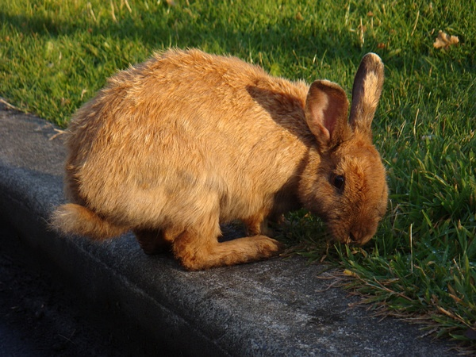

original link: https://www.douban.com/note/15864420/

所以我就不起了

來說說我這幾天到干啥啦

也沒啥

坐了12個小時多的飛機到了加拿大
然後又坐車坐ferry到了UVic
這裡很漂亮很安靜
有很多草地有很多bunny
溫度較低人都很friendly
宿舍是單人間超級乾淨整潔

早上上上英語課
和日本人韓國人西班牙人墨西哥人意大利人講English
下午可以睡覺可以看書可以參加活動可以去downtown轉轉
such a small city
but it's quite nice and peaceful
生活在這裡也超級愜意喔~~~

啊
晚上10點才天黑......

現在是下午2:21

忽然想起来
来传一张可爱的bunny~

The bunny is eating.
