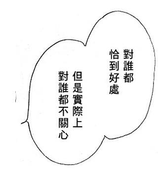

original link: https://www.douban.com/note/157075972/

最近心思活络话有点多。。。。

刚刚去吃饭，我买了一份肥牛米线。饭堂工友问我要不要牛丸，我一时没反应过来，下意识地摇头。工友笑说，吃牛肉不吃牛丸~【嗷！在我摇头的时候就有点后悔了~白送我的牛丸干嘛不要啊摔！

然后又开始反省自己。。。。。

想起前两天，朋友K去和一位长辈一起吃饭。那位长辈看到她包上面别了一个徽章，是我们在台北机场买的，国民党党徽。长辈说很好看呢，朋友K下意识说，「喜欢啊你要不要，我送给你」。说完就后悔了，因为那枚徽章她个人也是很喜欢的。但是话已经说出口，最后长辈当然就收下了。

她回来后，跟俺们吐槽，「好后悔啊，就习惯性地说了那句话，说的时候就后悔了啊」什么的。我说，「谁叫你习惯性说那句话，白送的东西谁不要啊，活该！」【其实白送我的牛丸我也没要！aho！

其实想来，我跟K的性格在这方面真是截然相反呢。对于别人的请求邀约之类的，我会习惯性地拒绝，有的时候是真的有考虑过觉得不好，也有很多时候就是出于习惯而已。嗯，这也很明显地说明，我以习惯性的拒绝来保护自己免受伤害，但其实这种过度的自我保护也使得我的人生经历更加单薄无趣。

而K是典型的双子座，什么没尝试过的都想尝试一次。她会习惯性的问别人，「要不要一起去XX？」 大概因为这样，她人缘一向不错。所以，我喜欢和K一起玩的原因也不过是因为她总有各种各样的理由说服我去尝试一些没做过的事以及去没去过的地方。

不过我个人认为她最大的弱点就是不懂得拒绝。这点反而是我最习惯性做的事。她习惯性的说「好」，但是事后又不知道该怎么推掉。我告诉她，直接说清楚原因或者编个借口，其实别人也没什么所谓的。但是她非不愿意直接了当，因为她害怕和别人起冲突，害怕伤害到别人。

这么想来，我还真是个自私的人，基本都只考虑自己的感受。

