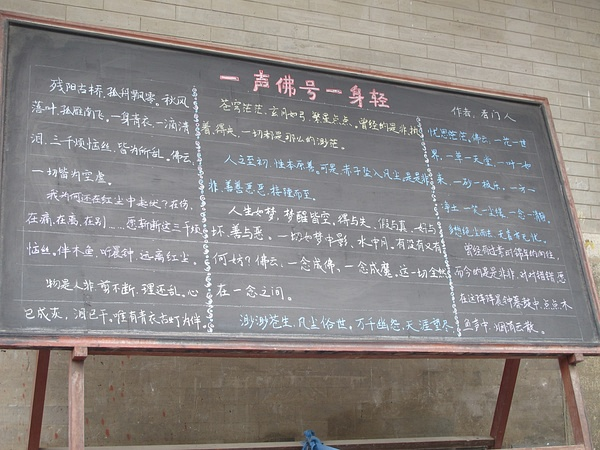
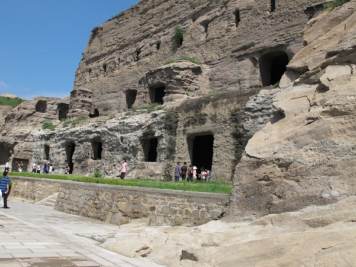
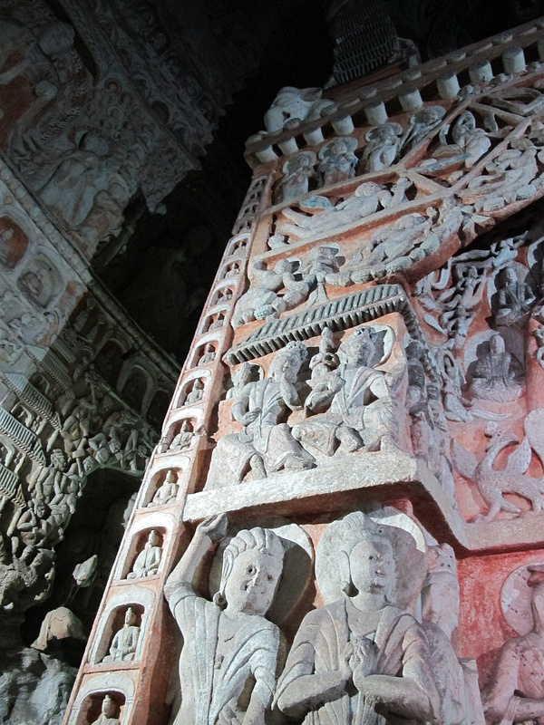
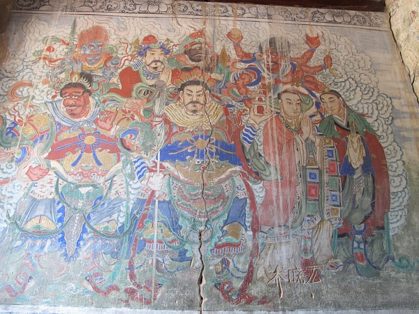
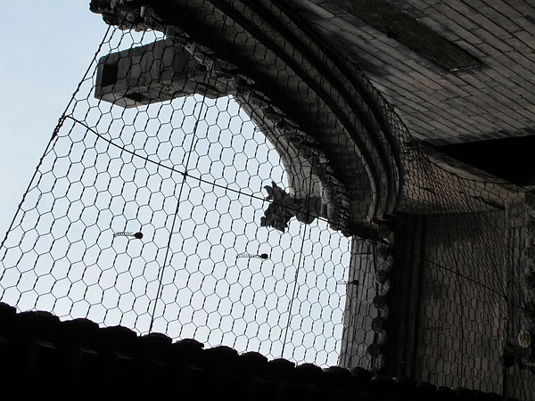
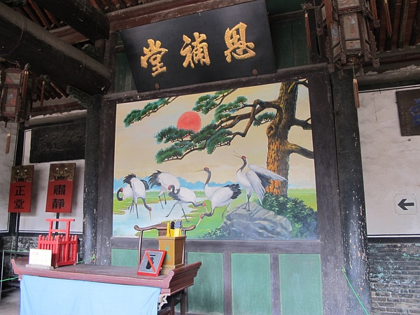
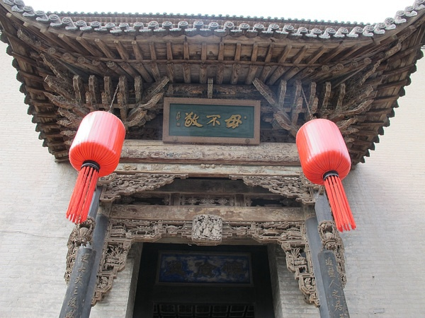
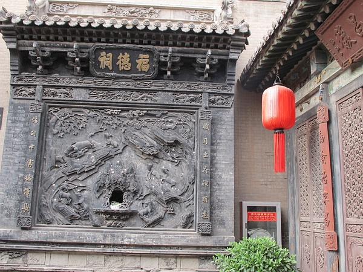

original link: https://www.douban.com/note/231191473/

例行来记个流水账。。。。。。。。
这次完全被别人安排去哪哪玩，所以自己没做功课就去了，于是就跟自己出去玩相比兴致少了，乐趣也少了。果然出去玩还是要找志同道合的人一起计划才有意思啊！
同行的有我、我表妹、我老爹、老爹他大学同学一家老小五口人，总共8人。

8月9号
下午的飞机去太原，然后有人来接直接开车去了忻州住下然后晚餐。从这顿晚餐开始了山西行，之后每餐都被喂得很饱。山西面食多，总之吃了各种各样的面食，然后就等着长膘吧TuT。。。。

8月10号
白色小面包车，我和表妹坐在最后一排，与行李箱为伍，被送进了五台山。这天天气甚好，阳光明媚，初秋的温度也甚舒服，除了太阳下面还是很晒的。
五台山是佛教名山，文殊菩萨的道场，文殊菩萨是掌管智慧的，所以这里香火很旺。我妈之前曾来许过愿，然后她非要说是因为文殊菩萨很灵我高考才成绩不错=L= 我对五台山最初的印象只有顺治出家的地方。
下午去了菩萨顶、显通寺还有白塔。话说这几处地方原来都是藏传佛教= = 在白塔那里见到了好多喇嘛= =

什么五台山最大的炉，什么一个香港富商送的

白塔下面的转经筒 要顺时针转三圈

虔诚的五体投地

白了个塔的~

啊~~视野不错

近一点的白了个塔~

啊~~~抓拍失败~

寺庙里的树最好看了

啥康熙还是乾隆题的字

只是觉得还挺好看的~~~

显通寺里最好看的一个寺，白砖的，里面供的啥佛忘了

8月11号
晚上的五台山真的好冷orz 冷风真是嗖嗖的吹~·~
上午又去了殊像寺和五爷庙还有黛螺顶。殊像寺和五爷庙真是香火旺到不行，挤着去点灯点香拜佛拜五爷。导游说在殊像寺许愿求智慧求学业，在五爷庙求财求官。
咱不能免俗，既然来了就诚心求个“前途似锦”求个财不求官。另外说是五爷庙特别灵，有很多人赠送的“有求必应”的牌匾，小小的五爷庙堆满了人。

五爷庙的人好多。。。。。。

据说小牌匾挂不了几天就会换，大一点的牌匾就大概挂一个月也会换。。。。

在殊像寺点灯点香许愿花了2张毛爷爷，在五爷庙点香也花了2张毛爷爷。。。。。QAQ

殊像寺烟雾缭绕啊缭绕啊~

嗡嘛呢叭咪吽

殊像寺的人潮啊人潮啊。。。

小清新了没=v=

然后下了五台山，开始凄风惨雨的，然后一直开车去了大同，到了大同也是冷死了啊啊啊啊啊啊啊~黄土高原啊~下大雨啊~嘤嘤嘤嘤QAQ
中间经过了一个应县木塔，很坑爹就不提了。
本来以为大同煤矿有名，空气会不会不太好，结果好像说是近几年城市好好建设了一番，一派高端大气之风~比太原都好~连路灯都显得很大气啊XDD还挂着鲜花啊！
住的宾馆也是此程住的最好的地方，房间很新很干净，电视节目碉堡了，HBO、NHK、ESPN、华娱、星空好多好多难得一见的付费台，还有棒子的什么台= =，真是高端大气！（你个土鳖！

可惜只住了一晚TAT

8月12号
昨天的风雨过去，又是一个阳光明媚的日子。
咱去了云冈石窟。四大石窟之一，另外三个是敦煌的莫高窟、洛阳龙门石窟以及天水的麦积山石窟。去过云冈后，我就只差天水的麦积山石窟没去过了呀=w=
龙门石窟去的时候比较小，没啥很深的印象了。莫高窟的印象还是比较深的，那些飞天的壁画的确很美，但是风化也实在蛮严重的。
对比来看，云冈石窟的风化好像就好多了，至少保护措施就没有莫高窟那么多，但是几个最漂亮的也还是有不准照相的规矩什么的。不过都没好好守规矩。

石窟被盗的三个佛像，有一个在美国，还有一个好像在英国，剩下的一个下落不明

总赶脚佛祖的眼神略恐怖orz

三佛~

小佛~

最有名的一尊佛像~

是不是很高端大气！

有个熊孩子的爸妈让熊孩子照着大象下面那个人的姿势摆拍，我和表妹在旁边不厚道的大笑起来XDDDDD

哦~为某些人而开~

石窟里面~

乔晓宏又是一个欠揍的熊孩子！！！

下午又坐车回了太原。

8月13号

上午去了平遥古城，古城装逼什么的XDD
不过其实平遥总体来说都显得破破旧旧的，而且颜色也都灰蒙蒙的，以及这天阴天，没有丽江那么阳光明媚装的那么顺手=L= 不过越破越值钱www
平遥古城有个县衙还挺有意思，牢房监狱有展示一些刑具拷具，想着还是觉得心惊肉跳的。还有前面的大堂和后面的所谓民事法庭，最后面还有吃饭睡觉的地方什么的。还挺气派的说。
然后去了中国第一家票号，日升昌记。晋商还是很有名的嘛~~

密码。月份、天数、数额、单位什么的。。。

汇票~还有说是当时票号伙计还一定要找173-175的美男子，以及会写一手好字~

天网恢恢，防盗的

15岁的老狗

进大门给vip客户看的，把铜钱建到墙的缝隙里，以示有钱可靠~

刑具之一，跪搓衣板，吊着长辫子，大木头压腿，看你招不招~

忘了这个字是有啥意思了

刑事法庭~

曾经中国的华尔街~

民事法庭~

一个破房子~

塞了红包之后的牢房，不塞红包就是一个伸手不见五指的破洞~

牢房~

这个好恐怖，处死女囚犯的，让女人跨坐在木马上摇来摇去，流血过多而死。。。。。。。

平遥比较规整的也就这一条街

然后还去了乔家大院，我倒没看过那个很出名的电视剧。人好多啊又是挤死了orz

大红灯笼高高挂呀~

镇宅之宝照妖镜（胡诌

慈禧太后赐的九龙宫灯

乔家大院呀~

忘了这事啥

据说是巩俐用过的道具床呀~

私塾~说那块牌匾可是500多年的核桃木呀~非常值钱~

醋坛子wwwww 给媒婆看的，显富贵www

8月14号
这天就去了晋祠，下午就飞机回武汉了~
这天又下雨，好冷啊啊啊啊orz

晋祠圣母殿的柱子。。。略可怕QAQ

戏台子~

说圣母殿里这个红头发的宫女是个阴阳脸什么的，怕怕

2千年的匾

没用砖啊石头啊只用木头扣起来的结构什么的

雨中圣母殿~

晋祠的确山清水秀的，古树很多很漂亮

这颗好像是柏树来着，螺旋着长~

三千两百年的柏树。。。估计有树精了吧XD

三千两百年的柏树还说有个故事，是说本来在圣母殿的两旁各有一颗柏树，左边的是雌的，右边的是雄的，但是雌的中间染了什么蛀虫什么病活不下去了就被砍了，现在留存下来的这颗雄的很伤心，就开始倾斜的往另一边长想去看一眼自家媳妇。而且正好中间又长起一颗直直的树撑住雄柏，所以传说是他们俩的儿子。儿子也有1500多年了的说。

基本上就是以上这些。
写得好无聊啊= =
不过山西其实还蛮有地方特色的说，避暑好去处~另外虽然吃了不少好东西，但是也有不少也没吃到的赶脚。还有也可以考虑下雪的时候去五台山，雪景也很美的样子。
