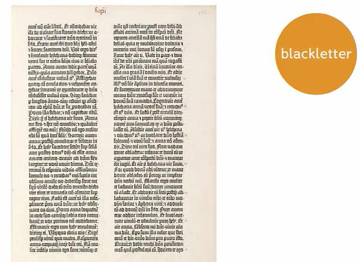
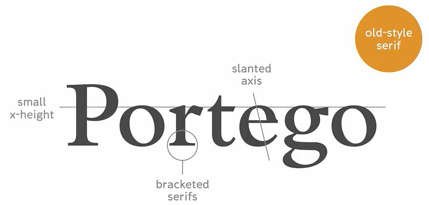
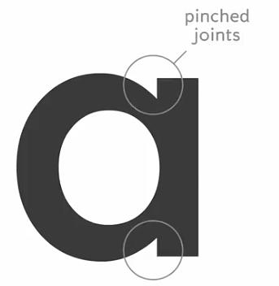
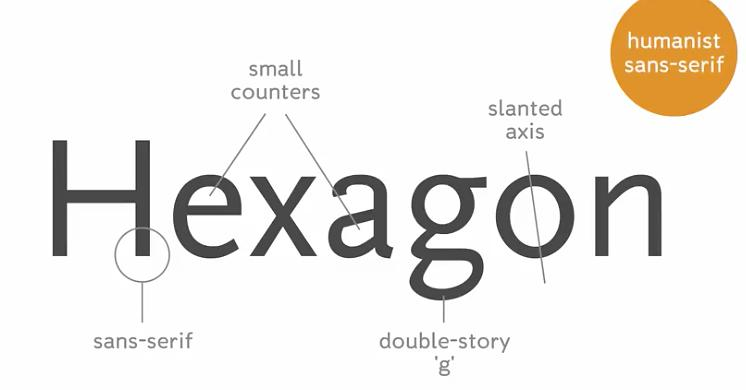

original link: https://www.douban.com/note/667028571/

> 一个纯种小白的一点笔记

[Intro to Typography](https://www.coursera.org/learn/typography) 第二周的内容, 来, 我们来讲点 history story ✨ (注: 基本上是翻译+意译)

> No typeface is a neutral transmitter of content. All typefaces carry associations, whether explicit or implicit.

讲师的这句话倒是颠覆了我对字体的认知, 我以为只有一部分字体有非常鲜明的特点, 才会有特殊的意义. 后来想想, 其实任何字体都是人创造设计的, so, 绝对的 neutral 和 objective 不存在的.

再以及, 一个字体的发展可能比我们知道的要长很多很多, 所以它的语境意义也可能是多层次的, 在不同时期也不一样的, 举例:

##  一个叫 Fette Fraktur 的字体

Fette Fraktur 长这样

Fette Fraktur 是 19 世纪德国人设计的, 为了复刻文艺复兴时期的手写 style, 非常有特点吧~ 但是后来被和纳粹联系到一起, 二战后就不被允许使用了, 直到 2000 年以后, LA 的街头艺术家们才重新开始使用. 是不是很神奇呢, 这个字体竟然比我奶奶年级还大! 也是经历过磨难的呢~ 😂

于是继续一些 case study~

---

##  [Bembo](https://en.wikipedia.org/wiki/Bembo)

\- 15 世纪早期在欧洲的活字印刷术没有发明出来的时候, 书基本上是修道院里专门抄书人员手抄的, 所以当时的书可以说是奢侈品. 后来 Gutenberg 发明了活字印刷后, 他自己设计字体也是从模仿修道院抄书员的手写字体来的, 当时的字体叫 **Blackletter** , 长这样:

\- 再后来, 活体印刷通过威尼斯传到意大利, 意大利那边的设计者制作的是模仿欧洲南部抄写员的手写体, 这种字体就叫 **Roman Script** :

\- 威尼斯历史上最有影响力的一位出版商叫 Aldus Manutius, 他的成就就是开始大规模印刷书籍, 使得更多人可以以低廉的价格买到书. 他当时请了一位设计师 (punch cutter) 叫 Francesco Griffo 设计字体, 这个字体也就是今天的 **Bembo** .

\- 现在使用的 digital version 是一个美国设计师 Stanley Morrison 在192x 年 从 Manutius 的版本而来. 取名为 Bembo 的原因是当年第一本使用 Griffo 的字体印刷的书, 是一本诗集, 诗集的作者叫 Pietro Bembo. (well, 这个字体到今天也不是 free 的....但是以诗人的名字来命名也很有意大利风格了~

\- 在 Manutius 的时代, 书不是印刷在纸上, 而是在羊皮纸/动物皮毛上, 材料费贵, 所以为了省钱, 会尽量在一页上塞入更多文字, 为了这个目的, Manutius 也让 Griffo 设计了第一种斜体 Italics

\- 以上两种以及其他 15-16 世纪的 Roman Style 都被归类为 **old-style serif** , 非常 calligraphic, 主要特点如下, 具体来说: 1. 比较倾斜, 2. bracketed serif 是说衬线部分与 stroke 的其他部分是以弧线连接起来的), 3. 比较小的 x-height

\- 综上, Bembo 类似的字体一般与 literature, classicism, 中世纪联系起来

---

##  [Didot](https://en.wikipedia.org/wiki/Didot_%28typeface%29)

\- 在 Bembo 的 300 年后出现的, 被归为 **modern serif** , 主要特点就是看不见任何手写 style 的痕迹了:

\- 时代背景的话是 18世纪的欧洲, 对 empiricism, rationality, scientific rigor 非常热衷, 所以也体现在字体美学上, 第一个这类型字体叫 Romain du Riot, the King's Roman -> 路易十四世 1692年指定为 Royal French Print Office 的官方字体. 它是由 designer 和 engineer 一起捣鼓出来的, 所以有一种 mathematically precise grid, 看以下这种精确的设计稿就明白了:

嗯... 就是强迫症的爱好

Romain du Riot

\- 后来一个研究印刷技术的人叫 John Baskerville, 他发明了一些技术可以打印出精美的字体笔画. 也就是这个人发明了字体 **Baskerville** . Baskerville 归类为 **transitional serif** , 它处于 old-style 和 modern serif 中间

\- 又 40 年后, 一个巴黎设计师做出 Firmin Didot

\- 今天的 digital version 是法国设计师 Adrian Frutiger 在 20 世纪的重现诠释

\- Didot 和 **Bodoni**  非常像, Bodoni 是差不多同一时期一个意大利人 Giambattista Bodoni 设计的, 他们俩是互相影响的, 并且都受 Baskerville 影响

\- 基本上 modern serif 的形式上是 thin, elegant, minimal, 欧美 50-70 年代时尚杂志用的非常多, 现在也经常和 fashion 联系起来

---

## [Clarendon](https://en.wikipedia.org/wiki/Clarendon_%28typeface%29)

\- 这个字体产生于工业革命时代, 这个时代除了书籍印刷中需要使用 type, 媒介变多了, poster, product packaging, advertisment 等等. 在很多场合需要很大的字体 来吸引眼球, eye-catching. 以前主要使用的 metal type 不适用了, 因为过大的字体金属太重. 直到 1823 年, 一个美国的 type manufacturer 叫 Darius Wells 的人发明了 wooden type, 用木制 type 来印刷, 很大的字体也完全 ok 了

\- 19 世纪也产生了 ultra bold modern serif, 叫 fat faces. 当时最流行的 serif 类型叫 **Egyptian style type** , 今天的叫法是 **slab serif type** . 特点如图, 是不是很醒目~ 给人一种 sturdy industrial look

\- 一个有趣的问题: **Why Egyptian?**  为啥是埃及?

\- 还是要回到 19 世纪欧洲国家各种跑去探索非洲和亚洲的时期, 所以当时的欧洲人对异域文化有狂热的 obsession, 叫 Egyptian 可能就与此有关, 将这种当时显得很特别的字体与异域文化的气质联系了起来

\- well, 所以到今天, slab serif 给人的感觉仍然是华丽和异域风情的, 工业 look 气质, 所以经常和维多利亚时期风格, industriallism, spectacle, ornament 联系在一起了

---

## [Futura](https://en.wikipedia.org/wiki/Futura_%28typeface%29)

\- 时代处于经济高速发展后又被 World War I 重挫的时期. 相对的 Fine Art 的世界中, 也产生了一种新潮流: rejecting and deconstructing traditional modes of representation 对传统的解构 (大概这么翻译)

\- Futura 是1927年德国设计师 Paul Renner 设计的

\- 20年代, 最早期的平面设计师们(例如 Bauhaus 的一位老师, 匈牙利设计师 Moholy-Nagy) 提倡以理性及功能性的角度去设计, 在字体上就是希望能剔除一些字体的历史习惯以及过多的装饰部分, 仅仅使用最基础的形式/颜色/结构, 目的是为了有效的交流.

\- 于是同时期的 Paul Renner 实践了这个理念, 设计出了 Futura 这个字体 (well, 这个字体到今天也不是免费的...

\- Futura 归类为 geometric sans-serif: (minimal geometric form)

其中一个细节是 pinched joints, 特意将交叉处弧线做扁了一点, 否则会出现较大一片黑色, 不够平衡

\- 基于设计的理念来说, 基本上这类字体和 simplicity, transparency, naivety, 以及 early European modernism 有关

---

## [Helvetica](https://en.wikipedia.org/wiki/Helvetica)

\- 在 Bauhaus 之后出来的就是瑞士的 Basel School of Design, 他们的理念是 clear objective, neutral as possible, 和瑞士这个国家类似...

\- Basel 喜欢 sans serif, 当时最接近他们偏好的字体叫 **Aszidenz-Grotesk** , 189x 年德国人设计的, 归类为 **grotesk sans serif**  (和 modern serif 类似)

\- 50年代由于 Swiss Style 的兴起, 1957年 Helvatica 出现. Helvatica 属于 **neo-grotesk/rationalist sans serif** , 它和 Akzidenz 相似, 但是更加 clean, mechanical-looking

\- 60-80 年代, Swiss Design 统治世界 (雾), so 直到今天, Helvatica 仍然主导商业社会, 很多图标/路标的 default font, 很多 UI 的 default font

\- 一件有点讽刺的事是这样: 2007 年, 一个叫 Gary Hustwit 的人拍了一下 Helvatica 的纪录片, 结果发现自己陷入了设计师的论战之中. 一派 modernist 设计师任务 Helvatica 是非常好的 neutral, objective 的代表, 另一派 postmodernist 设计师认为 Helvatica 千篇一律, 只会使人麻木.

\- well, 不管怎么说, Helvatica 现在的确是 ultimate default in typography

---

## [Scala Sans](https://en.wikipedia.org/wiki/FF_Scala_Sans)

\- 80 - 90 年代, computer 改变世界, 所以 typeface 也 explosion 了

\- Scala Sans 是 荷兰设计师 Martin Majoor 在 1992 年设计的, 被归类为 Humanist sans serif, 主要特点就是 他是非衬线体, 但是有很多 old-style 衬线体的特点:

\- Humanist sans serif 中最出名的一种叫 Gill Sans, 192x 年由一个英国人 Eric Gill 设计 - Gill 当时参考了 old style serif, 又结合了 sans serif 的美学 - Scala Sans 又参考了 Gill Sans

\- 这个 Majoor 在两年前(1990 年)的时候也设计了一种 old style serif 叫 Scala. Scala 和 Scala Sans 虽然一种是 serif, 一种是 sans serif, 但是是有着相同的结构:

上面是 Scala, 下面是 Scala Sans

\- Scala Sans 的含义上就很多层次了, 它既有着 humanist typeface 的比较人性化的一面, 又带有rationalist sans serif 的机械感, 细节部分偏传统, 但是整体 style 气质是现代的, 这些融合在一起也是现代字体设计的特点.
