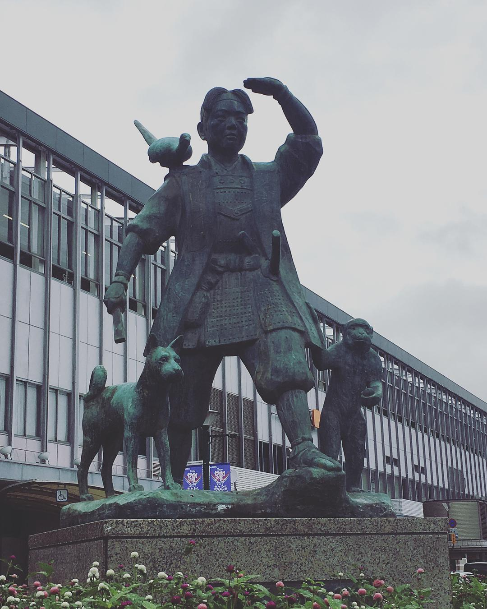
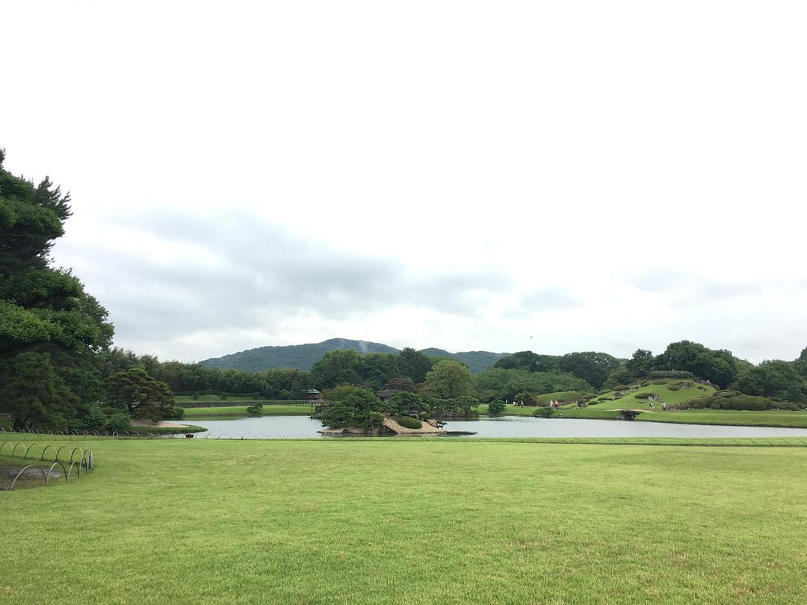
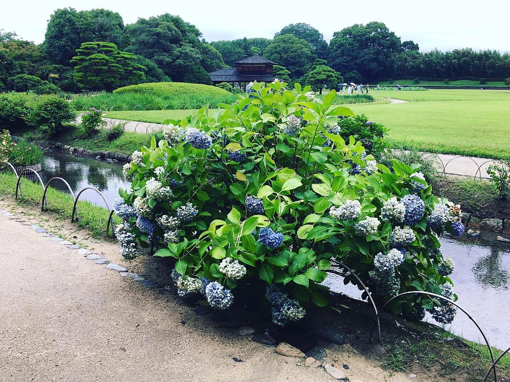
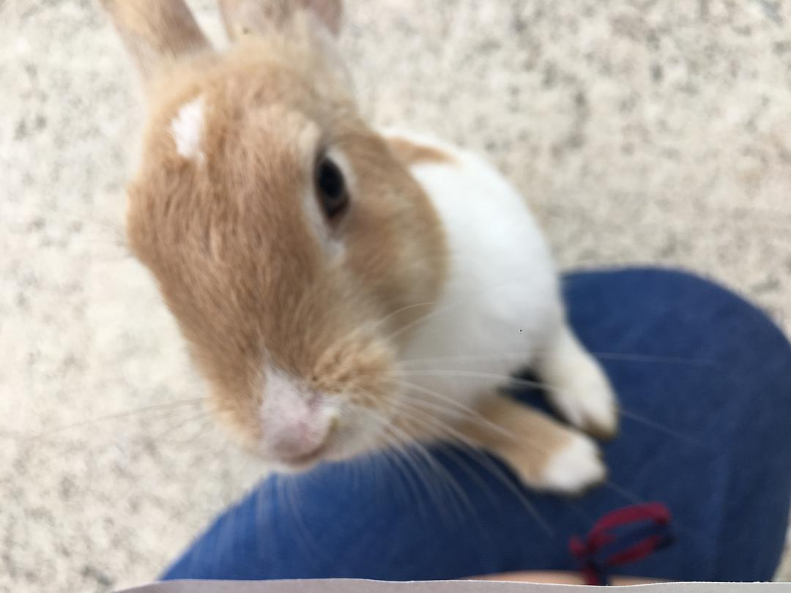

original link: https://www.douban.com/note/728217071/

这次时间比较长，真 787 的出去玩，比上班还累。。。。。。自找的 \_(:з」∠)\_

以及写起来太累，这次决定拆开写。。。

## 行程总览

- 7.20：HK -> 大阪 -> 冈山，玩冈山后乐园 + 兔子岛，住冈山 （22687 steps，13.3km，12 floors）
- 7.21：[冈山 -> 广岛，缩景园 + 核爆和平纪念公园，-> 严岛神社大鸟居，住冈山](https://www.douban.com/note/728267844/) （22696 steps，12.7km，12 floors）
- 7.22：[冈山 -> 岩国锦带桥，-> 尾道闲逛，住冈山](https://www.douban.com/note/728415477/) （16855 steps，10.7km，12 floors）
- 7.23：[冈山 -> 宇野港 -> 直岛，回冈山住](https://www.douban.com/note/728579087/) （23686 steps，14.3km，49 floors）
- 7.24：[冈山 -> 犬岛 -> 高松，住高松](https://www.douban.com/note/728934373/) （18329 steps，10.4km，13 floors）
- 7.25：[高松 -> 丰岛，回高松住](https://www.douban.com/note/729118519/) （29056 steps，16.6km，31 floors） - 7.26：[高松 -> 男木岛+女木岛，晚上高松 -> 大阪](https://www.douban.com/note/729348647/) （20811 steps，12.4km，34 floors）
- 7.27：[上午半天休息，下午京阿尼，回大阪逛逛街购购物](https://www.douban.com/note/729353142/) （15778 steps，9.9km，7 floors）
- 7.28：早班机 -> HK

** 括号里的只是我的 ios Health 上面记录的步数，行动距离，以及上下爬的高度这样。。。平常每天最多只走 1k 步的人，这次真的卒 orz

## 7.20 冈山后乐园 + 🐇岛（大久野岛） 阴天阵雨 🌧

凌晨的航班，一早 6 点就到达关西国际，出关之类的都很快，先去案内所领取了事先买好的 JR 关西及广岛地区 5 日 pass，非常推荐 [JR 西日本的 pass](https://www.westjr.co.jp/global/tc/ticket/pass/)，都非常值，特别是包括山阳新干线的 pass，简直太划算，**山阳新干线** 真是爽，其实坐一程新干线从大阪去冈山或者广岛就基本已经赚回来了。

大概坐车 2 个多小时，10 点前就到达了冈山的酒店，寄存了行李，就轻装出门了。因为这天没有太阳，偶尔阵雨，甚是凉快，就直接从酒店腿去了后乐园。

冈山站一出来就有桃太郎

走路时偶尔发现的井盖都很可爱

井盖 2 号

[后乐园](https://okayama-korakuen.jp/index.html)是个园林，但是又不怎么像正常的园林，总之「充满了吐槽的乐趣」（by 同行友人）。本来在它们网站上看到说不同季节有不同的花看，春天可以赏樱，夏天可以看荷花菖蒲山茶花之类的，秋天也可以看🍁之类的。只是很可惜，我去的时候荷花败得差不多了，说是有紫薇花，但好像还没开，非常不凑巧。。。[花期讯息戳](https://okayama-korakuen.jp/hanadayori/index.html)

一进后乐园，第一感觉是怎么这么大草坪，是公园么？

稍微像园林的地方

最好笑的是这片水稻田 23333 农业混搭风

但是有很多很 fat 很 big 的锦鲤！

极其少没有谢的绣球花

败得基本啥到木有的荷花池

气愤！泥巴地把我的白鞋搞脏了！才第一天！

1个小时就逛完后乐园了，过个桥就有个竹久梦二乡土美术馆，但因为门票要 800yen （后乐园才 400），想着对竹久梦二也没啥特别深感情，看着就小小的一间，于是并没有掏钱进去，只去了旁边的周边店买了点小手信噗 w

梦二乡土美术馆就这么大

回程倒是正好坐上了黑猫特供 bus

以及正好与 tama 酱电车遇到

中饭直接在冈山站买了便当，あなごめし

看上去有点干，但其实吃起来完全不会，也因为饿了，迅速风卷残云了

转了两次 JR 到达一个小站，忠海港，然后坐船去大久野岛，也就是兔子岛。想去这个岛，完全是一时兴起，在查 JR pass 的时候看到宣传资料里有，pass 也能到，于是就想去撸一撸兔叽了，反正也是濑户内上的小岛呀~ 所有关于兔子岛的资料[戳这个网站](http://rabbit-island.info/)就行，主要是看好船的时间。

一下船就有不少🐇了

完全不怕人，随便摸，甚至找你要吃的

这天也是完全不热，海边相当酥胡~

因为我蹲下来了而爬到我身上要求投喂

嗯，就是被🐇围攻的我。。。😂

感觉很少人去这个岛，除了交通不怎么方便，还有个原因是大久野岛是曾经日军研究生产毒气化学武器的地点，曾经完全被隐匿起来，现在留下不少遗迹。曾经的毒气岛，现在的兔子岛，这个反差也实在是。。。

毒气储藏室遗迹

工厂遗迹1

工厂遗迹2

工厂遗迹3

工厂遗迹4

整个兔子岛腿完了一圈大概用时 2 个多小时，然后就原路返回冈山了，大概 8 点多回到酒店。

Day1 摸鱼写完惹。

\>>> [Day 2 广岛一日游](https://www.douban.com/note/728267844/)
