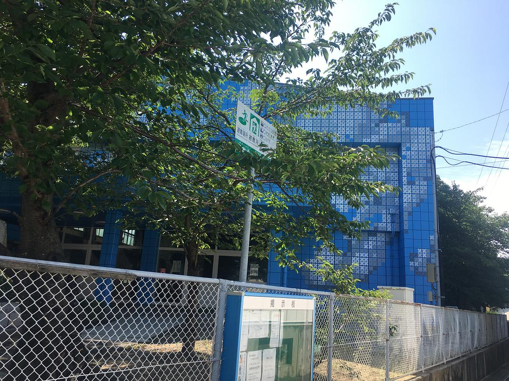
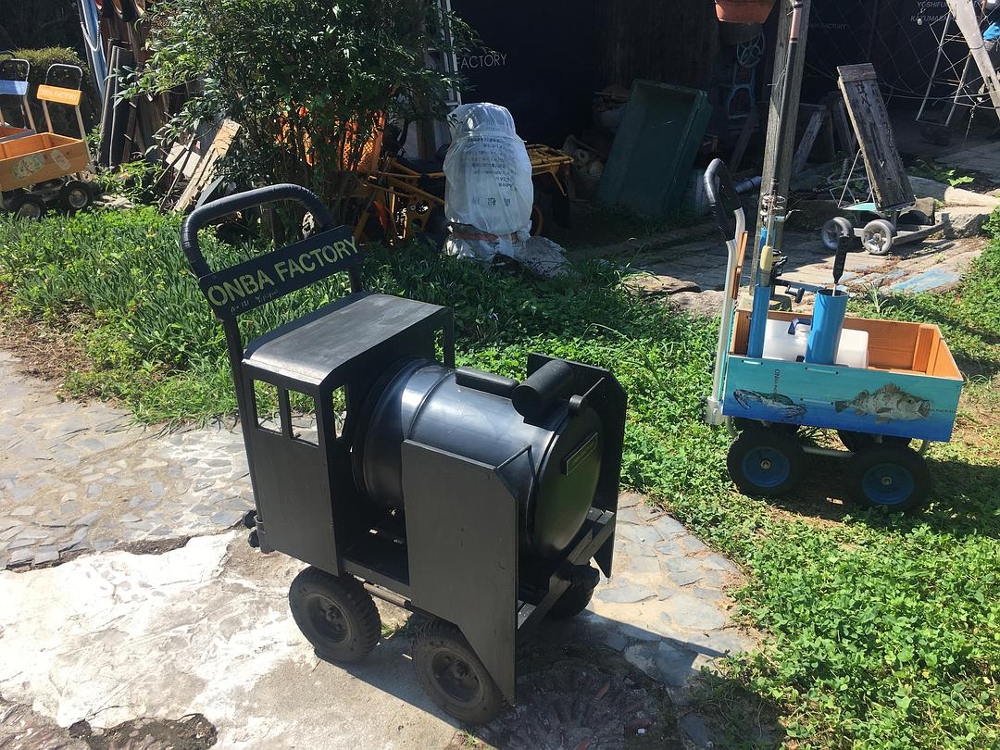
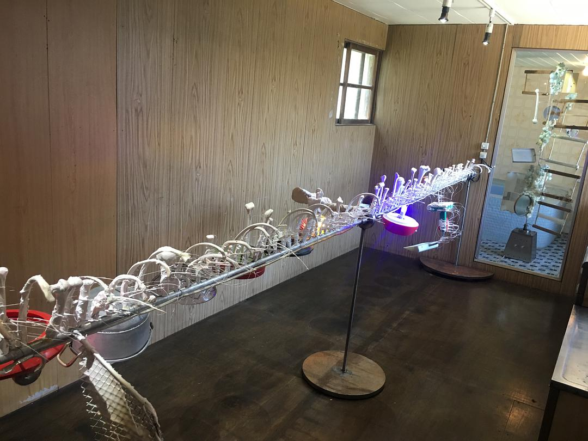
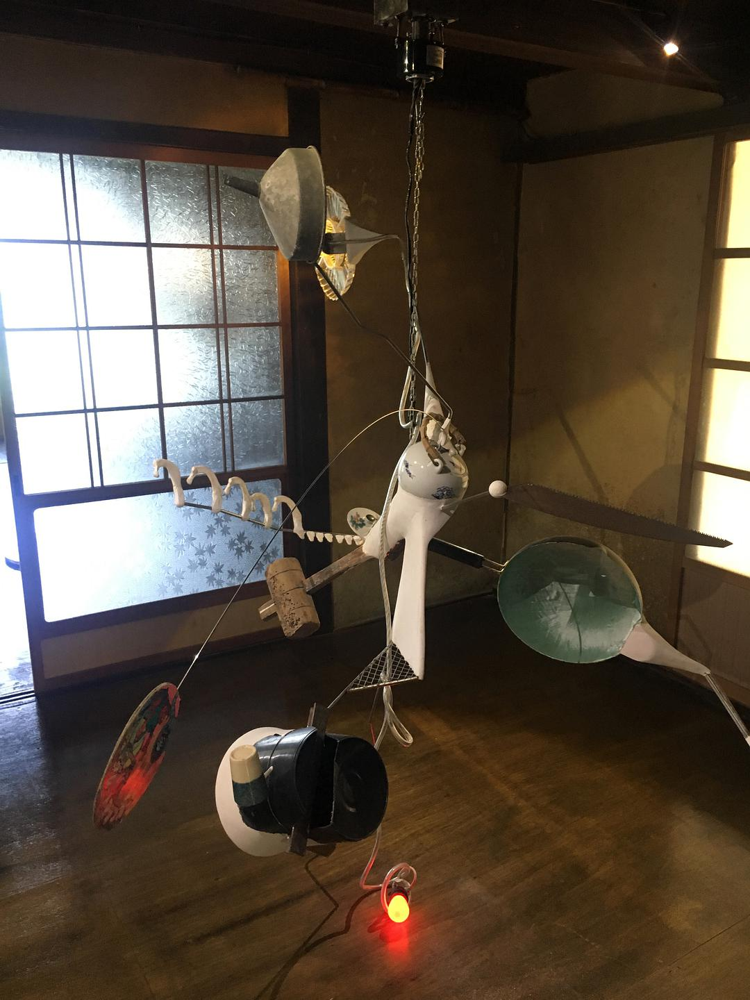
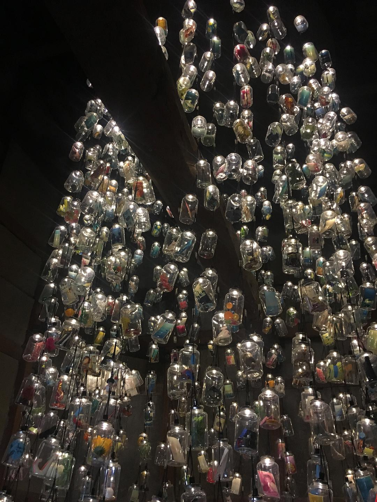
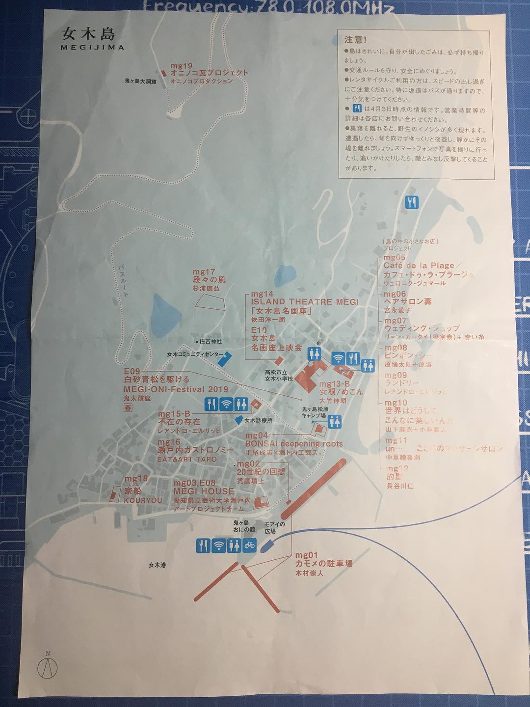
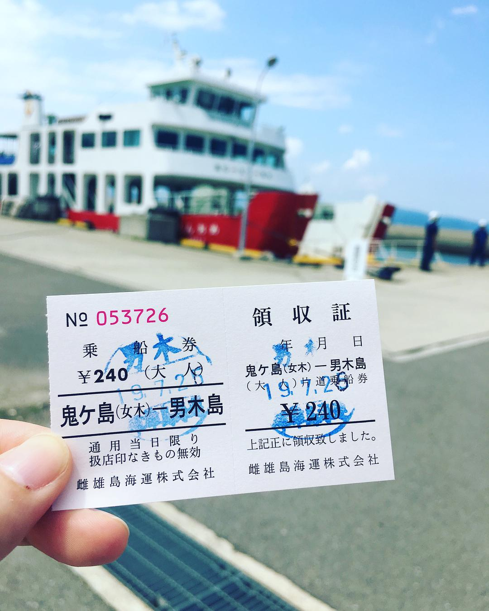
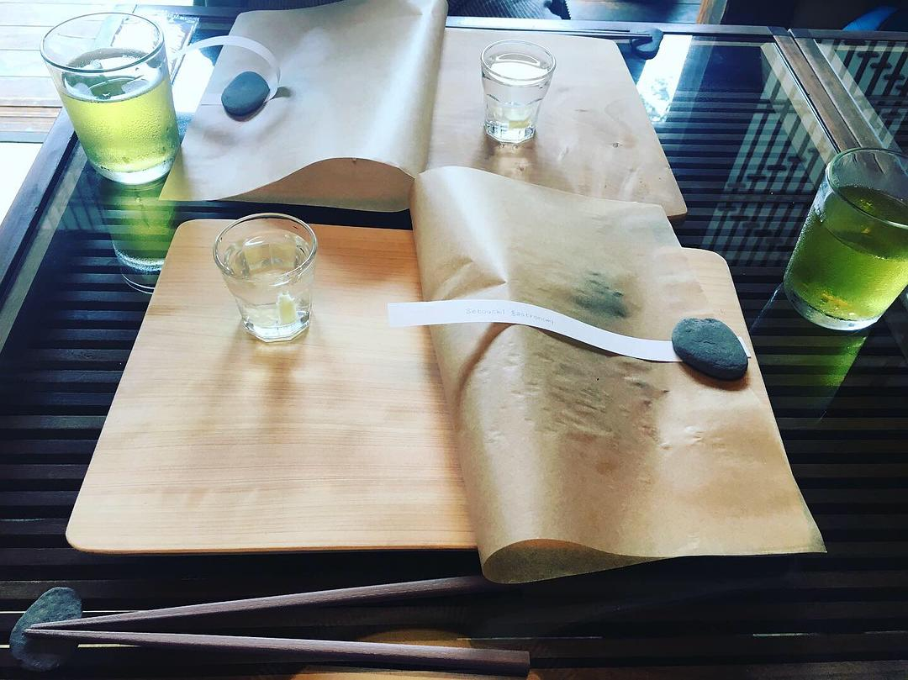

original link: https://www.douban.com/note/729348647/

前情提要：
- [其一 冈山后乐园 + 兔子岛](https://www.douban.com/note/728217071/)
- [其二 广岛一日游](https://www.douban.com/note/728267844/)
- [其三 岩国锦带桥 + 尾道](https://www.douban.com/note/728415477/)
- [其四 直岛](https://www.douban.com/note/728579087/)
- [其五 犬岛](https://www.douban.com/note/728934373/)
- [其六 丰岛](https://www.douban.com/note/729118519/)

## 7.26 男木岛、女木岛 **大晴天 ☀️☀️☀️☀️**

Day7，跳岛第 4 天。目标：雌雄双岛。

一般会选择男女木岛一起玩，因为这两个岛离高松港很近，并且去男木岛的话是一定会经停女木岛的。

还是 7 点起床，去赶第一班 8 点的船先去了男木岛，计划再坐 1 点的船从男木岛去女木岛，最后坐最后一班从女木开的 5：20 的船回高松。因为男女木岛都不大，于是各留半天感觉时间非常宽松。 后来事实证明，这个安排其实都过于宽松，最后其实赶到 3 点多的船回了高松。

## 男木岛

男木岛地图

8：40 到达的男木岛，和丰岛类似，大部分 artwork 是 9 点半才开，所以一开始还是先去找室外的没有时间限制的 artwork。基本上，看地图可知，其实最远也就是到 og16 歩く方舟。所以，可以先在港口周边把室外 artwork 打卡完毕，然后腿去 og16 。完了再往回走，基本上可以磨蹭到大部分展馆开门了。

船票~

og01男木島の魂：也是船票 ticket office 以及案内所，很好看

这一个居民家特别可爱~ 有好多守护的喵喵狗狗

井盖 5 号？

对，男木岛很多喵，也是一点不怕人的

甚至主动靠近你哦~

远处那个看着像 4 个🍄的就是行走的方舟

近一点看得到是有 4 双腿 www

这么看就还真的挺 行走的方舟的~ 有趣

还可以靠近~

og17青空を夢見て：其实是指学校体育馆外墙

og03生成するウォールドローイング -日本家屋のために

og04うちの海　うちの見

og05 男木島 路地壁画プロジェクト wallalley，街边壁画会遇到几次，不是每一处都有 stamp 可以盖就是了

og06 オンバ・ファクトリー

都是以前的婴儿车改造，都很可爱~

旁边有个 ONBA Cafe，风景也相当不错哦~

另一个看上去也很舒服的 cafe

og07 The Space Flower・Dance・Ring （宇宙華・舞・環），这个作品的艺术家是个 89 岁高龄的爷爷

og07 The Space Flower・Dance・Ring （宇宙華・舞・環）

经过这一段的时候屋里传出的歌声，在ukulele 的伴奏下，又偶尔不是唱歌，只是念诗，虽然不太听得懂，非常好听，是有个艺术家（？歌手？）每天有几场念诗音乐会，好像是 500yen，有时间有兴趣的可以试试

og08アキノリウム

og11 Trieb－家，就像家里有个瀑布一样。。。

og12 自転－公転，就是各种奇奇怪怪的东西绑在一起转啊转啊

另一组

og13 記憶のボトル，收集的各种充满回忆的小物件

比如有奥特曼

og15部屋の中の部屋

然后发现男木岛 2 个多小时就腿完了，顺利赶上了 11 点的船去女木岛，比计划提前了 2 个小时。

## 女木岛

女木岛本身比男木岛大一点点，不过除了一个 mg19 很远外，其余都在港口附近，其实也很快就可以腿完。

因为到达女木的时候正好遇到巴士去 mg19 大洞窟要开车了，于是就决定先把最远的去掉，其余的就回港口慢慢逛。

女木岛也叫鬼ヶ島，宣传自己是桃太郎传说中桃太郎去打鬼的那个岛 233

鬼 都做的很q

mg19 就是逛一下这个大洞窟，而且需要另外付钱，这个洞窟十分内地景点感哈哈哈哈，最大的优点是洞里面草鸡凉快，有个温度计放在里面显示的是 15 度，而室外应该有 35 度惹~

洞窟所在的山，是直接看得到对面的男木岛的~

天气太好~~~

然后等巴士回到港口区域，继续晃~ 巴士时间艺术节网上有，但实际好像有加班次，正好遇到加开的班次~

推荐一下下面👇这个 mg14 ISLAND THEATRE MEGI 「女木島名画座」，电影主题，里面有好多手绘风格的电影海报，还有一个 mini 放映厅，荧幕上循环放映的是老旧电影院的纪录片，挺有趣的~

外墙使用的还有旧式百老汇或者西式电影院风格的招牌

那个年代的电影明星们

应该会有很多眼熟的电影海报

mini 放映厅

老旧电影院的纪录片

再一个还挺不错的是 mg16 瀬戸内ガストロノミー，是个吃饭的 artwork。需要提前去领取一下整理券，大概一天有 5 个时间段可以预约，然后一个人需要 1500yen，然后边吃饭的时候，艺术家（其实是厨师？）会边在旁边介绍食材或者制作中的一些小知识小趣味小窍门，就还挺有趣的~ 以及 1500 yen 虽然一开始觉得有点贵，但是就这个体验来说，以及最后吃到的东西来说，也值了~

那个小杯子里是用女木岛才有的一种特殊 melon 以及醋制成的饮料，酸甜口味，但也蛮酸的。艺术家说melon 是在女木岛发现的特殊品种，直径只有 2cm，是全世界最小的 melon，是不是很神奇呢 www

右边两杯就是女木岛生产的两种醋，可以试试味道~

前菜~ 鱼肉新鲜好吃哦~ 渍物也都清爽~

鸡肉~ tata 酱是现场调制的，说了点小窍门，因为我又不会做也没太听懂 \_(:з」∠)\_

最后这碗面我吹爆，无敌好吃，番茄汁的冰镇素面，素面是小豆岛产的，怎么说呢，大夏天的来这碗冰镇素面，简直太爽了！！！我还可以吃三碗的感觉~

最后的最后还有个🦶型小饼干，可爱 www

放两张 ppt 感受一下

另外一个挺神奇的小院子，是在一个休校的小学里的 artwork，这里的名字是[「女根」](https://setouchi-artfest.jp/artworks-artists/artworks/megijima/31.html)。

进门就是这个

整体非常。。cyberpunk

这个装置也很有意思， 看着很诡异，是可以坐上去玩的，然后右手摇杆可以转圈，然后连接的竹竿就会升起，头顶的铁铲也会转，椅背上的铁铲也会动，整体很神奇，虽然也不知道为啥有这么一个东西哈哈哈哈

也不知道为啥有人在搓麻？哈哈哈哈

mg04 BONSAI deepening roots：一个很有多盆栽的屋子，这个挺好看的，推荐转一转~

废弃厕所里长着植物的感觉~

来了个小刨冰🍧

mg01 カモメの駐車場，有点可爱 w

然后就坐到 3 点 20 的船回了高松。跳岛行程正式结束了~ 小豆岛和大岛这次就放弃了。小豆岛其实相当大，内容很多很分散，但是小豆岛的交通也因为大显得很不方便，曾经想过要住在岛上一天，但查过酒店之后又实在有点劝退，条件好的太贵或者交通不便，要不然就条件实在一般。在男木岛上碰到过几个台湾阿姨们，就说他们是开车在小豆岛玩的，虽然这样很方便，但是给车买船票来回的钱也是相当贵的了。大岛是很小，比较没名气，但估计用 2 个小时也可以看完，最早计划后一天想去看鸣门漩涡以及顺路玩下淡路岛，所以就也放弃了。后来旋涡的时间和交通以及淡路岛的交通也都挺麻烦的，最后旋涡和淡路岛也一并放弃了。

再后来就等着从高松回大阪的高速巴士了。如果还有 JR pass 的话，还是可以从高松坐慢车回到冈山，再转新干线的。可惜 pass 只有 5 日有效，对比后觉得做 JR 高速巴士比较划算。另外高速巴士会有提前购买优惠，力度最大的就是提前 21 日购票优惠，优惠 700yen，一个人只需 3400yen。为了保险起见，我买的是 7 点的车。如果不贪图那 700yen 的便宜，其实应该 4 点半还是 5 点的车就够了，sei 知道男木岛女木岛逛起来这么快 🤦🏻♀️ 大巴坐 3 个多小时就可以到达大阪 JR 难波站。

stamp 收集成果如下👇 所有 E 开头的是指 Event，[Event 的时间不定](https://setouchi-artfest.jp/event/)，我去的几天只有两个 event，都不是很有兴趣，也不一定能赶上，就没有特别去管了。。。

惨痛的直岛。。。

完全放弃的小豆岛和大岛

宇野港也没仔细看，高松其实有一些里高松港口很远的点，比如机场

<<< [Day6 丰岛](https://www.douban.com/note/729118519/)

\>>> [Day8 京阿尼+大阪闲逛](https://www.douban.com/note/729353142/)
