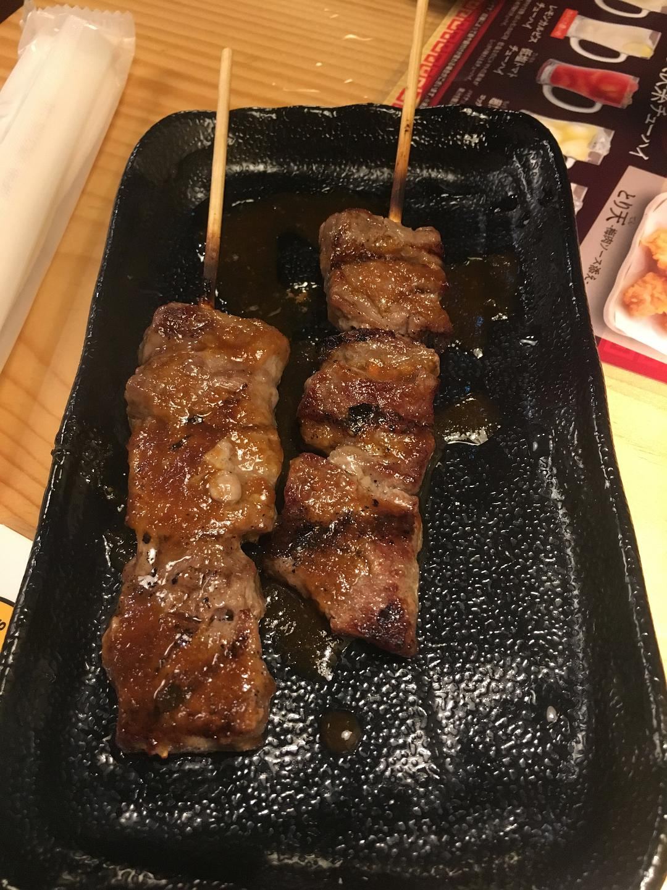
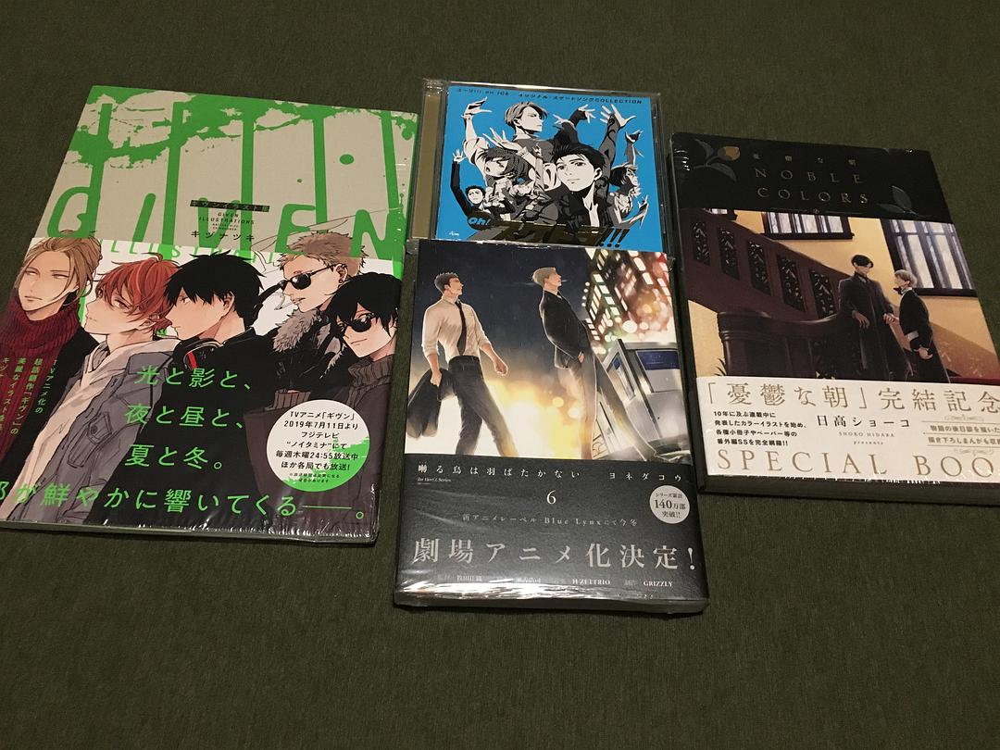

original link: https://www.douban.com/note/729353142/

前情提要：
- [其一 冈山后乐园 + 兔子岛](https://www.douban.com/note/728217071/)
- [其二 广岛一日游](https://www.douban.com/note/728267844/)
- [其三 岩国锦带桥 + 尾道](https://www.douban.com/note/728415477/)
- [其四 直岛](https://www.douban.com/note/728579087/)
- [其五 犬岛](https://www.douban.com/note/728934373/)
- [其六 丰岛](https://www.douban.com/note/729118519/)
- [其七 男木岛 女木岛](https://www.douban.com/note/729348647/)

## 7.27 京阿尼 + 大阪闲逛 宇治 ☔️ 大阪☁️

最后一日，没有很多内容，只是前一篇太长了，就还是另开一篇。。。

早先和友人商量最后一天就要么在大阪逛逛街休息，或者到时候再看想做啥。再后来说不如去大阪枚方那边正好还在进行中的小樱展，买点谷子，结果正好在出发前发生的京阿尼的事件，于是决定最后一天去看看吧。

这一天应友人强烈要求，上午啥也不干，在酒店休息到退房时间才出门。就在酒店楼下吃了个咖喱猪排饭当中饭，然后坐车去京阿尼。宇治地区这天下大雨，我本来就只带了一把小太阳伞，在丰岛的时候已经因为不断在海边被海风吹翻，伞的骨架直接断了，这天的雨勉强打着，其实还是搞成了落汤鸡。。衰

酒店楼下有一家咖喱猪排饭

装修也很旧式，招待的也是奶奶

咖喱很浓厚，满腹~

然后坐车去了六地藏站，马上到站的时候在车上都可以看到第一 bldg 那栋楼。站旁就是可以鲜花的地方。只是我们没有找到去哪里买花，这个没有事先查一查比较失策。

近距离看到的时候真的冲击力很大，鼻子有点酸，RIP 🙏🏻

冒着雨走去了木幡的本社，单纯只是希望看到本社还是好好的样子吧。然后就回去了，在难波站附近逛街。

animate 收银处是有捐款的，昨天看到京阿尼推上公告截止 8 月 2 号 animate 的捐款已经收到差不多 2.5 亿日元

逛 animate 看到的奇怪周边

这一套相当萌~

晚上去吃了鸟贵族，噗 w 结果竟然还要等位呢，等了半个小时的样子

这次是真的没有买什么东西。。。。

艺术节周边系列

其他杂物

二次元系列

感谢观看，终于写完了 。🙇🏻♀️

<<< [Day7 男木岛、女木岛](https://www.douban.com/note/729348647/)
