original link: https://www.douban.com/note/745990626/

是一次没啥精心计划的出游，纯粹想消耗掉两日调休假期，又不想一个人出门，于是蹭上了安娜要去看演唱会，于是就一起出发了。直到要出发前一晚才大概想好要去玩些啥。。。也是真的很随意了😅 流水账还是要照例来写一写，都是些常规的游客路线啥的~

## 12.13 ✈️ 晚上到达成田机场

这次没有买红眼航班，因为红眼航班很贵，下午这班反而最便宜，到达是大概正好晚饭时间。到了成田后，因为晚上也没啥安排，在成田机场意外撞到一个 anime goods store，于是就开心地逛了起来。（某人说着已经脱宅了，还是会开心地买 EVA 和钢蛋周边 🌚

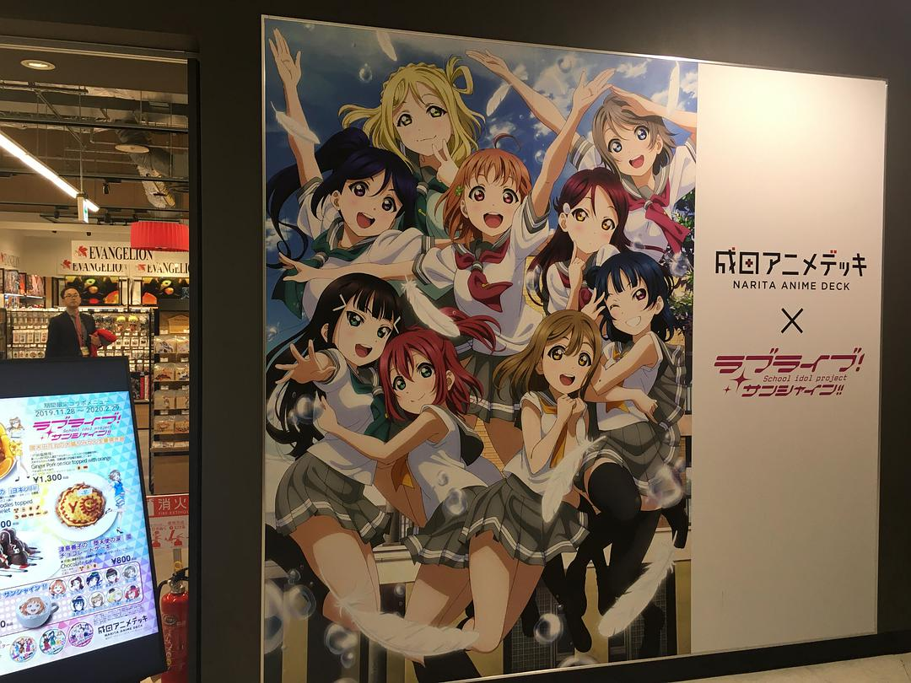

说实话，我不知道这个是啥动画，我也半脱宅了。。。

其实，这个背景是个什么地方，我也不知道。。。🤦🏻‍♀️

没有看错的话，背景是京都的永观堂，为啥和 SAO 配？？

巨人和富士山，合适

新的海报已经有了，后来才发现看板放歪了 23333

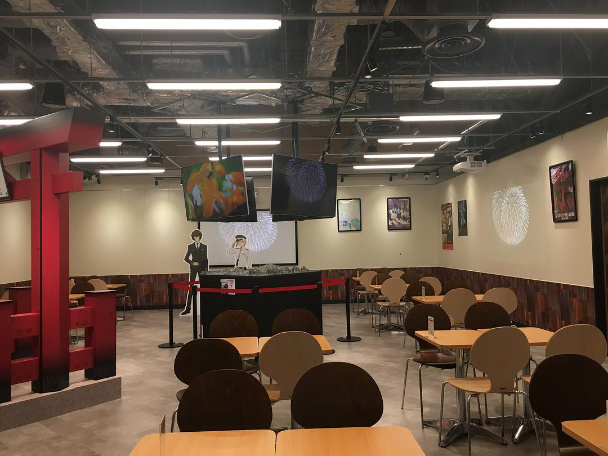

store 旁边的餐厅是这样的，烟花投影意外挺有气氛的

再以及巧合地碰上了这个 stamp 收集开始第一天，在 store 和餐厅就可以连盖两个了，然后就得到了凌波的贴纸！在池袋应该还可以获得真嗣的印章，然而最难的是去箱根才有的凌波的印章，才能集齐。。。箱根是不可能去的，就此放弃

逛完了就去浅草入住酒店了。发现酒店的走廊一部分是室外，于是可以在酒店里看得到 sky tree

大概就是这种的 feel

放下行李后去吃饭，去了鸟贵族 🤣

鸟贵族还是不错的， 味道没有大问题，吃了个爽一个人 1500-2000yen吧

回酒店之后，半夜看了一集五郎，还好鸟贵族吃得饱饱的 www

哎呀 啧啧啧

## 12.14 Akira Wall Art 展 + Nintendo Tokyo + Pokemon Center + 根津美术馆 + KK 演唱会

前面三个都在涉谷 parco 里。早前查了一下最近有啥展览可以看，比较感兴趣的就有这个 [Akira Wall Art Exhibition](https://art.parco.jp/museumtokyo/detail/?id=299)。另外正好前两周看到世雄去了涉谷 parco 的 Nintendo Tokyo 爆买，且提供了一个[提前领取整理券的小攻略](https://www.douban.com/people/donbou11/status/2714593858/)，于是我按照世雄说的，9 点刚过到了涉谷站，再走过去 parco。世雄没有说清楚的是整理券其实是在 parco 侧门外穿着红色衣服的任天堂 staff 直接派发的。而我一开始在 parco 正门前看到有人排队就傻兮兮跟着排了 5 分钟。觉着好像有点不对才问了下旁边的工作人员。。。😂 结果我拿到的整理券已经是 11 点半的了，看了下时间，是 9:18。

parco 商场本身其实 10 点才开门，所以红衣服 staff 们是直接站在外面派发整理券的

拿到 11点半的，也就是 11:15 左右就可以去门口排队等入场，基本上等个 5 分钟左右就可以顺利进去了

去买了个肉まん当早饭，在周围随便逛了下，接近 10 点回到 parco 门口等开门，看着感觉已经有 200+的人在排队等开门了。。。。

开门之后因为还有一个多小时，我先去了 parco 4 楼的 parco museum，也就是 Akira Wall Art 展的地方，非常凑巧地这天正好展览开催的倒数第二天，被我赶上了 😏

这个展览其实是 parco 在重建的 2017年5月〜2019年8月期间，外墙的装饰画，之前不知道有这个，没有看到实景，只能来看下这个展的照片惹。

提供帮忙摄影服务，白色衣服的是 staff 小姐姐 😂

除了这些还有些原画作品和拼贴作品展示。

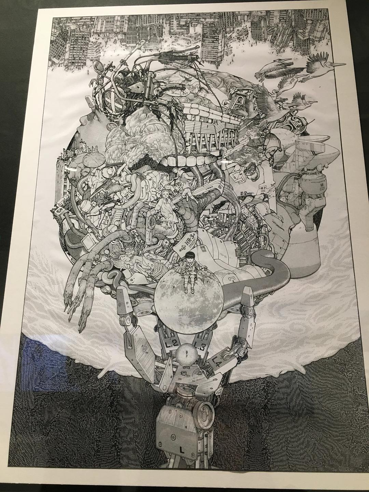

整个展览蛮小的，但还有很多 goods 买。。。有些还卖切了。。。（霓虹金做周边真的是世界一流，一骑绝尘 😂

霓虹金的商品摆放也是很有想法

本来想买个布袋，但是这个太薄了，旁边的樱花妹都有点嫌弃，最后穷逼我只买了个贴纸 😅

这些好像不是 for sale 的。。。

一些以前的海报，总之非常帅啦

另外，还扭了个扭蛋。

最帅的那一款一发入魂！

一个小时不到就从 Akira Wall Art 出来了，然后就去 parco 6 楼了。[6 楼实在挺好逛的](https://shibuya.parco.jp/floor/detail/?f=6f)，除了 Nintendo Tokyo，还有 Pokemon center，Jump shop，Capcom store，刀剑乱舞本铺。在这里很容易消磨时间并买买买。只有 Nintendo Tokyo 需要整理券，其他基本都不需要。刀剑乱舞会控制人数，需要排队，但也还好。穷逼我也没有钱爆买，只是随便买了点而已。

乱七八糟发点图。。。🌝

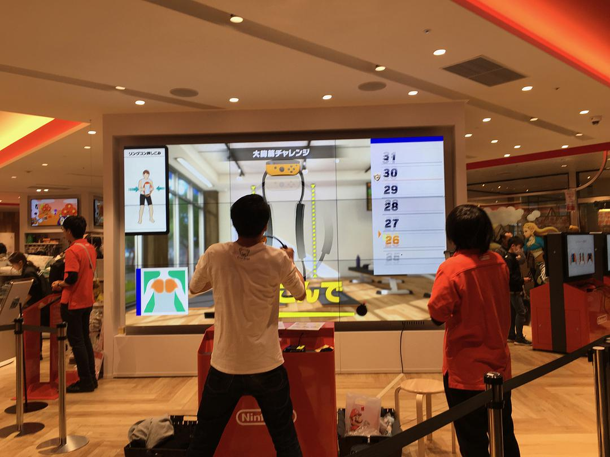

门口有健身环体验和 challenge 旁观看真是好好笑 233333

在 jump shop 差点心动的小玩意，嗯哼

小英雄的贴纸好可爱的！！各种 sold out。。。忧桑

一个清秀的林克

刀剑里面就是有个榻榻米，于是看到一个婶婶带来了自己的娃娃，专门拍照 www

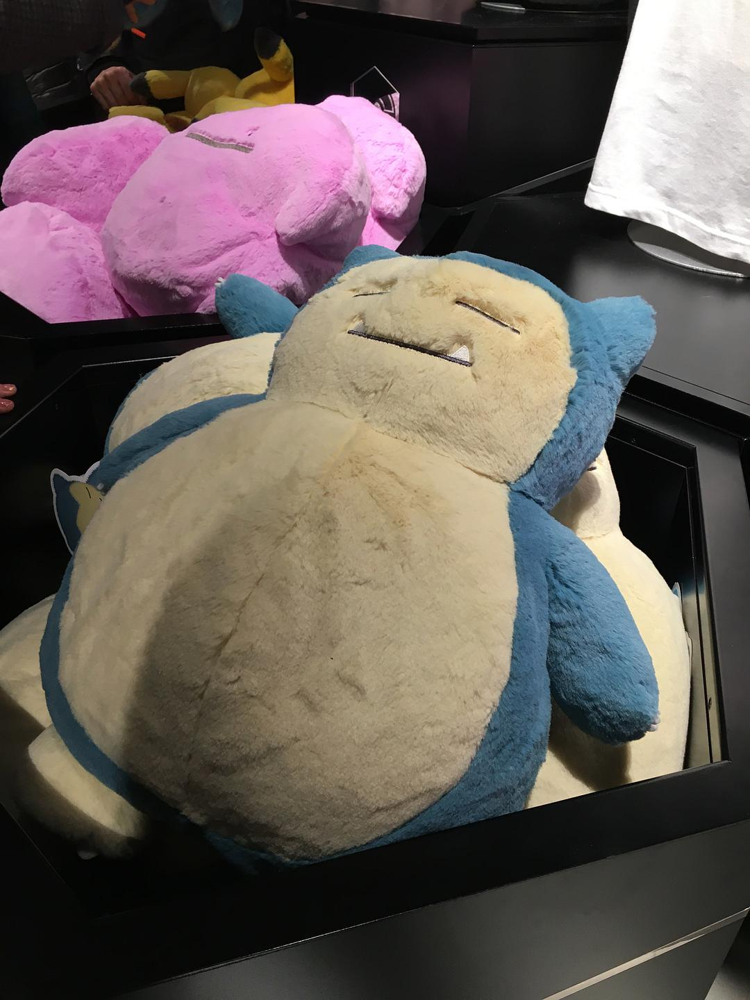

摸得草鸡舒服，不舍得放下，于是买了😂

如果没有整理券的话，就可能要排队 3 个小时。。。

可爱！！！！

据世雄说，小滑板之前不限购的，现在限制每个人只能买一盒了

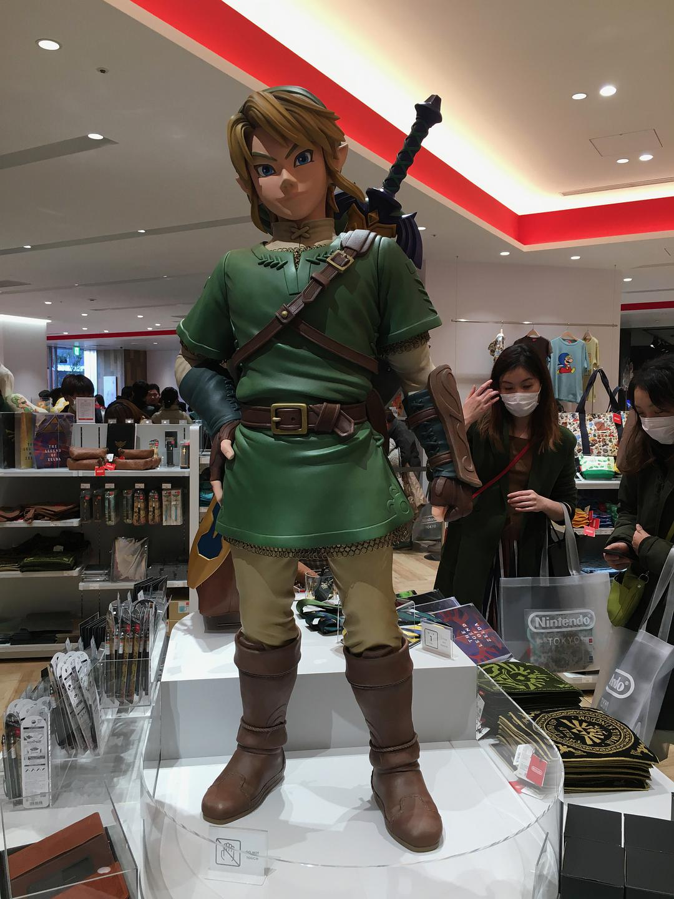

领带蛮好看的，可惜我用不上。。。

于是无聊的我买了笔。。。。

好了，因为我比较穷，就没有过多留恋在 parco 6 楼，大概不到 1 点就搞定了一切，离开了涩谷。坐了一站地铁去到了表参道，走过去根津美术馆。因为前一晚被安娜推荐这个馆，还不错，庭园和建筑本身还算值得看一看，也离涩谷近，不花很多时间。

在表参道附近走了一段，的确会明显感受到，为啥贵妇们所谓上流社会之类的或者想要装逼的人会喜欢表参道，会想要住在港区青山，能感受到那种高级感wwwwww 以及オシャレwwwww

这个是三宅一生

楼上那边是理发店，肯定爆炸贵。。。

然后去[根津美术馆](http://www.nezu-muse.or.jp/)乱转了一下，最近是一位茶道家川上不白的三百生诞，所以是介绍江户时期茶道发展的特别展览。完全不懂茶道的我也就能看懂一些字和画。其中很喜欢一幅字，写的是「**老来無力且坐喫茶** 」，有点可爱w。

美术馆门口

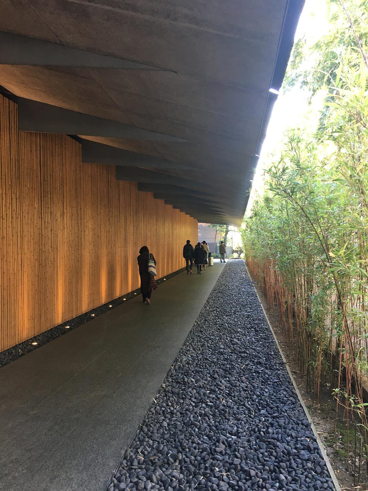

网红打卡点

庭园里面

还有不少🍁可以看，别看光线这么斜，其实这个时候才下午 2 点多。。。

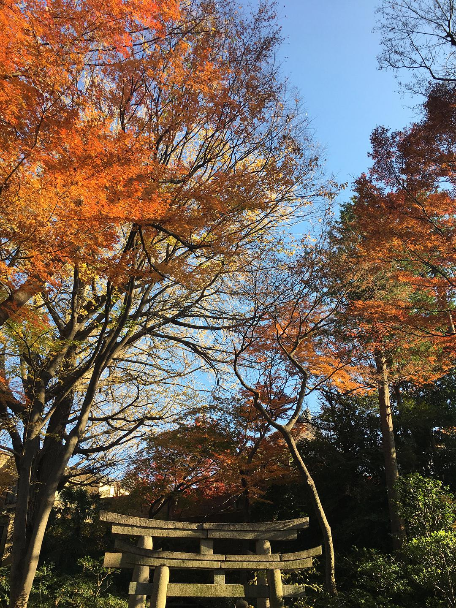

锦鲤发现，拜一拜 🙏

根津美术馆逛完就差不多 3 点了，准备去往东蛋和安娜汇合了。我先去到了东蛋旁边的 laqua city 找东西吃。发现这个一半是游乐园的神奇商场。

有旋转木马，过山车🎢，激流勇进，摩天轮🎡。。。

买了个🍔穿过 laqua 就是 Tokyo Dome 了，此行一大目的，是去看 Kinki Kids 演唱会。当然我是一个路人，不是粉丝，只是纯粹好奇在霓虹看 J 家演唱会到底是种啥体验。我很多年没有看过大型演唱会了，上一次演唱会应该是 13 年看陈奕迅，mla 那种 live band 演出不算在内。反正安娜塔气抽到了票，就跑来蹭一蹭了。毕竟这个票才 660，想想我去看聚橙 gala 拼盘音乐会都花了 898，结果看了个什么鬼，这个 660 肯定是值的。

开演前可以先去排队买 goods。按安娜说法，KK 家还算好的，排队不用很长时间，很快可以排到，Arashi 的 goods 贩售可能需要排队 2-3 个小时，想想明年 Arashi 要来北京开演唱会，不知道会是什么状况。。。

这次演唱会叫 ThanKs 2 YOU

Tokyo Dome 没拍全。。。🤦🏻‍♀️

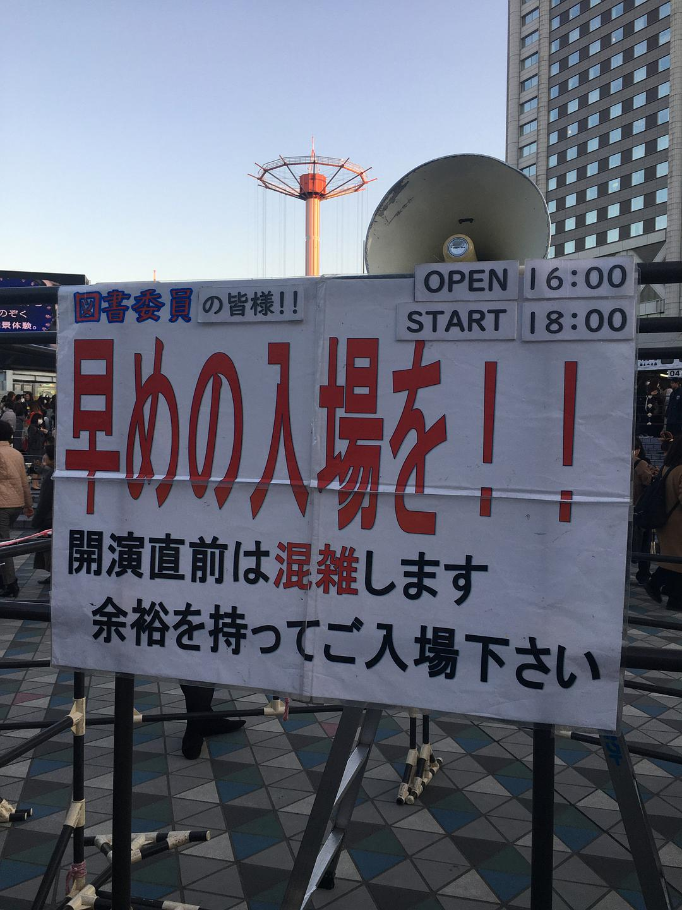

在东蛋门口磨叽了很久，都是因为安娜记错开演时间，并且需要等另外两个小伙伴一起入场。听说今年第一次开始启用电子票了😂 所以没有纸质票留作纪念，有点残念。（只有电子票根留作纪念）

偷摸摸地拍了一张开演前舞台，反正也看不清楚

安娜提前预测，今年大概率会唱的大多是抒情歌，于是她让我听了两张精选，我好好地预习了一下。她预测地过准，我竟然觉得整场演唱会 80% 的歌我都听过了！并且我最喜欢的两首都唱了，《Kiss からはじまるミステリー》（之前看金田一的时候就单曲循环上了），《雪白の月》（听精选的时候 pick 上了）。再以及，演唱会上的钢琴版《银色暗号》特别惊艳，我在精选集里听到过，但并没有什么很深的印象。回来之后我重新听普通 CD 版，发现真的没有钢琴版好听，不知道怎样才能再听到钢琴版。歌说完，可以再说一说 talk，蛮有趣的，我也魔性地记得了 51 的 とんこつあじ 🤣🤣🤣　再以及，直到演唱会快结束，听了两位说了很多很多有关ジャニーさん的事，最后突然意识到演唱会的名字 ThanKs 2 YOU 的 YOU 大概是双关的，不仅指歌迷粉丝们，更是**「You たち」的 YOU**  吧，也就是说纪念今年过世的ジャニーさん才是真正的主题。有心了。

## 12.15 镰仓江之岛一日游

这天我还是一个人行动，安娜下午要去看第二场 KK 演唱会。我就去了最常规的游客路线，镰仓+江之岛。具体怎么走，都是前一个晚上才仔细看了下[别人的攻略](https://hiromishi.com/2017/08/kamakura.html) 😅 攻略里面写了几种一日 pass 可以使用，查了下最后选了小田急线的一日 pass，小田急线是比较慢的一条路线，但是一日 pass 包括了来回新宿和藤泽，以及江之电部分，也才 1520 yen，还是很划算的。（单程新宿去藤泽需要 1000+，单独[江之电一日 pass](https://www.enoden.co.jp/tc/tourism/ticket/noriorikun/) 需要 650yen。不过这条路线就坐不到[悬挂式的单轨电车](https://www.jreast.co.jp/multi/pass/kamakura_enoshima.html)了，那条是从大船到湘南江之岛的 monorail。）

早上 9 点半才出门，磨叽到新宿，再买 pass，坐上小田急线到藤泽，换上江之电的时候已经差不多快 12 点了。于是正好先在腰越吃了个中饭，しらす丼。

这张 pass 回到新宿会被闸机回收

借攻略的图一用，pass 可用区间

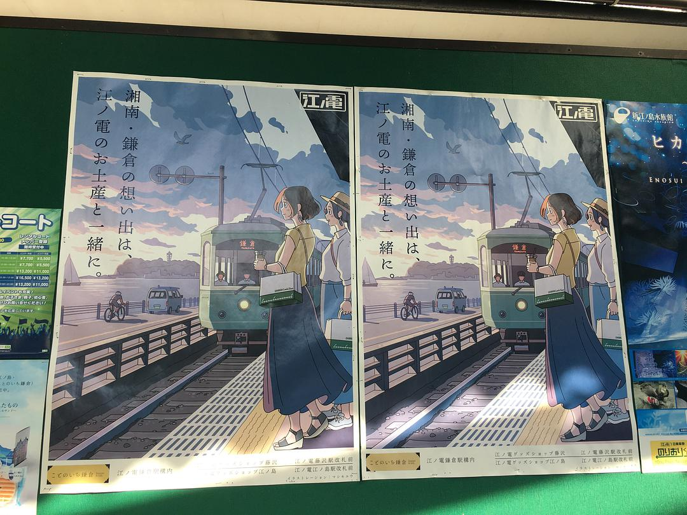

画风总觉得眼熟

电车就开在马路上 www

因为还挺喜欢攻略里介绍的这个小店，于是就跑来吃饭了

店内陈设之类的都很可爱，有不少 star wars 的周边

しらす丼セット

江之电

镰仓高校前 那个打卡点，我懒得下车，于是就在车上拍了下湘南海岸而已 😅

看了下大佛

付 20yen 可以进入大佛内部😂

话说镰仓的特产好像是这个鸽子饼，我看很多人拿着袋子，但是为啥我觉得特别丑，而且一块饼辣么大，好吃么？我是第一次如此不想买特产。。。

反倒是另外一个まめや 我很喜欢，全是各种各样的豆子，我试了下明太子 mayo 味，有点神奇但是好吃，于是买了两袋

镰仓小町通，我真是只是来逛了下商店街了。看了下并不怎么想去鶴岡八幡宮，并且想在日落之前上到江之岛上去看夕阳，基本上冬天 4 点半到 5 点就是日落了，所以逛完小町通我就坐江之电回到了江之岛

しらすかまぼこ，类似鱼饼的东西，好吃，很香

还有其他选择，都看上去挺好吃的

经过一家玩偶店，老奶奶玩偶做得很可爱，再往店内一望，真的是个奶奶正在缝纫机上工作着

这家团子店很多人在排队，如果下次有人一起去，比较想试试，比如三个人可以试三种味道啥的www

看到了可爱的柴公仔w

还有经过一家神奇的专卖 sausage 的老店

发现江之岛晚上有 light up，然后我真的去看了，一个人😂

差不多 4 点多我终于到了江之岛。。。

换上了圣诞装的小鸟们

时间差不多，已经是这么斜的阳光了

在江岛神社转了下这个轮。。。

听说可以求财，于是我第一次重金买了个金运御守！保佑我发大财不用工作，走上人森巅峰（bushi

另外好像还可以求容貌，比如这里有两个希望有泽尻的美貌或者村花的可爱 🌚

嗯 或者千年一样的美少女 233333

还有这个，列表详细定制自己想要的东西了 噗 www

上到展望台附近的时候夕阳已经是这个样子了，天气挺好的，可以看到远处的富士山🗻

5 点的时候，展望台 light up 开启，周围的游客一起“呜哦哦哦哦哦” 的那一刻，有点可爱

日落看完，进去了旁边的花园看了湘南の宝石的 light up，一个人。。。。

霓虹的这些 light up 哟，特别是 12 月的 light up，太有圣诞气氛了，几乎都是非常好的 date spot，适合家人情侣玩，一个人真是显得很撒鼻息。。。

接下来请欣赏蓝紫色的闪瞎眼的 light up。。。

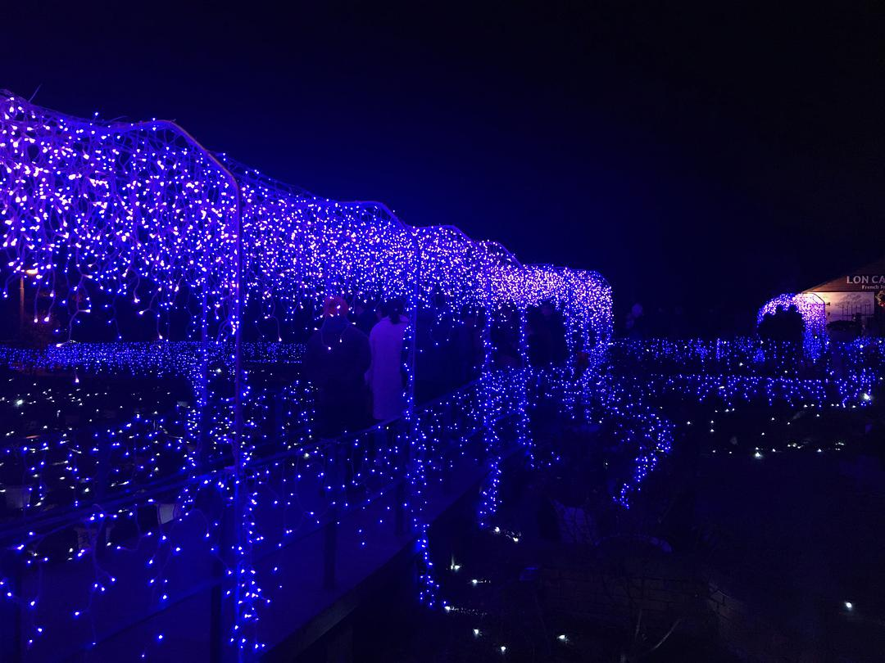

手抖了一下，变成了印象派画作有没有！

真的。。要瞎。。。

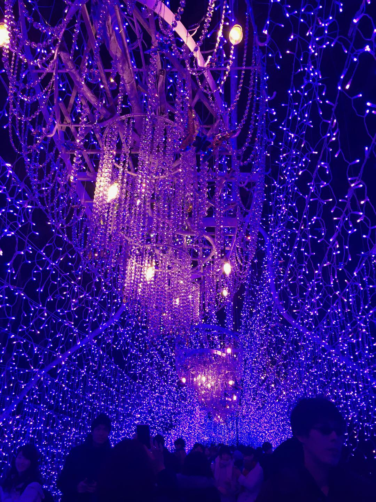

无聊的一个自拍。。。

讲实话，这个主题我服气。。。

这几个灯还是好看的

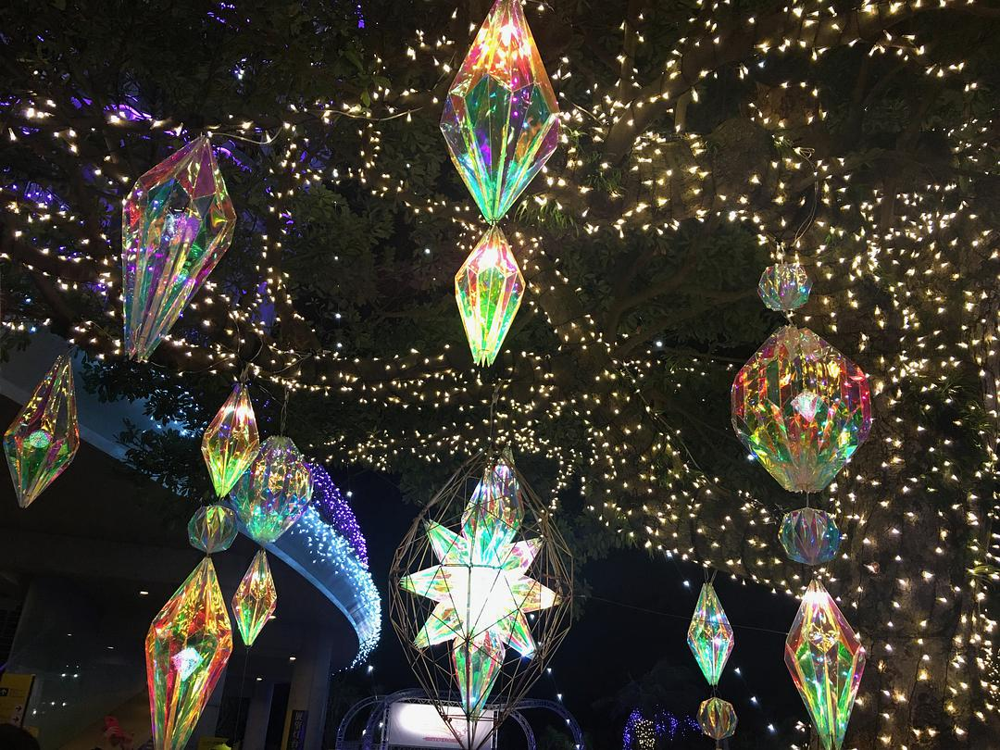

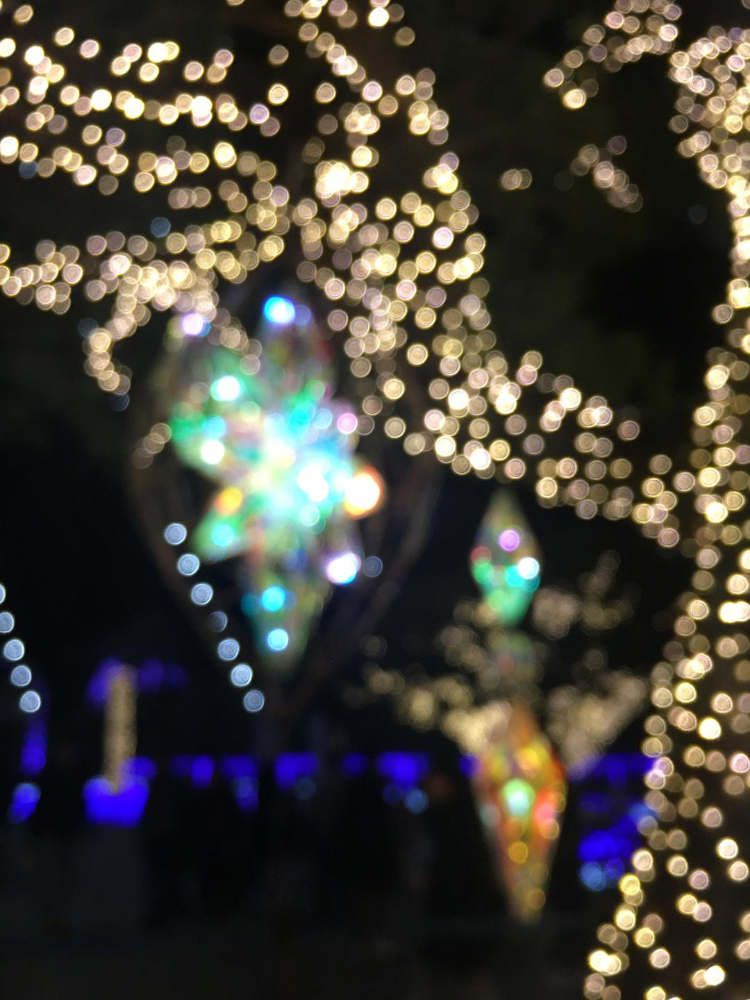

趁着👀还没瞎，离开了 light up 公园。。。下山到商店街继续吃东西去了。

去排队买了出名的朝日堂，猎奇分子没有买常规的タコせんべい、エビせんべい，而是买了新产品，青のせんべい。

青色仙贝介绍说之前桃李演的日剧《完美世界》里登场过，不巧正好没看那部剧，但是青色仙贝的味道是しらす，所以应该不会难吃就是了

兑换券有点可爱 w

下次还是需要试试タコ的

青色仙贝成品是这个样子的，长相神奇，的确不知道蓝色是怎么调制出来的，但是挺好吃的~

吃了仙贝又看到了しらすコロッケ，于是又买了一个，于是今天一天都在吃各种しらす！大满足~

## 12.16 Emeraldas 浅草到台场 + 看高达 + fuji TV + 《西区故事》音乐剧

这天更休闲了，10 点才退房离开酒店。到邮局寄了下明信片，然后就去到浅草吾妻桥旁准备坐船去台场。

其实也是临时起意说，坐船去台场好了，我还没看过高达，安娜挺喜欢松本零士设计的很有 Scifi 感的船，也不介意再去看看高达www 这天月曜日，坐船游览的人也蛮少的。[在网站上可以直接预订](https://www.suijobus.co.jp/special/emeraldas/)（网站挺酷炫的），正巧 Scifi 系列的船出了一个新的 Emeraldas，这个名字应该是来自[松本零士的漫画 Queen Emeraldas](https://ja.wikipedia.org/wiki/%E3%82%AF%E3%82%A4%E3%83%BC%E3%83%B3%E3%83%BB%E3%82%A8%E3%83%A1%E3%83%A9%E3%83%AB%E3%83%80%E3%82%B9)，讲的是一个女海贼的故事，我没看过漫画和动画，看了下 wiki，是说曾经改过设定，现在的设定是她是银河铁道 999 的メーテル的姐姐。

这里坐船~

等船中

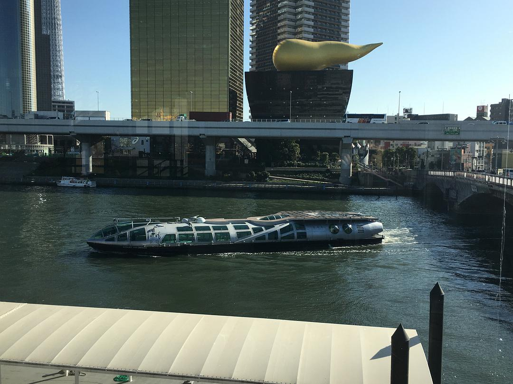

Emeraldas 来了~

登船

可以上到甲板

前方是彩虹大桥

这个角度可以同时看到彩虹桥和远处的东京塔🗼，可惜它不够高不够醒目 2333

台场到着

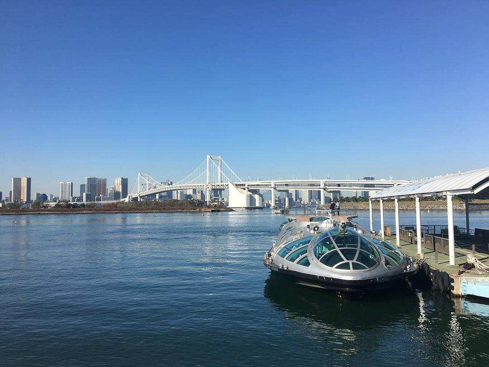

不明所以的🗽

带着球的就是 fuji tv 局

旁边的 aqua city 里也有个 jump shop

在这里吃了个拉面🍜

不会太厚太浓的味噌系拉面，好吃~

碰到一个排队人群，发现是 baby metal 的 goods 贩卖排队， 80% 以上是宅男🌚，估计最近这边 baby metal 有演出

看到高达惹~

逛了下钢弹 shop

然后去了 fuji，大概因为是月曜日，不仅 gallery 没开门，25 楼球体展望台也没开，人少得以为 fuji 要倒闭了一样 😂

fuji shop 里也没啥可买的赶脚，大概真的要倒闭了。。。（bushi

大楼里的 lawson 卖着腹肌吉祥物，话说我才知道 fuji 吉祥物是这只蓝狗。。。

由于没有做好功课，不知道 gallery 和球体今天关门，于是就在 fuji 大堂里纯粹坐着休息，等日落 light up。也是基本上 5 点就开灯了。

晚上的彩虹大桥就真的是🌈色了，以及看得到一点🗼

晚上的高达

之后 就跑去 IHI Stage Around 去看音乐剧《West Side Story》了，据安娜说，就是美国版的罗密欧与朱丽叶。。。

这里的舞台挺有趣的，据说是舞台有 360 度的，可以转着切换舞台背景设置，也就不需要人去中间手动搬动道具啥的，只需要转圈就好

为了 mamo 而来~

看完剧就直奔羽田机场，坐凌晨的飞机回了。

摸鱼写完鸟。也就是贴了一堆乱七八糟的图而已。。。。。
