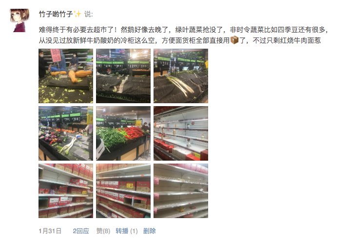
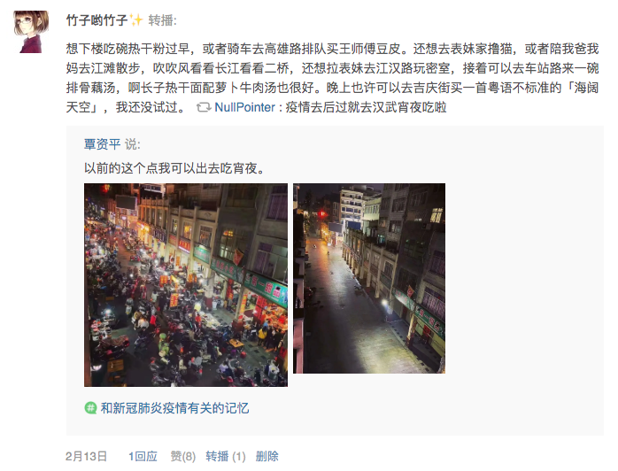
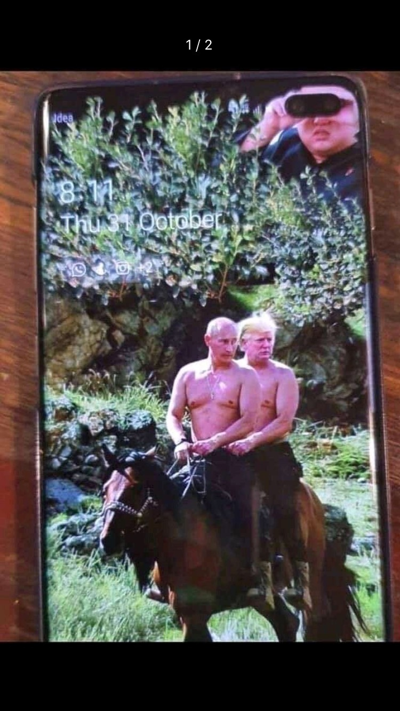
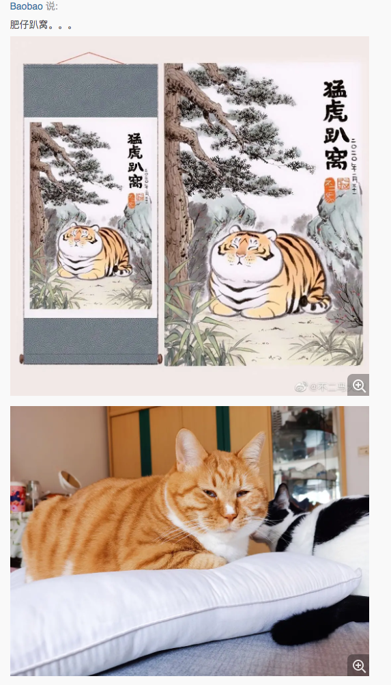
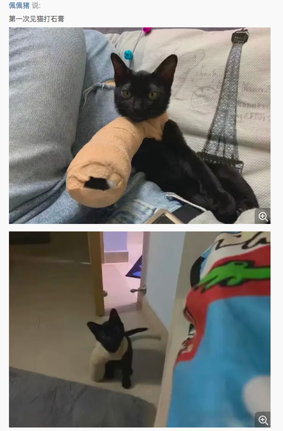

# 凌晨，在二环高架上奔跑的🐗

<video controls width="100%">
    <source src="/video/inoshishi.mp4" type="video/mp4">
    Sorry, your browser doesn't support embedded videos.
</video>

这个画面一直在我脑海里挥之不去，所以拿来装逼做标题。
另外，作为一个武汉人，如此之巧地在旋涡中心呆着，感觉有必要为这段时间写点东西保存一下。
毕竟，封城差不多一个月了也还没到头，不知何时是个头。
这个视频的原出处微博不清楚违反了什么条规被删除了，或者原 po 自己删除了，我也找不到了。

## 1.16 以前

我应该也是 12 月底看到武汉不明原因肺炎的新闻。毕竟爸妈都在武汉，我爸还是个老慢支，经常咳嗽咳到喘不过气，更让我担心。
因为香港 Sars 时期的悲惨教训，香港卫生署在有这个消息传出来后，就开始每天通报疑似病例。
于是从去年底到 1 月上旬，我每天都去香港卫生署以及武汉卫健委的网上去看通告，有没有新增，有没有确诊，确诊的是什么样病人。

当时的武汉卫健委的通报都只有个位数，基本没有疑似病例统计，还有好几天没有通报，通报了的也每天在说有限人传人。
而当时的香港卫生署，虽然每天都增加十几二十几个疑似病例，但都没有真正确诊的，大都检查出是其他流感或病毒。
当时还觉得香港人似乎是 PTSD，会不会是反应过度了。
但，这两相对比，我真的以为不是很严重的情况，毕竟和我妈打电话提起，她也觉得毫不在意。
但，鉴于我不太放心，还是很早开始嘱咐我妈，尽量要我爸出门的时候带口罩，我爸在我们家就是大熊猫，需要重点保护。
我妈虽然一直说我小题大作，但还是基本照做了，早晚就不说了，每天中午也开车去接我爸回家吃饭和睡觉。

直到 1 月 16 日，我看情况也没有任何特别明确的变动，我就按计划飞机回了武汉。

离开深圳前一日，我顺路在我租住的小区附近买了一袋普通口罩，准备去机场和坐飞机的时候戴上。
结果，晚上睡太晚，早上起来就去赶飞机的我，脑子基本处于当机状态，还是忘拿口罩了。

中午飞机到了，我爸妈都来机场接我了。本来只有我妈说要来，然后我和她两个人准备搭乘地铁回去。
但后来我爸执意要来机场接我，我妈只好开车过来了，然后一起开车回家。我爸那天是带着口罩了。

后来，我妈说，还好 1.16 那天开车去接我了，如果我和我妈搭地铁回家，说不定真的就被传染了。

## 1.16 ~ 1.22

回武汉之后的前几天，事情也完全没看出任何端倪。

我爸照常上班中，也开了不少会，我也在家上班中。1 月 18 日周六，我早上开周会，开完之后，我们还一起出门去武昌赴宴。
这天算是南方小年吧，我爸几个大学同学、现在的狐朋狗友（经常一起搓麻将），一起吃了个饭。
吃饭的地点非常巧，就在武汉病毒研究所旁边，我妈当时停车就停在那个科学院院子里。

吃完午饭后，我爸跟狐朋狗友去搓麻将到11、12 点才回家。我和我妈下午回家休息了一下，晚上又出门去了武汉广场。
我和我妈出门坐轻轨和公交的时候都戴上了口罩，口罩是家里的几个留存货。

在武广里逛了很久，大概 3 个小时的样子。还记得逛了 muji，然后看到法兰绒睡衣有打折，就买了。
事后证明这个睡衣买得太值了，封城后在家里就是两套睡衣换着穿，其他的衣服都不用换不用洗的节奏了哈哈哈。

1 月 19 日的时候，我记得通报确诊一下子多了几十个。本来打算再去楼下药店买点口罩，但是那天不太舒服，就犯懒没去。
这天晚上，还撺掇表妹表哥们一起，打算大年初一去看《姜子牙》

等到 1 月 20 日的时候，通报确诊瞬间增加一百多，我有点慌了，赶紧下楼去药店，结果药店口罩已经卖光了，店员说不知道什么时候能补到货。
后来，我妈在小区另一头的药店买到最后一包口罩（10 个），但是是普通护理口罩，而且是儿童口罩😂，我和我妈都还可以勉强用一用。
当天晚上钟南山教授在新闻 1+1 里和白岩松连线，明确说明有人传人，我爸妈才终于认同形势似乎不太好。
我开始在京东和淘宝上买口罩。可能我早了那么一点点，买到了一盒医用外科口罩（50 个）和一盒 3M N95 口罩（50 个）。

但是外科口罩是 2 月 2 日才收到的。N95 口罩直到 2 月 18 日才收到。不过，能收到就不错了，一直以为会被征用啥的。

1 月 21 日，我妈去他们单位的医务室买了一瓶医用酒精以及另外经过的药店买到一小包护理口罩（10 个），这天其实我还没意识到为什么要买酒精，这点上还是我妈有生活经验。
那几天，我每天问老爸，能不能不去办公室那边上班了，把东西拿回家吧。
我妈说没事，办公室那边其实也没啥人了，临近过年都是这样的。
这天在淘票票里排队等了一、两个小时线上的人工客服，帮我查询一下是否可以退掉《姜子牙》电影票。
淘票票的客服说帮我问一下，不确定是否可以退掉，如果成功之后会发短信通知我。

1 月 22 日，确诊数字暴涨的感觉，我在家里亲戚的 wx 群里问，要不然年饭（原本定在 1 月 24 日）别吃了。
我妈仍然表示年饭而已，没事的，我们几家亲戚都可以开车的，那边酒店订的也是包厢，接触不到什么人的。
我反而很慌，反驳说怎么可能呢，你吃饭有服务员的啊，端菜的啊，哪会不接触人。
好像是这天开始，有很多高铁、机票免费退票的政策出来，淘票票也给了我短信说成功退掉了。
后来，《姜子牙》等一系列春节档电影都说下线了，延后上映。想来电影院也是损失惨重啊。

## 1.23 ~ 1.30

1 月 23 日，腊月二十九，半夜鸡叫式的宣布武汉封城。我不知为啥，其实 5 点多就醒了，看到封城的消息，整个人觉得很魔幻，有点崩溃。本来没睡够，还想再睡一会儿的，结果完全睡不了。
7 点的时候我妈也醒了，知道了消息，然后还是去送了我爸去办公室，然后去蔬菜配送店里买了很多蔬菜。
10 点多的时候，亲戚通知取消了预订的年饭，大家都在家里云过年吧。
中午我爸被我妈接回家，我爸说下午不用去了，开始乖乖待在家里了。

1 月 24 日，除夕。我妈打电话给南航询问是否可以退机票。本来打算大年初二到初七，回一趟我爸老家江苏南通那边，去看望奶奶和其他亲戚，必须取消了。
但是，我爸提前准备带回江苏的各种年货正好在封城后自己慢慢吃了起来，算是凑巧，家里的确不愁肉类吃。
我妈那天说家里有两只鸡，一只鸭，差不多半只羊，一条半大咸鱼，还有一些卤牛肉和几公斤的猪肉。
后来豆瓣上的友邻说，上一辈囤货的智慧和经验，这次全部都用上了。事实证明的确如此，只要冰箱放得下，这些肉类够我家三个人吃很久了。唯一不好储存的就是蔬菜了。

除夕晚上的春节联欢晚会，还是正常举行了，我也还是看了，为了吐槽，和有几个帅哥可以看看。
诗朗诵自然令人作呕，我避开了那一段，后面让人尴尬到崩溃的是谢娜和肖战的小品。

封城后，我们家开始每天自测体温，我爸认真地拿了个小本本记录体温以及各类细节琐事。

初一到初七这几天，我整个人每天都泡在魔幻到让人崩溃的新闻里，这几天的体温一直都偏高，37 度上下，但也一直没到 37.3°，另外心跳也一直能感受到偏快。有几个晚上也是因为感觉到心跳太快而几乎整晚都睡不着。

为了调节心情，这几天每天都上线加班，回复老板 slack 里的问题，修 bug，搞了个大的组件重构。

就像豆瓣友邻说的，没想到有一天我需要用工作来逃避现实。

1 月 28 日，连续阴天了很久的武汉终于放晴了，阳光特别好，封城后第一次出门，陪我爸散步绕着小区转了一圈。

1 月 30 日，天气又非常好，我又一次陪我爸出门遛弯，顺便去药店看了下，药店是要啥啥没有的。
遇到了小区里的三只流浪猫，希望它们能一切安好。

忘记哪天给 CU 的内地生校友会里捐了 500 块，给韩红的慈善基金会捐了 300 块，淘宝的那个啥基金会，因为不太信任以及怕是要给红十字的，只捐了 20 块。
校友会的效率很高，没过几天就基本完成了物资捐赠，怎么说呢，我无条件相信我校校友，一群各省的高材生，比你红十字的能力高出不知道几倍几十倍几百倍。
韩红这个人以及她的基金会，也让人信服，即使前几天被人实名举报，我也无条件相信肯定是蓄意抹黑，是的，人就是要有点偏见的。嗯哼~

## 1.31 以后

1 月 31 日，我们公司开始正常工作了。本来我司就是长期远程办公的，之前本来说今年年后可以去新 office 上班了，疫情影响，看来要继续远程办公挺长一段时间了。
这天下午我跟着我妈去了趟附近的超市，蔬菜需要补货了。
但是很遗憾，去得比较晚，几乎啥也不剩了。

2 月 1 日，官方说双黄连可抑制新冠病毒，然后网上的双黄连以及药店的马上被扫货扫光，简直可笑。
因为前一天没有买到蔬菜，我妈又上午单独去了次超市。可能，这就是后面经常被人骂的武汉人自己不禁足，还去超市排队。
但是，不了解全部实情的时候，总有人大放厥词。
去买蔬菜基本只能去超市，政府在封城一个多星期后，也没有任何其他具体政策说明，市民的日常生活如何保障。
超市的工作人员过年本来就不太够的，这一封城，说不定很多返乡工作人员直接回不来上班，来上班的人员的防护用品也不太够的。
蔬菜一直在上架，超市里的标语一直都说大家不要抢菜囤菜，一直都有货的。
排队买菜其实是去排队过秤，我家附近的中百超市我所能见到的秤只有 3 个，每个人都是一车的蔬菜需要过秤，能不慢吗？
另外，能熟练记住蔬菜的代号来快速过秤贴标签打包的人，也并不是一直有 3 个工作人员的。
后来有一次发现，本来一个会过秤的人下班了，后来到相同岗位过秤的人说只能给水果过秤。。。😓 明明是她不会，记不住代码，非要说是机器做不到。

Anyway，这天我妈排队过秤排了 1 个多小时，后来让我爸帮忙出门去帮她拿回家的。

这之后，我也开始寻找网上买菜送菜的方法。

2 月 2 日，收到了 1.20 买的医用外科口罩 50 个。一下子觉得 2 月份熬过去无忧了。

2 月 4 日，我的姨妈来了，比我预计的提早了 8-9 天。

那几天关注到豆瓣友邻小杭的求救，妈妈刚刚去世了，父亲也病重了，实在令人心碎。
我一直关注着的武汉友邻文泽尔文大，和他的一些同事小伙伴一直在做志愿者，到处实地去了解并发布各种最新消息，也去联系小杭想帮忙解决她父亲的床位问题。
文大在武汉生活多年（我的感觉文大应该比我大十岁的样子），留过洋，阅书无数，开着一个特别有逼格的图书馆（应该就在江汉路，虽然我至今没去过），在武汉的人脉信息资源绝对是非常丰富且靠谱的，所以我非常相信他提供的信息。
然而这中间依然有人骂文大说话说得太满，小杭父亲还没有真正能转院获得良好的医治，却在网上说“基本解决了”。
还有，早前一开始封城有人说武汉的大白菜 40 块还是 80 块一个。文大也站出来说那个只是武商超市的有机蔬菜的价格，有机蔬菜平时就非常贵，买的人很少。
而其他的普通蔬菜基本都是正常价格，这个在我之后去中百超市买菜的时候也都证明了。当时也有人骂文大说他片面，说他看到的只是一部分。

我想帮他说句话，他生活在此地多年，特殊时期仍然出门帮忙做志愿者，他对武汉原本的情况以及最新的情况的了解，怎么着也比那些只能在网上骂战的人多吧。
作为武汉人，我不是不感谢那些为了不合理的事情而愤怒的人，但仍然也需要理智地分清哪些人是在做实事的，哪些人是只是耍嘴皮子吧。

小杭的父亲后来还是因为治疗地不够及时，去世了，但小杭也在豆瓣上说了，非常感谢文大提供的帮助。这句话足够让那些喷子闭嘴了。文大就是在做实事的人。

2 月 6 日。豆瓣日记功能暂停使用了。
晚上，李文亮医生去世了。
又接近凌晨的时候，说他还在抢救，上了 ECMO 什么的。

2 月 7 日，官方的公告，李医生是凌晨 2 点 58 去世的。这个中间到底是怎么一回事，我不知道我有没有机会知道真正的真相。
中午吃完午饭，我又陪我妈去了趟超市补货蔬菜还有鸡蛋、卷纸之类的，排队过秤还是用了半个小时，总的来回一个小时，戴口罩一个小时就感觉快要窒息。

2 月 8 日，元宵节了，结果这天忘吃汤圆了。

2 月 9 日。早饭煮了汤圆。下午，和我妈大吵了一架，因为李医生的事。我妈说，觉得李医生的死的确很惋惜，但是并不至于到全网哀悼情绪上升到如此地步，这一定是有人故意带节奏，怕不是美帝的阴谋。
还转发让我看一篇她认为的李医生不能称之为吹哨人的公众号文章。
这篇文章和所有其他这类文章一样，非要在吹哨人这个概念不对，以及第一个人不是李医生这种事情上做文章。
然而，我看到的很多人，都认为这不是什么重点，这些话不过是转移视线。
就因为李医生是个普通人，根本不是什么大英雄，才更加让人感到难过伤心。

和我妈吵架的时候，我虽然很愤怒，但是脑子是清醒的，并没有那种情绪上头脑子直接 boom 的感觉，但是仍然提高了音量吼了起来。
因为无法说服我妈理解我，甚至无法像我爸一样生气的时候毫不犹豫直接顺手砸东西，我只能打自己耳光。
没有哭，只是觉得难过。

豆瓣令人发指的删帖禁言封号已经比微博更加猖狂了。

2 月 10 日，江岸区终于出了通告，要求封闭小区管理，每户 3 天可出入一个人。当然通告出来和真正实施毕竟有时间差。
我妈上午又出门买了点水果和取快递。

但其实，我一直很好奇我们小区到底有没有确诊的，我在楼栋门口和小区门口从来没有看到过这方面的通报。而其他城市的同事朋友都有收到过详细的通报。
所以我一直让我爸妈打电话找物业问一问，是不是有小区业主的 wx 群，有没有通报这些信息。

2 月 11 日，我爸终于打电话给物业，加入了小区的业主群里。我猜的果然没错，业主群里一直有热心的业主帮忙在联系组织团购买菜的事宜。
这些都不是物业或者社区街道搞的，都是业主们自救搞起来的。

之后的这段时间，我爸经常会关注业主群的动向，有合适的团购就参加一下，基本我们真的不需要出门去买菜了。

也忘了从哪天开始，我找到了武汉微邻里的公众号里每日上报体温的地方。希望不要让人来敲门测体温，实在不安全没必要。

另外，有豆友做了一个逃避审查的小工具，就是把中文乱序一下，[网站在此](http://cnvoice.herokuapp.com/)。人基本可以读懂意思，但机器直接检测就不那么容易了。
虽然，这个方法也并不是很完美，但也多少有点作用的。
我用豆友的代码，简单做了个豆瓣上可直接点击使用的[油猴脚本](https://gist.github.com/bambooom/f90c48005709e598ec1f678630c69a9c)。

再后来，只是乱序可能都不够了，摩斯密码、竖排文字、火星文字、粤语文字的转化都出来了。
无法正常使用中文来说话，实在太可笑了。

2 月 13 日。

自如这边出了通告，3 月 1 日后返回租住城市并继续租住的，减免 2 月份的服务费。
我当下非常气愤，房租一毛钱是不会减的，清洁服务提供不了，所以就减免服务费了。不愧是垃圾公司。

2 月 15 日。武汉下大雪了。

这天把明星大侦探终于看完了。

2 月 16 日。把明侦的衍生节目名侦探学院看完了。
看完后，我明白一个道理，作为颜狗，我肯定喜欢长得好看的小哥哥，跳舞跳得好的也不会讨厌，演戏演得好的也是。
但会让我真正觉得有点崇拜敬佩有点上头的人是脑子比我好的聪明的人，看学院的节目我就深刻体会到了这点。
是聪明让我会对人有滤镜加成。

  
私心念叨一下，推荐自己喜欢小哥哥们😍😉😏（其实都是弟弟，都比我小很多🤣🤣🤣）

我喜欢蒲熠星，南京大学毕业，脑子真的好，游戏能手，偶尔觉得他在划水，但又经常高光高能，颜值也是很够的，耐看。南方人口音也是可爱，撒老师最爱的徒弟~
也喜欢文韬，青海省理科状元，北大数学系出身，逻辑思维真不是盖的，几个游戏被他第一次玩就能玩透，其他人望尘莫及。文韬也是真的好好看的啊！（咆哮）
还有之前看的密室逃脱里，有人说他看着柔弱，其实是热爱健身的，玩个游戏一拳 500 爆表，腻害腻害👏
也喜欢唐九洲，真的不会说谎，可爱不会过度，有自己擅长的游戏，绝对不蠢，毕竟人家也是北邮搞过计算机的。
还有周峻纬，人称英年早婚，颜值没的说，模特架子，读心理系出身，玩需要心理战的游戏的时候，他真的一眼看得出谁在说谎。
不能忘了齐思钧，看节目之前都没有意识到他在之前的明侦节目里出演过，不过是演个 NPC，马上就会死的姓甄的人。他是中国传媒大学毕业的，话痨，但也看得出来脾气好，人缘好，比较照顾其他人。

2 月 20 日，豆瓣日记功能恢复了。

2 月 21 日，豆瓣鹅组又被停用了，停用 7 天。

2 月 22 日，我妈早上起来试着做了热干面，勉强过关吧。😏

晚上被逼做了咖喱饭🍛，还是挺好吃的~

2 月 23 日，这两天开始疯狂传播武汉老师汉骂的视频，仔细听了下，实在让人舒爽，而我妈又开始说什么应该换位思考啊，人家社区人员哪里忙得过来啊 blablabla 的。
我忍不住又开始反驳她。累🙄

## 留存一些 mademyday 的东西，大概每天能有一点这些东西，我就还能苟活着

