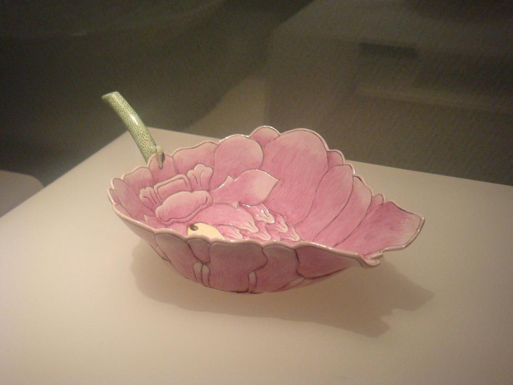
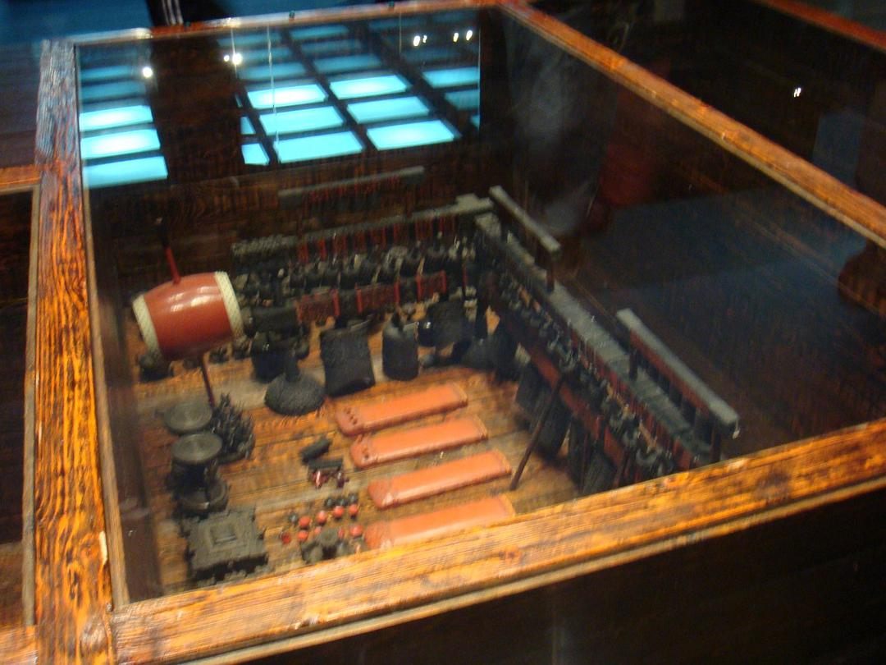
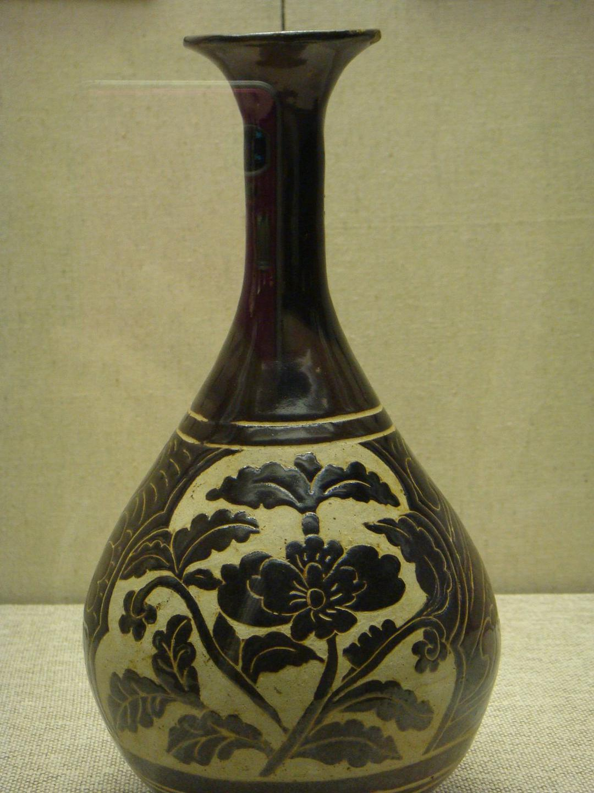
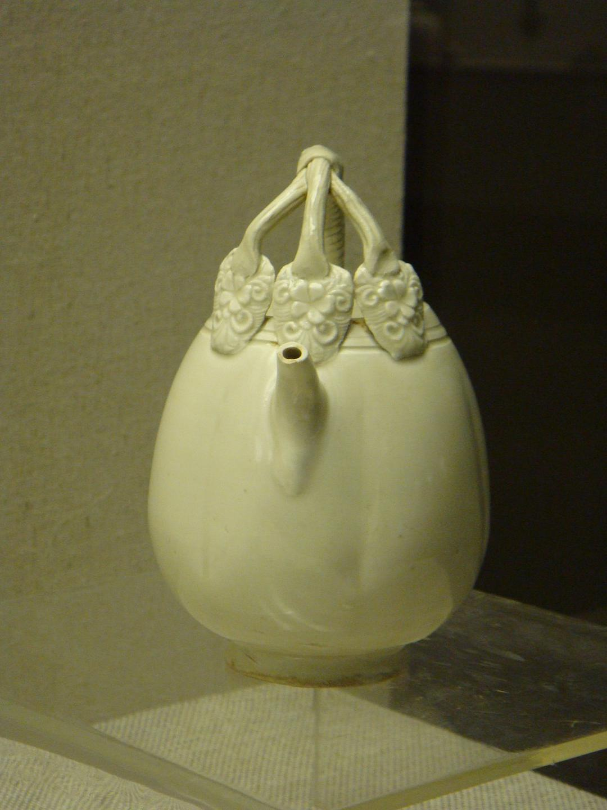

original link: https://www.douban.com/note/787704919/

意外发现 google photos 里存了 2009 年初去湖北省博时的照片，虽然不记得什么时候上传的，那就放出来康康 🌚

青花四爱图梅瓶（元）

真的，当年见过这只。。。

这个看细节好精美啊！

八大山人 《双鹰图轴》

编钟的小模型

它名字叫啥，我忘了

真实编钟的规模实在牛逼

细节其实非常多的

有点点可爱

青花牡丹纹梅瓶（元）

炉钧釉紫砂汉方大壶（清）

定窑白瓷贴花提梁小壶（北宋）
