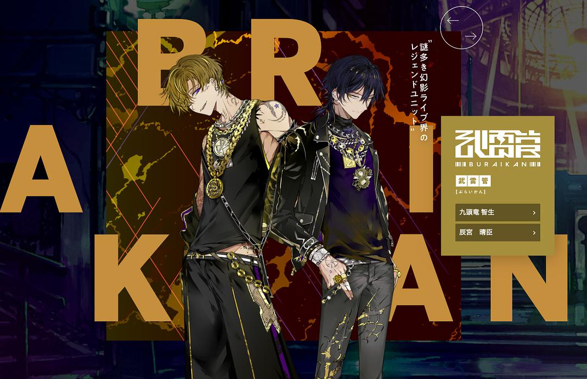

original link: https://www.douban.com/note/803479251/

Paradox Live 是在[ヒプノシスマイク 听碟记录](https://www.douban.com/note/763128418/) 里提到过的另一个类似的声优 Rap 计划，角色、声优、歌都是完全不一样的。本来只听了歌觉得没有那么喜欢，无意认真听抓的，但是最近发现继续推出了新的队伍，声优是我蛮喜欢的小野贤章和诹访部顺一，顿时感兴趣了！！！决定开坑认真听听惹~ 先把人物介绍从 ヒプノシスマイク 那边搬过来并补充一下，然后慢慢填坑！

这是之前的主视觉图

这是新的主视觉图，新队伍还没加上去

图片截图都来自官网：[https://paradoxlive.jp/](https://paradoxlive.jp/)

BAE

## 1\. BAE

潮系 3 人组。人设担当是叫秋赤音的插画家，个人网站：[http://akiakane.net/gallery/](http://akiakane.net/gallery/) 是还蛮华丽的风格，而且秋赤音也做服装设计相关的工作。所以给 BAE 设计的服装看着都还蛮潮系的。毕竟这一组一个混血一个韩国人一个伪娘。

🎙 中间的**朱雀野 アレン** 是含有 4 分之一俄罗斯混血的古典音乐世家出身，但是自己喜欢 hiphop 被父母嫌弃，离家出走。 🎙 左边的**燕 夏準**  设定是韩国有钱家庭出身，一般表现地像个贵公子，但内心比较扭曲，对复杂的家庭环境厌恶，想着有一天要对父母复仇。声优是村懒步，虽然并不是很熟村濑步，但是记得他是个美国人来的，英语口音很好听。 🎙 右边的伪娘叫**アン・フォークナー** ，dei 那是个伪娘，小时候被严格管教，现在就非常放飞自我，追求美丽，在做陪酒小姐的打工。CV 叫 96 猫，最开始是个 nico 人气唱见，现在算是歌手吧，本人是个很娇小的妹子。（难得有个妹子）

听过几首 BAE 的歌之后，是还蛮浓厚的韩国味儿，虽然歌不算太喜欢，但是村濑步的英语和韩语发音都很正，歌曲里面日语、英语、韩语无缝切换的确厉害，然后 96 猫的声音是帅气的姐姐那种，所以 BAE 的歌即使不算很喜欢，但这个组合的搭配实在很舒服~

The Cat's Whiskers

## 2\. The Cat’s Whiskers

酒吧氛围四人组。人设担当是小宫国春，个人网站：[https://yomosugara.jimdofree.com/](https://yomosugara.jimdofree.com/)。看了下，做过一些游戏的人设插画之类的，比如有 FGO 和刀剑乱舞相关的。

🎙 最前面拿着帽子的大叔是 leader **西門 直明** ，设定是白天的工作是语言学教授，晚上是一个 bar owner，温柔爱照顾人。这组其他人都在他的 bar 里工作。 🎙 看上去很拽的穿皮衣的小哥是 **神林 匋平** ，以前非常不良，现在已经改邪归正了，和西门认识很久，是个热血系。 🎙 银发的叫**棗 リュウ** ，神秘人物，官网没有实质介绍内容，不过我个人挺喜欢人设服装和配饰上的各种小细节，很可爱。以及这个角色的 CV 是花江夏树哦~ 花江最近几年应该很火了耶，最早认识应该就是当时大热门的東京喰種里的金木研，花江的表现还是很出色的。去年他还配了鬼灭的炭治郎，不错不错👏 🎙 左边棕发那个叫**闇堂 四季** ，看着人设图应该就能猜到是那种很自卑消极的性格设定，但是在音乐方面有特别才能。

个人觉得猫组的歌很像酒吧里会放的带点 jazz 风味的那种，但是有的好听，有的就怪怪的😂

cozmez

## 3\. cozmez

双子组合。人设担当叫 キナコ，个人网站：[https://marubotan.jimdofree.com/](https://marubotan.jimdofree.com/)。感觉画风比较偏可爱系，也做过刀剑乱舞相关的工作。

🎙 **矢戸乃上 珂波汰** ，右边的，是哥哥 🎙 **矢戸乃上 那由汰** ，左边的，是弟弟。兄弟的设定偏简单了点，主要就是定番的从小无父无母了，兄弟之间相互依赖，绝对的信任。以及弟弟的 CV 是豊永利行，以前有几个还比较熟的角色，比如 Yuri on ice 的勇利，少年同盟的春。

歌实在无感，但听说双子组似乎在这个企划里的人气其实蛮高的。

悪漢奴等

## 4\. 悪漢奴等（あかんやつら）

这个组的组名起得相当好。人设就是我认识的はらだ老师，画风还挺好识别的。

🎙 站最前面的是 leader **翠石 依織** ，把组员当亲人一样看待的大家长式温油的设定吧。组里其他人都是他捡回来的。他是开夜总会 club 的。 🎙 后面的壮汉叫 **雅邦 善** ，相当于在翠石的 club 做保安，直爽的热血系。 🎙 后面那个抱着猫的少年叫**征木 北斎** ，父亲是正在服役人员，天然无口系，对野猫温柔。 🎙 反戴鸭舌帽的叫**伊藤 紗月** ，人设看上去就是个很狂的少年，很容易和人争吵。 🎙 翠石左边那个叫**円山 玲央** ，元气末子，喜怒哀乐写在脸上，以前是个富家少爷，但是和家人走散了，所以才被翠石捡了回去。

恶汉组的曲风有点点偏向 hpmi 的名古屋了，毕竟 leader 都是僧人。

武雷管

## 5\. 武雷管

这个就是才推出的新队伍。设定是 Paradox Live 世界的传奇组合。

🎙 左边的金发角色叫 **九頭竜 智生** ，声优是小野贤章。设定就是基本上没有弱点的天才，传说中的 rapper 的这种感觉。MC 夜叉。 🎙 右边的黑发角色叫 **辰宮 晴臣** ，声优是诹访部顺一。设定是面瘫无表情，反应冷漠，但是是传说中的作曲家，写出的歌却情感丰沛且细腻。MC 修罗。

（没啥，我可能只是想听诹少唱歌吧🤣

今天先把人物介绍完善了一下，具体听碟就 TBC。。。。
