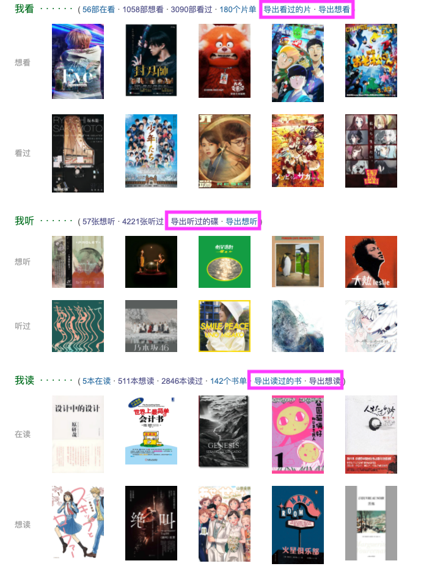
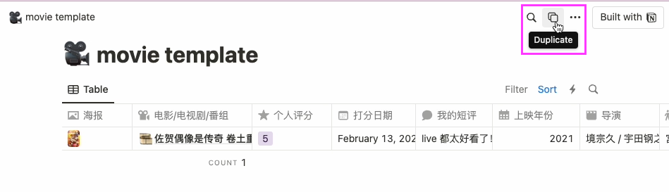
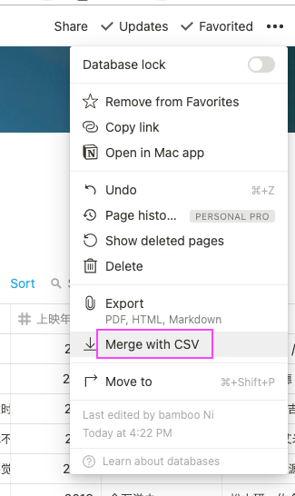
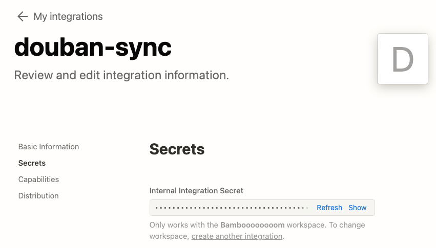
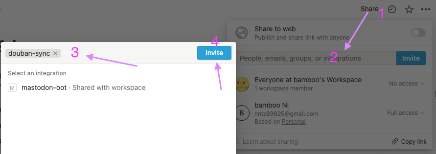
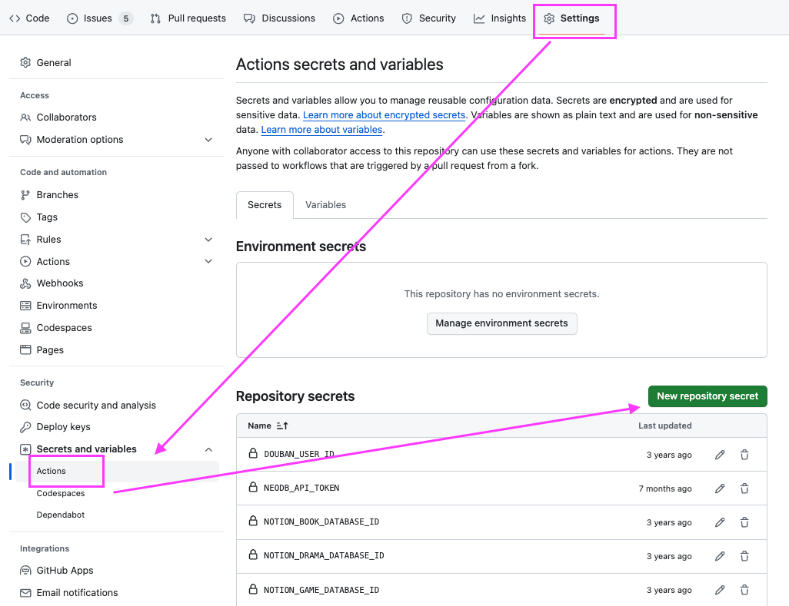

我个人的豆瓣标记条目导出到 Notion 并同步的一套操作和工具，并不适用于所有人。
如果想要使用并在使用中有问题欢迎直接联系我。

## 1. 使用油猴脚本一键导出`看过/读过/听过/玩过`的电影、书、音乐、游戏、舞台剧条目

油猴脚本 -> [豆瓣读书+电影+音乐+游戏+舞台剧导出工具](https://greasyfork.org/en/scripts/420999-%E8%B1%86%E7%93%A3%E8%AF%BB%E4%B9%A6-%E7%94%B5%E5%BD%B1-%E9%9F%B3%E4%B9%90-%E6%B8%B8%E6%88%8F-%E8%88%9E%E5%8F%B0%E5%89%A7%E5%AF%BC%E5%87%BA%E5%B7%A5%E5%85%B7)

是我从另外一个友邻的脚本完善修改的，安装后会在自己的豆瓣页面上看到多出五个链接，“导出看过的”之类的。

另外应一部分友邻的要求，把“想看”的部分的导出链接也加上了，但是这一部分数据没有后续处理，
“想看的”列表如何使用，全凭自由发挥了。




分别点击这五个“导出看过的”链接的话就会分别从
- `https://movie.douban.com/mine?status=collect`
- `https://music.douban.com/mine?status=collect`
- `https://book.douban.com/mine?status=collect`
- `https://www.douban.com/people/<people>/games?action=collect`
- `https://www.douban.com/location/people/<people>/drama/collect`

这几个地方自动翻页去获取个人标记数据（包括评分、评分时间以及短评）并最终导出 csv 文件。每次都可能需要一点时间给脚本去翻页获取数据，中途不要关掉浏览器，也不要在这个页面上去操作什么。

因为这三个地方不是具体条目页面，页面访问 limit request 并不严格，所以这样跑脚本完全不会被当做机器人而遭到封禁 IP 或要求重新登录之类的。

但局限也就是这里无法准确获取更多有关条目本身的信息，比如电影条目的 IMDb 链接、制片国家，也无法精准把导演和演员之类的人名区分开。

所以会发现导出的列表和最后实际使用中的 Notion table 的信息有对应不上的或者缺失的。这是正常的，也是无法避免的。
我个人的 Notion 示例看着数据是完整的，是因为最早尝试过自己写爬虫完整地爬取数据，但是数次遭遇被临时封禁 IP
并要求重新登录，整个过程很痛苦很麻烦，所以决定放弃爬虫方案了。

如果还是想要更完整的信息，建议使用[豆坟](https://blog.doufen.org/)。我个人也会过一段时间使用这个，因为还可以备份广播、相册等对我来说并不是特别重要的部分。

## 2. 在 Notion 创建 database 并导入 csv

此处我做了几个方便直接 duplicate 的模版，因为表格每一列的属性等的设置起来还挺多需要注意的地方。

- [movie template](https://bambooo.notion.site/02ab64ae11df4d46b16273a0b9adf6ae?v=7c7788ded74743519612e80f1b2384ff)
- [book template](https://bambooo.notion.site/2c6d35b0e1414af387f9e2a20d10cb4c?v=33be13cbae1f4bf581d325dfa1fa5604)
- [music template](https://bambooo.notion.site/43a25b0e62354cc4a38a8aa0c60ac31c?v=45b0b31a85804b42a8993e99b63e3f47)
- [game template](https://bambooo.notion.site/0fcb63ccfc65455b9349b29685690b71?v=5fc35837865640fe8e008ef80961d87f)
- [drama templa](https://bambooo.notion.site/29233844d4e34a9eb6fd48fb0a7b1598?v=8e9681e173204853b3df0d8c10f0e549)

打开模版后直接点击右上角的 **Duplicate**，即可将模版复制到自己的 workspace 中。



然后在新建的 database 页面右上角菜单打开后选择 Merge with CSV，将第一步导出的 csv 文件进行导入，数据量较大的话可能需要一点时间。



导入后大致效果：


因为我的油猴脚本导出的 csv 是这样的:


表格的栏的顺序在 Merge CSV 之前最好不要编辑移动，导入之后就可以按喜好编辑移动了。


## 3. 将豆瓣标记更新到 Notion （适合不想折腾的完全的小白）

> 如果愿意折腾的话，可以跳过此项继续看第 4 步。

虽然尽量把豆瓣标记条目备份导出了，但并没有打算完全不用豆瓣了，毕竟的确没有完美的替代，友邻也都依然是我喜欢和期望看到的。
所以在备份了已有的条目后，依然想使用豆瓣标记，但想同时同步标记到对应 Notion 表格。
如果每个条目仍需要手动输入的话可太麻烦了，此处我提供两个解决方法。

如果不想折腾不懂的东西的话，最直接的方法是：
- 过一段时间使用油猴脚本重新导出 csv 表格
- 用 Excel 类工具编辑表格，删除已经导入的部分
- 再次使用 Merge with CSV 功能导入 Notion 表格

操作上也不算复杂，如果想要比较傻瓜式的操作的话，使用这样的方法即可。

## 4. 使用 GitHub Actions 定时从 RSS 信息更新 Notion

> 如果愿意折腾一些不太懂的东西，可以使用这个方法进行同步，是我个人使用的更自动化的方法，欢迎试用并反馈，谢谢～

所幸这么多年过去了，google reader 都死掉了，豆瓣的 RSS 依然还保留着。
在个人页面的右下角一直安静地存在着：


以[我的账号的 RSS 信息](https://www.douban.com/feed/people/MoNoMilky/interests)为例，
这个 feed 里只有书影音的标记信息，并且想看、在看、看过三类状态的信息也都包括。**缺点是仅有保留最新的 10 条信息。**

我个人的方法就是定时读取这个 RSS feed，然后从中将新的标记信息自动更新到 Notion 里去，就很方便了。

完成的脚本 -> [sync-rss.js](https://github.com/bambooom/douban-backup/blob/main/sync-rss.js) 就是做了上述事项，其中也顺便针对每个新的条目去条目页面截取了更多我想要保留的信息，因为数量很少所以也不会引发被封锁 IP。（代码写得不好看，凑合能用吧😂 ）

想要使用这个脚本，需要做以下几件事。

### 4.1 获取 GitHub 代码仓库

1. 注册一个 GitHub 账号，如果没有
2. fork 我的[代码仓库](https://github.com/bambooom/douban-backup) （懂的人也可以不 fork，直接 clone，再在自己账号里创建新的 repo 再 push）

### 4.2 注册 Notion Integration

按照 [Notion 文档](https://developers.notion.com/docs/getting-started) 注册一个 Integration，叫什么名字随意，获取 Token




### 4.3 给 Notion Integration 权限

在你前面创建的 Notion database 页面右上角点开 Share，然后点开 Invite 那个编辑框，搜索你的 Integration 起的名字，确认 Invite。
邀请 Integration（把它想成一个 bot），这样你就可以使用 Notion API Token 来访问或者更新 Notion 了。**要注意的是每个 database 都需要单独邀请 Integration。**



邀请后在页面上即可看到这个 Integration 是有权限编辑的。


### 4.4 在 GitHub 代码仓库中设置 secretes

在自己 fork 或创建的代码仓库里设置 secrets。



key 的名字如图中绿色框内，请不要更改。另外 `DOUBAN_USER_ID`、`NOTION_TOKEN`（即前面获取的 Integration 的 Token） 是必须的。
任意一个 databse 的 ID 也是必须的。（不需要所有都有）


#### `DOUBAN_USER_ID` 是啥

即你的豆瓣的 ID，如图这两个地方均可获取。


#### database ID 在哪里

Notion 数据库的 ID，在 Notion 网站的 URL 上即可复制。（前面的 Notion 文档中也有提到什么是 database ID，不要把后面的 `?v=xxxxx` 也复制进去。）

```
https://www.notion.so/myworkspace/a8aec43384f447ed84390e8e42c2e089?v=...
                                  |--------- Database ID --------|
```

## 其他说明

### 本地测试运行

如果是懂自己在干什么的人，想要在自己电脑上跑脚本的话，需要在仓库目录下创建一个叫 `.env` 的文件配置齐下面的 secrets 即可。
### GitHub Actions 配置

这个脚本需要定时跑，也就是一个 cron job 而已，实现这个是靠 GitHub Actions 功能，[参考文档](https://docs.github.com/en/actions/reference/events-that-trigger-workflows#scheduled-events)。
GitHub 对免费用户的公开仓库暂时完全不会限制 Actions 的使用（Private repo 是有限制使用分钟数的），所以我在仓库里添加了这个 [workflow 设置文件](https://github.com/bambooom/douban-backup/blob/main/.github/workflows/sync-rss.js.yml)。

如果想要其他的配置，可以自行研究 GitHub Actions 的文档进行调整。

### 更改脚本运行频率

我设置的是每 6 个小时跑一次，因为我的标记也没有那么频繁，应该是够用了的。

如果想要更改这个频率，可以自行编辑你仓库中的这个 workflow 文件，将 6 改为 1 即表示每隔 1 个小时就运行一次脚本，改为 2 就表示每隔 2 个小时运行一次。


### 手动运行 workflow

另外我配置的 workflow 支持手动运行脚本，方便测试或者在偶尔标记较多时候可以及时手动同步。


最终贴上[我的 Notion 书影音 database](https://bambooo.notion.site/f6ff9481e3c044b09d9a46645e92d5b8) 当作例子。

## 番外篇 - NeoDB

[NeoDB](https://neodb.social) 暂时可以说是最为还原豆瓣条目标记功能的开源项目了。
需要的只是一个 Fediverse 的账号。

我很早就有注册并且随意看了下，功能还非常不全面，条目也很缺。
经过这两年的发展，已经比之前好了很多，条目没有审查，来源更丰富，除了豆瓣的条目，还可以从 spotify、goodreads、google books、steam 等等抓取数据，这些都是 NeoDB 的优势。

最近（2023.6）发现 NeoDB 有了比较丰富的 API，
于是想着狡兔三窟，不用只把数据放在一个地方，决定在同步到 Notion 的同时也同步到 NeoDB。

### 豆坟/豆伴导出
豆瓣的数据可以完整导入到 NeoDB 中，[参考这篇文档](https://about.neodb.social/doc/howto/)。
简单来说就是：
- 使用[豆坟/豆伴插件](https://blog.doufen.org/download/)，创建豆瓣的备份数据，[参考文档](https://about.neodb.social/doc/doufen/)
- 导出备份数据，是一个 `.xlxs` 文件
- 在 [NeoDB 页面](https://neodb.social/users/data/) 中上传 `.xlxs` 文件
- 导入文件并完成所有条目的标记需要一点时间，只需等待导入完成即可

### NeoDB 同步设置

1. 登录 NeoDB 后在 [developer 的页面](https://neodb.social/developer/)点击生成 Token：


2. 和前面说的相同的方法给 repo 添加一个新的 secret，`NEODB_API_TOKEN`，把生成的 Token 值贴进去即可

没有设置 Token 的不会去同步到 NeoDB，这个功能不是必须的。

最终放上我迁移后的 [NeoDB 页面](https://neodb.social/users/zhuzi@m.cmx.im/)。
